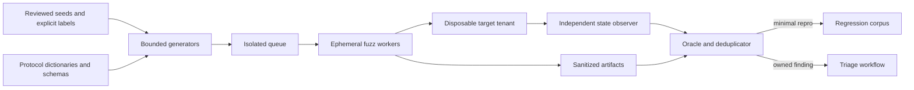

# MCP Security Testing and Fuzzing

Security testing turns an MCP trust model into executable counterexamples. This
course builds a bounded, reproducible test system that mutates protocol envelopes,
tool contracts, identity boundaries, approvals, and call sequences; judges outcomes
with an independent oracle; preserves minimal failures; and measures completed
disclosures or effects rather than trusting a target's response text.

## Course thesis

By the end, you should be able to explain the major security-testing techniques,
implement a structure-aware MCP fuzz harness, evaluate whether it finds real policy
violations without blocking valid work, and productionize it with common property,
API, coverage-guided, sanitizer, corpus, and continuous-fuzzing tools.

Level: advanced. You should already understand MCP messages and SDKs, authentication,
authorization, tenant isolation, approval, side effects, supply-chain evidence, and
release gates from Courses 1–13.

## Learning objectives

You will learn to:

1. translate threat-model invariants into positive, negative, boundary, metamorphic,
   differential, stateful, and concurrency tests;
2. design an independent oracle that inspects both a decision and observable state;
3. fuzz MCP 2026-07-28 JSON-RPC envelopes, routing headers, client metadata, tool
   names, arguments, sizes, encodings, and state transitions;
4. distinguish example-based, mutation, property-based, grammar/schema-based,
   stateful, coverage-guided, differential, and model-based testing;
5. use the official MCP SDK in memory and close SDK/version-specific contract gaps;
6. bound cases, input size, nesting, keys, strings, stateful steps, time, processes,
   and target authority;
7. reproduce and shrink a failure, cluster it by stable signature, and promote the
   minimized case into a deterministic regression;
8. separate crashes, unsafe accepts, completed forbidden effects, safe blocks, and
   false blocks with correct denominators; and
9. design isolated continuous fuzzing for parsers, SDKs, gateways, servers, and
   native dependencies without aiming traffic at production.

## 1. From invariant to evidence

```text
threat model invariant
  -> independent expected outcome
  -> seed corpus and generators
  -> isolated target execution
  -> decision + trace + observable state
  -> oracle comparison
  -> shrink and deduplicate
  -> deterministic regression
  -> release gate
```

A test is not a security proof because it printed `deny`. For a prohibited ticket
read, inspect whether protected data entered the response, cache, log, queue, or
effect store. For a prohibited write, inspect the downstream system or a faithful
test double. The target cannot be the sole source of truth about its own success.

The central boundary remains:

```text
generator / model / fuzzer -> proposes test inputs and hypotheses
trusted harness            -> bounds, labels, executes, observes, judges, records
```

An LLM can help propose attack variations or explain clusters. It must not assign the
ground-truth label, grant credentials, widen the target, decide that an effect was
safe, or mark a run successful from narrative output.

## 2. Threat model for the test system

### Assets

- target credentials, tenant data, test fixtures, and synthetic secrets;
- the oracle, labels, policy version, and expected outcomes;
- target artifact/version, protocol revision, configuration, and dependencies;
- corpus seeds, crash files, minimized reproducers, and trace evidence; and
- resource budgets, runner isolation, network destinations, and cleanup state.

### Adversaries and failure modes

- the target accepts malformed or unauthorized requests;
- a response says “denied” after a disclosure or write already happened;
- the oracle shares target code and reproduces the same bug;
- a generator mostly produces invalid noise and never reaches protected logic;
- a fuzzer lacks a seed, dictionary, grammar, or state needed for deep paths;
- a random seed, target build, environment, or dependency version is missing;
- failures disappear because the campaign does not persist and replay them;
- one bug creates thousands of duplicate crash files;
- a flaky dependency, clock, or shared state creates false failures;
- an unbounded campaign exhausts CPU, memory, disk, API quota, or downstream systems;
- production credentials or real customer data enter a corpus or report;
- a live target is corrupted because reset, tenant, or network isolation failed; and
- coverage, crash counts, or detector hits are misreported as safety outcomes.

### Safety invariants

1. Fuzz targets are disposable, isolated, credential-minimal, and explicitly scoped.
2. Inputs have hard byte, depth, key, string, case, step, and time budgets.
3. Trusted identity comes from harness configuration, never a fuzzed argument.
4. Expected behavior is specified independently from the target implementation.
5. Denied or malformed requests produce no disclosure or external effect.
6. Stateful effects use exact, expiring, single-use approval where required.
7. Every failure records target version, policy, seed/case, input digest, reason,
   outcome, and stable signature without sensitive payloads.
8. A minimized failure becomes a deterministic test before the bug is closed.

## 3. Choose the right testing technique

| Technique | Best use | Common limitation |
|---|---|---|
| examples/regressions | known requirements and past bugs | narrow input and sequence coverage |
| table-driven mutation | reviewed security boundaries | depends on mutation catalogue quality |
| property-based | broad typed values plus shrinking | needs strong properties and strategies |
| grammar/schema-based | structured JSON-RPC, JSON Schema, HTTP | schema conformance is not authorization |
| stateful/model-based | approval, tasks, subscriptions, lifecycle | state explosion and reset complexity |
| metamorphic | transformations that should preserve/change outcome | bad relations encode false assumptions |
| differential | compare versions, SDKs, policy implementations | disagreement identifies a question, not truth |
| coverage-guided | parser/native/deep implementation paths | coverage is guidance, not a security oracle |
| mutation testing | assess whether tests detect seeded code faults | mutants may be unrealistic or equivalent |
| fault injection | timeouts, lost replies, storage and dependency failure | requires observable recovery semantics |

Use them together. A schema-aware generator reaches valid handlers; boundary
mutations challenge policy; a state machine explores sequences; coverage feedback
finds new paths; an independent oracle decides whether the resulting effect is safe.

## 4. Define the oracle before generating input

Each `SecurityCase` in the lab fixes:

- stable case ID, class, mutation name, and seed;
- raw bytes and modern MCP routing headers;
- trusted principal, tenant, and scopes;
- expected decision and reason code; and
- expected observable effect delta.

`SecurityOracle` compares these labels with the target observation and the separate
`EffectLedger`. It reports independent violations:

- `DECISION_MISMATCH`;
- `REASON_MISMATCH`;
- `EFFECT_MISMATCH`;
- `FORBIDDEN_EFFECT_COMPLETED`; and
- `TARGET_CRASHED`.

This distinction matters. A cross-tenant read in the deliberately vulnerable
baseline returns `allow` and records a data-release effect. The hardened target
returns a uniform not-found-or-forbidden decision and records nothing. If a target
returned `deny` after recording the release, the effect oracle would still fail it.

### Avoid circular oracles

Do not call the same authorization function from both the system under test and the
expected-result generator. Better options include:

- a small independently reviewed reference model;
- a static labelled corpus from policy owners;
- postcondition checks over isolated datastore state;
- differential comparison followed by human adjudication; and
- metamorphic relations derived from invariants.

## 5. Build a layered MCP test matrix

### Layer 1: bytes and parser

Test empty/truncated JSON, invalid UTF-8, duplicate keys, non-object roots, invalid
JSON-RPC versions and IDs, excessive bytes, strings, keys, arrays, and nesting. Use a
duplicate-preserving decoder: ordinary conversion to a dictionary can silently erase
the first duplicate and prevent the test from seeing the ambiguity.

For native JSON, compression, HTTP, TLS, regex, URI, or serialization components,
combine coverage-guided fuzzing with ASan, UBSan, MSan, or language-specific memory
and race tooling. Crashes, hangs, leaks, excessive allocation, and algorithmic
complexity are relevant outcomes.

### Layer 2: modern MCP envelope and routing

For MCP 2026-07-28 Streamable HTTP, test the protocol-version, method, and name
headers against the body. The current TypeScript SDK documents modern routing-header
validation and a `HeaderMismatch` error for disagreement. Test both presence and
agreement according to the protocol revision and SDK you deploy.

The lab checks:

- `jsonrpc`, request ID, `tools/call`, and exact params shape;
- `MCP-Protocol-Version`, `Mcp-Method`, and `Mcp-Name` agreement;
- bounded client information and capability metadata; and
- a strict, allowlisted tool name.

Version-aware testing is essential. Legacy initialization, Streamable HTTP, modern
stateless requests, task extensions, MRTR, subscriptions, and SDK compatibility paths
have different state and error surfaces. Do not blend their expected behavior.

### Layer 3: capability contract

Mutate required and optional fields, extra properties, scalar types, Unicode,
normalization, enums, numeric boundaries, arrays, object nesting, and output schema.
Test that schema rejection occurs before the handler or external effect.

The lab's official Python SDK probe uses a real in-memory `Client` and `MCPServer`.
For the pinned SDK line, generated top-level argument models do not by themselves
reject every undeclared key, so reviewed middleware enforces the exact field set.
The test asserts that the handler call count does not change for an extra argument.
This is why SDK behavior must be tested rather than inferred from generated schema.

### Layer 4: identity and authorization

Mutate resource IDs, tenant-like arguments, scopes, token audience/issuer, subject,
delegation chain, ownership, lifecycle state, and policy version. Trusted identity
must remain outside fuzzed content. For existence-sensitive resources, verify uniform
denial behavior where policy requires it.

### Layer 5: content and result handling

Tool descriptions, prompts, resources, and results remain untrusted. Test injection
strings, deceptive metadata, oversized output, wrong content types, invalid structured
content, cross-origin instructions, secret-like data, and attempts to turn content
into authority. Detector outcomes are component signals, not authorization oracles.

### Layer 6: sequences, concurrency, and recovery

Generate actions as well as values:

- discover -> call -> capability change -> call again;
- propose -> approve -> mutate -> execute;
- approve -> concurrent duplicate execution;
- create task -> poll -> cancel -> late result;
- timeout -> unknown outcome -> reconcile -> retry; and
- revoke -> cached allow -> subsequent request.

The lab tests exact approval binding, expiry, replay, changed body, changed operation
ID, changed principal, and two concurrent consumers. One execution wins and the
other is denied without a second effect.

## 6. Property-based and stateful testing with Hypothesis

[Hypothesis](https://hypothesis.readthedocs.io/en/latest/) generates values from
strategies, finds counterexamples, and shrinks failures. Its example database replays
useful prior failures, but its documentation explicitly treats that database as a
cache rather than a correctness dependency. Promote security regressions to explicit
examples or checked-in fixtures.

The focused suite uses deterministic Hypothesis settings to verify that:

- arbitrary bytes never escape as an uncaught gateway exception;
- generated ticket IDs never release another tenant's record;
- any nonempty extra-argument set is denied without effect; and
- JSON object key ordering does not change semantics.

For stateful systems, `RuleBasedStateMachine` generates action sequences and moves
values between rules using bundles. Bound `stateful_step_count`, reset state per
example, and state invariants after every rule. Do not generate irreversible real
effects.

## 7. API and transport testing

[Schemathesis](https://schemathesis.readthedocs.io/) generates positive and negative
tests from OpenAPI or GraphQL, supports stateful scenarios, auth checks, seeds, time
budgets, shrinking, crash replay, and continuous fuzzing. It is useful when an MCP
deployment exposes an HTTP gateway or management API. Extend it with MCP-specific
header/body agreement, tenant, approval, output, and side-effect checks; generic
schema conformance cannot establish those properties.

For raw or stateful network protocols, tools such as boofuzz can model request graphs,
reset targets, monitor failures, and record cases. For Streamable HTTP, also use your
standard HTTP stack, proxy/WAF tests, timeout/cancellation tests, and transport-level
limits. Keep authentication and destination scope explicit.

## 8. Coverage-guided fuzzing and sanitizers

[Atheris](https://github.com/google/atheris) is a coverage-guided Python fuzzer based
on libFuzzer and can fuzz pure Python or native extensions. A harness exposes a
`TestOneInput(bytes)` function, instruments target code, seeds a corpus, and treats
uncaught exceptions as failures. For native extensions, combine it with Address or
Undefined Behavior Sanitizer where supported.

[libFuzzer](https://llvm.org/docs/LibFuzzer.html) evolves a corpus toward new code
coverage. LLVM now notes that libFuzzer remains supported for important fixes while
major new development has moved to Centipede. Coverage guidance helps discover paths;
it does not tell you whether a cross-tenant read was safe.

[OSS-Fuzz](https://google.github.io/oss-fuzz/) provides continuous fuzzing for
eligible open-source projects and supports multiple engines plus sanitizers.
ClusterFuzzLite brings similar CI-oriented workflows to projects that need repository
integration. Preserve reproducer inputs and exact builds for triage.

### Harness quality

A useful harness:

- reaches the intended parser or handler directly;
- resets global, database, cache, and clock state;
- avoids logging or startup overhead in the hot loop;
- contains no broad exception handler that hides crashes;
- treats expected validation errors as normal but unexpected exceptions as failures;
- supplies structured seeds and protocol dictionaries;
- has deterministic resource limits; and
- measures coverage in the target, not mostly in the harness.

## 9. Mutation and metamorphic design

Structure-aware mutation preserves enough validity to reach deep logic. Useful MCP
operators include:

- delete, duplicate, reorder, or add envelope fields;
- mismatch method/name/version headers and body;
- change a tool name to an unapproved near-neighbor;
- delete required arguments or add model-controlled tenant/scope/approval fields;
- cross tenant/resource/version boundaries;
- alter one byte of an approval-bound action;
- change Unicode normalization or URI encoding;
- repeat, reorder, or concurrently deliver stateful events;
- inject timeout, stale cache, revoked identity, or lost-response behavior; and
- change capability snapshots between discovery and use.

Metamorphic relations define what a transformation should do:

- JSON object key reordering and insignificant whitespace should preserve semantics;
- adding an undeclared argument must not turn deny into allow;
- changing an approved body, target, tenant, or operation must invalidate approval;
- retrying the same logical operation must not duplicate an effect; and
- changing trusted identity may change authorization even when request bytes do not.

Document every relation. A transformation that is harmless for one protocol revision
or media type may be material for another.

## 10. Reproduce, shrink, cluster, and regress

A raw crash directory is not a triage system. For each failure retain:

- target artifact/version and dependency lock digest;
- protocol and policy versions;
- case ID, class, mutation, generator version, and seed;
- sanitized input or encrypted restricted artifact plus public digest;
- expected and observed decision/reason;
- observable state delta and trace/evidence IDs;
- failure signature, environment, and resource limits; and
- minimized reproducer and regression-test location.

The lab emits only an input digest and classification metadata, not ticket content.
Its small delta-debugging example removes optional capability metadata while
preserving the forbidden cross-tenant disclosure. Hypothesis, Schemathesis, Atheris,
and libFuzzer provide more powerful shrinking/minimization workflows.

Cluster failures by an explainable signature such as sanitizer stack, exception and
top frames, violated invariant, decision/reason, or effect class. Do not call two
failures unique merely because their raw inputs differ.

## 11. Run the lab and focused tests

From this course directory:

```bash
python3 lab.py
```

From the repository root:

```bash
pytest -q tests/test_course_14_security_testing.py
```

The demonstration runs the same ten labelled cases against:

1. a deliberately vulnerable baseline that forgets tenant ownership; and
2. a hardened gateway with strict parsing, authorization, and effect checks.

The baseline completes one forbidden disclosure. The independent oracle finds it,
emits a stable redacted artifact, and shrinks the reproducer. The hardened target
passes every case. A separate official-SDK probe verifies real in-memory protocol
behavior and exact-argument middleware.

### What the lab proves

| Claim | Executable evidence |
|---|---|
| malformed input is bounded | byte/depth/key/string limits and property tests |
| ambiguous JSON is rejected | duplicate-preserving parser test |
| modern routing is coherent | protocol/method/name header-body tests |
| tool schemas are closed | missing/extra/type/boundary mutations and SDK call count |
| tenant identity is trusted | cross-tenant and generated-ID postcondition tests |
| oracle is independent | expected labels plus separate effect ledger |
| approval is exact and one-use | mutation, expiry, replay, and concurrent-consume tests |
| campaign is reproducible | seed, case budget, target version, input digest |
| failures are actionable | stable signature, redacted artifact, minimal reproducer |
| metrics mean what they say | explicit case-class populations and outcome counts |

### Lab limitations

The gateway is a deterministic policy target, not a production HTTP stack. The local
effect ledger stands in for an independently queried datastore. The campaign uses a
reviewed mutation catalogue, not coverage feedback. Add real deployment adapters,
transport parsing, process isolation, sanitizer builds, persistent corpus storage,
and authenticated target-state inspection without changing the oracle boundary.

## 12. Evaluation and release decisions

Report counts and rates with explicit populations:

```text
attack success rate
  = completed forbidden effects / labelled attack attempts

safe block rate
  = correctly blocked attacks with no effect / labelled attack attempts

false block rate
  = valid attempts blocked / labelled valid attempts

robustness crash rate
  = unexpected target crashes / labelled robustness cases

oracle pass rate
  = cases matching decision, reason, and effect / all executed cases
```

Also track unique failure signatures, time/cases to first failure, paths or features
reached, flaky reproductions, shrink ratio, median triage time, regression escape, CPU
hours, and cost per unique actionable defect. State units and aggregation.

Coverage is a harness/navigation measure. A 100% line-coverage run can still miss a
tenant-policy error. Crash count is not unique vulnerability count. Detector recall
is not attack success rate. Blocked attempts are not completed forbidden effects.

A release gate should fail on reproducible crashes, invariant violations, forbidden
effects, or unacceptable false blocks according to an owned policy. New coverage or
an untriaged differential disagreement may create review work without automatically
proving a vulnerability.

## 13. Production campaign architecture



Operational controls include ephemeral workers, no production routing, synthetic
data, egress allowlists, CPU/memory/process/disk limits, per-call timeouts, watchdogs,
target reset, secret scanning, encrypted restricted artifacts, retention, ownership,
and a kill switch. Parallel workers reduce wall-clock discovery time but increase
total work; do not sum worker durations and label the result “latency.”

## 14. Common toolchain

| Layer | Common choices |
|---|---|
| unit/regression | pytest, unittest, Vitest/Jest, JUnit |
| property/stateful | Hypothesis, fast-check, jqwik, ScalaCheck |
| API/schema | Schemathesis, RESTler, Dredd, contract-test frameworks |
| Python coverage-guided | Atheris |
| native coverage-guided | libFuzzer, AFL++, Honggfuzz, Centipede |
| continuous fuzzing | OSS-Fuzz, ClusterFuzzLite, managed CI fuzzing |
| network protocol | boofuzz, Peach-derived/commercial tooling where appropriate |
| sanitizers | ASan, UBSan, MSan, TSan, LeakSanitizer |
| coverage | coverage.py, pytest-cov, llvm-cov, language-native coverage |
| mutation testing | mutmut/cosmic-ray, Stryker, PIT |
| isolation | containers, disposable VMs, gVisor/Kata, sandboxed test tenants |
| observability | OpenTelemetry, structured logs, crash reporters, artifact stores |

Choose tools based on the target language and boundary. A native JSON parser needs
sanitizers; a Python policy layer benefits from Hypothesis; an HTTP gateway benefits
from Schemathesis; a stateful approval service needs model-based sequences and
transactional postconditions.

## 15. Exercises

1. Add `resources/read` with URI normalization and authorization, then create
   percent-encoding, Unicode, traversal, and cross-origin metamorphic cases.
2. Implement a Hypothesis `RuleBasedStateMachine` for approval issue, mutate,
   consume, replay, expire, revoke, and concurrent delivery.
3. Build an Atheris entry point around `parse_request`, seed it with valid modern and
   legacy envelopes, and add an MCP method/name dictionary.
4. Expose the lab behind a disposable HTTP adapter and add Schemathesis checks for
   routing headers, ignored auth, output schema, and effect postconditions.
5. Seed a cache-key bug or approval-replay bug and verify that the suite kills the
   mutant. Explain equivalent mutants you exclude.
6. Differentially test two supported SDK versions. Classify each disagreement as
   intended compatibility behavior, harness error, regression, or unresolved review.
7. Add timeout and lost-response fault injection. Prove the harness reconciles target
   state before allowing a retry.
8. Design a nightly campaign dashboard with correct denominators, target versions,
   budget/cost, unique findings, regression status, and accountable owners.

## 16. Production readiness checklist

- [ ] Every campaign names its exact target artifact, protocol, SDK, policy, and seed.
- [ ] The oracle is independent and inspects observable disclosures/effects.
- [ ] Positive, attack, boundary, malformed, stateful, concurrency, and recovery
      populations are labelled separately.
- [ ] Identity, tenant, scope, approval, and destination come from trusted harness state.
- [ ] Byte, structure, step, time, worker, memory, disk, and network budgets are hard.
- [ ] Targets are disposable and cannot reach production data or effects.
- [ ] Expected errors are distinguished from crashes, hangs, leaks, and corruption.
- [ ] Stateful reset and cleanup are verified after every case/scenario.
- [ ] Seeds and dictionaries contain no credentials or sensitive customer content.
- [ ] Failures are reproducible, minimized, deduplicated, owned, and retained safely.
- [ ] Fixed findings are explicit regressions; fuzzer caches are not the only copy.
- [ ] Metrics disclose numerator, denominator, units, slices, and observation source.
- [ ] Coverage is treated as navigation evidence, not safety proof.
- [ ] CI has a short deterministic suite; longer campaigns run on an owned schedule.
- [ ] A kill switch, quarantine path, and triage SLA exist.

## References

Primary and official sources reviewed on 2026-09-29:

- [MCP 2026-07-28 release overview](https://blog.modelcontextprotocol.io/posts/2026-07-28/)
- [MCP TypeScript SDK v2](https://ts.sdk.modelcontextprotocol.io/v2/)
- [MCP TypeScript SDK: 2026-07-28 routing-header behavior](https://ts.sdk.modelcontextprotocol.io/v2/migration/support-2026-07-28)
- [MCP Python SDK](https://github.com/modelcontextprotocol/python-sdk)
- [JSON-RPC 2.0 specification](https://www.jsonrpc.org/specification)
- [Hypothesis documentation](https://hypothesis.readthedocs.io/en/latest/)
- [Hypothesis stateful testing](https://hypothesis.readthedocs.io/en/latest/stateful.html)
- [Schemathesis continuous fuzzing](https://schemathesis.readthedocs.io/en/stable/guides/continuous-fuzzing/)
- [Schemathesis stateful testing](https://schemathesis.readthedocs.io/en/stable/explanations/stateful/)
- [Atheris coverage-guided Python fuzzer](https://github.com/google/atheris)
- [LLVM libFuzzer documentation](https://llvm.org/docs/LibFuzzer.html)
- [OSS-Fuzz documentation](https://google.github.io/oss-fuzz/)
- [boofuzz network protocol fuzzer](https://github.com/jtpereyda/boofuzz)
- [OWASP Web Security Testing Guide](https://owasp.org/www-project-web-security-testing-guide/)

Recheck protocol revisions, SDK behavior, and tool releases before production use.
