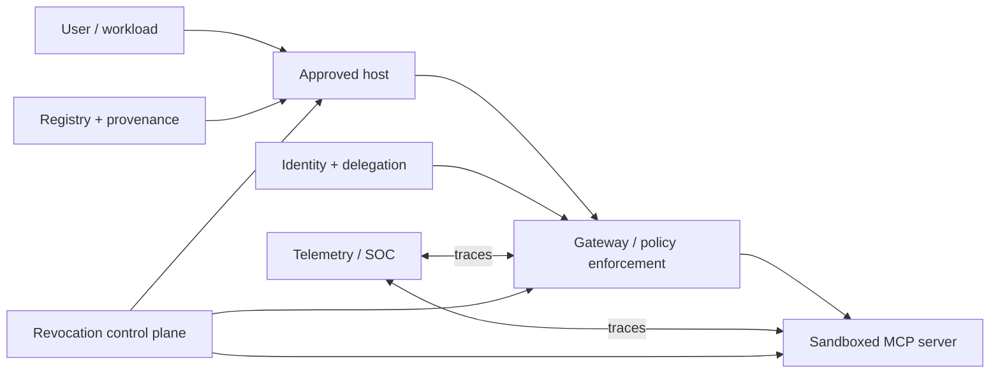

# Enterprise MCP Security Architecture

## Learning objectives

Design a platform architecture with distinct registry, identity, authorization,
isolation, observability, revocation, and tenant-boundary controls; assign
owners; and review cross-plane failure and bypass paths.

## Reference architecture

## Lab and review

Run `python3 lab.py`. The review fixture makes missing control planes visible;
it is not an architecture approval. A real review maps data classification,
tenant isolation, identities, policy decision points, server ownership,
artifact provenance, runtime sandbox, egress, trace retention, revocation,
incident ownership, SLOs, and exception handling. Design for failure of every
control plane and prevent one gateway/identity from becoming universal ambient
authority.

## Evaluation

Exercise tenant escape, registry compromise, policy outage, gateway bypass,
credential leak, sandbox escape, telemetry loss, and revocation propagation.
Require a named owner, test, trace, runbook, and recovery path for each.

## References

- [NIST AI RMF](https://www.nist.gov/itl/ai-risk-management-framework)
- [MCP architecture](https://modelcontextprotocol.io/specification/latest/architecture)
