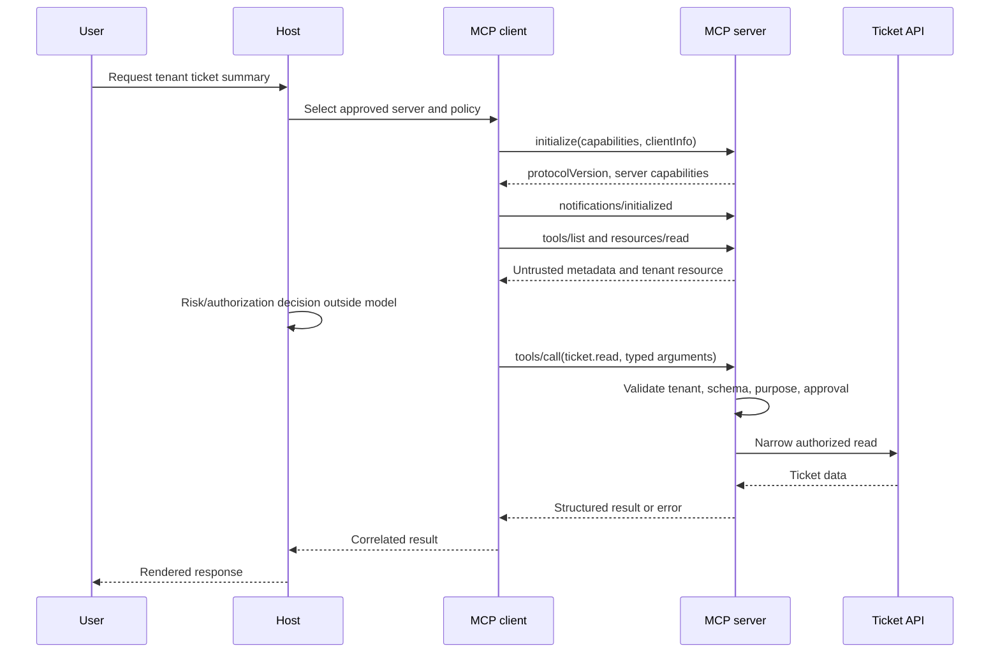

# MCP Architecture, Lifecycle, and Trust Boundaries

## Learning objectives

After this course, you can trace a Model Context Protocol (MCP) session from
connection through shutdown; distinguish host, client, server, tool, resource,
and prompt responsibilities; identify the principal, authority, data, logging,
failure, and revocation path at every boundary; and reject the mistake of
treating a discovered capability or natural-language description as permission.

## Why this topic matters

The support-platform host in this curriculum connects to a tenant-scoped ticket
server. A normal session looks harmless: the host discovers `ticket.read`, a
model selects it, and the server returns a ticket. But the same path can expose
secrets or invoke a destructive tool if the host trusts server metadata, the
server trusts model arguments, or a downstream credential is broader than the
user's request. Security controls only make sense once the learner can point to
the exact protocol message and trust boundary they protect.

**Success criterion:** given a captured trace, account for the negotiated
capability and each tool/resource/prompt interaction, then identify what must
authorize it. **Non-goal:** this lesson does not implement OAuth or a production
policy engine; Courses 06–08 do that. The default lab is offline and never
contacts a live server.

## Prerequisites

Basic JSON and HTTP/process concepts are enough. Continue through the [canonical curriculum map](../../README.md) as later topics are published. The migration plan is the current map for not-yet-published topics.

## MCP / protocol mental model

MCP separates an AI application into a **host**, one or more host-managed
**clients**, and independent **servers**. A client speaks protocol messages to
a particular server. A server exposes three different kinds of surface:

- **Tools** are model-invokable operations. A tool selection is a proposal, not
  an authorization decision.
- **Resources** are URI-addressed context the client can read. Their URI and
  tenant scope are security inputs.
- **Prompts** are server-provided templates or configuration. Treat their text
  as untrusted content, never as authority.

The host owns user experience, integration selection, approval, and the local
trust decision. The client owns the protocol session. The server owns its own
validation and must not inherit the host's broad authority. A downstream API
must separately verify the calling identity and requested action.

## Lifecycle and mechanics

An MCP connection begins with `initialize`: client and server exchange a
protocol version, implementation information, and capabilities. The server's
reply is evidence of what it claims to support—not proof it is trusted. The
client sends `notifications/initialized` after successful negotiation. It can
then list and call tools, list/read/subscribe to resources, and list/get
prompts. Notifications communicate state changes without an `id`; requests and
responses correlate via JSON-RPC IDs. Session termination must close transport
state and invalidate in-memory authority, while longer-lived revocation belongs
to the host, registry, or identity system.

Two common transports shift different boundaries:

- **Local stdio**: the host launches a local process and exchanges messages over
  standard input/output. The critical controls are executable provenance,
  environment minimization, filesystem/process isolation, and process
  lifecycle. Local does not mean trusted.
- **Streamable HTTP**: client and server cross a network boundary. The critical
  controls include server identity, TLS, request origin and session protections,
  authentication, egress policy, and transport logging. Remote does not move
  authorization out of the server.

Capability negotiation answers “what might be available”; it never answers
“what this user may do.” Cache only reviewed capability metadata, bind a cache
entry to server identity and version/digest, and invalidate it when a server is
revoked or changes capabilities.

## Trust-boundary review

| Boundary | Principal and credentials | Data and authority | Required evidence | Failure and revocation |
| --- | --- | --- | --- | --- |
| User → host | User session | Request, consent, tenant | Request/audit ID | End session; revoke consent |
| Host → client | Host workload identity | Approved integration configuration | Server selection decision | Do not launch/connect; disable integration |
| Client → server | Client/session identity | Protocol messages, discovered metadata | Session/trace ID, server identity | Close session; revoke server |
| Server → downstream API | Server with narrow delegated credential | Validated arguments and intended action | Tool audit, audience/tenant/purpose | Deny; revoke credential; rotate |

Logging must be correlatable but redacted: record trace ID, server identity and
digest/version, tool/resource/prompt name, tenant, policy decision, destination,
and error class—never raw bearer tokens or unbounded sensitive content.

## Architecture patterns and technology choices

Use direct local stdio for a narrowly packaged, host-managed integration when
the host can establish process provenance and isolation. Use Streamable HTTP
when a server needs independent deployment or multi-client reachability, with
network identity and session controls. A registry/gateway adds an explicit
review, discovery, policy, and revocation point for enterprise deployments, but
does not replace server-side validation. Course 17 examines that trade-off.

The official MCP SDKs package protocol mechanics, but do not grant a server
authorization, isolation, or safe tool design by themselves. Use SDK APIs for
correct protocol framing; enforce security invariants in typed application code,
the policy layer, and the downstream resource server.

## Worked example: one safe read

The [lab](lab.py) captures a deterministic, protocol-shaped trace for
`ticket.read`. It starts with initialization, exposes one narrow schema through
`tools/list`, reads a tenant URI, calls the tool with exactly one field, and
returns a structured result. Before running it, predict these outcomes:

1. A tool description appears only after negotiation and must remain untrusted.
2. `ticket_id` is the only accepted argument; arbitrary arguments are absent.
3. A result is correlated to its request ID and can be audited with a trace ID
   in a production implementation.
4. Cancellation/termination stops the session; it is not a substitute for
   credential or server revocation.

Run it with `python3 lab.py`. The fixture is intentionally not an MCP SDK
server; it exposes the messages and invariants first. Course 04 replaces the
fixture with a real official-SDK server and client.

## Attack surface, failures, and defenses

| Failure | Why it works | Control | Verification |
| --- | --- | --- | --- |
| A malicious server advertises `fetch_url(url)` | Discovery is mistaken for approval | Host capability risk gate and narrow allow-list | Reject unreviewed/broad schemas |
| A prompt asks for secrets | Prompt text is treated as instruction/authority | Treat server content as untrusted; reauthorize next action | Injection test produces no side effect |
| Client forwards a broad host token | Downstream server becomes a confused deputy | Audience-bound, short-lived delegated authority | Wrong-audience token denied |
| Local server reads `.env` | Process launch is treated as trust | Pin artifact, minimal environment, sandbox | Fixture cannot read unapproved paths |
| Server changes after cache | Cached claims outlive review | Bind cache to digest/version; revocation invalidates | Changed/revoked server is blocked |

## Evaluation / verification

Run the lab and deliberately modify the tool-call argument set or remove the
initialization notification. `security_review` should return a specific finding.
For a real trace, score the review as complete only if it includes: negotiated
version and capabilities; server identity; user/tenant; tool/resource/prompt
names; policy decision; downstream destination; and a revocation owner.

The checkpoint question is: *Why is `tools/list` not an authorization grant?*
Because it describes an offered capability. Permission must be decided with the
authenticated principal, action, resource, tenant, purpose, risk, and approval
at an enforcement point outside the model.

## Production considerations

Pin and verify the server artifact before local launch or remote onboarding.
Keep client/server connection pools bounded; do not retry side-effecting tool
calls unless an idempotency contract makes retry safe. Attach correlation IDs,
enforce timeouts, rate limits, output-size limits, and typed error mapping.
Minimize process environment and outbound routes for local servers. For remote
servers, authenticate both sides where applicable and make server removal,
credential revocation, and capability-cache invalidation an exercised runbook.

Established practice is strict schemas, explicit policy enforcement, traceable
tool calls, and least privilege. Emerging practice adds registries/gateways and
continuous behavioral assurance. Open problems include portable provenance and
consistent authorization semantics across composition of MCP, A2A, and agent
runtimes; these are examined later in the course rather than assumed solved.

## Exercises

1. Add a `prompts/get` request to the lab trace. Write an invariant that prevents
   the prompt text from changing the permitted tool set.
2. Model a local stdio server that needs a config file. List the filesystem,
   environment, process, and supply-chain controls before it starts.
3. Replace `ticket.read` with `ticket.update`. Define an action fingerprint,
   approval boundary, idempotency strategy, and audit event before writing code.
4. Explain which control owns revocation for a compromised remote server and how
   the host, client, server, and downstream API respond.

## Review questions

1. Which lifecycle message confirms that negotiation completed?
2. What is the security difference between a resource URI and a tool argument?
3. Why are capability version/digest and revocation both relevant to caching?
4. Which boundary must enforce a downstream API's authorization decision?

## References

- [MCP specification — lifecycle](https://modelcontextprotocol.io/specification/latest/basic/lifecycle)
- [MCP specification — transports](https://modelcontextprotocol.io/specification/latest/basic/transports)
- [MCP specification — architecture](https://modelcontextprotocol.io/specification/latest/architecture)
- [Official MCP Python SDK](https://github.com/modelcontextprotocol/python-sdk)
- [MCP security best practices](https://modelcontextprotocol.io/docs/tutorials/security/security_best_practices)
