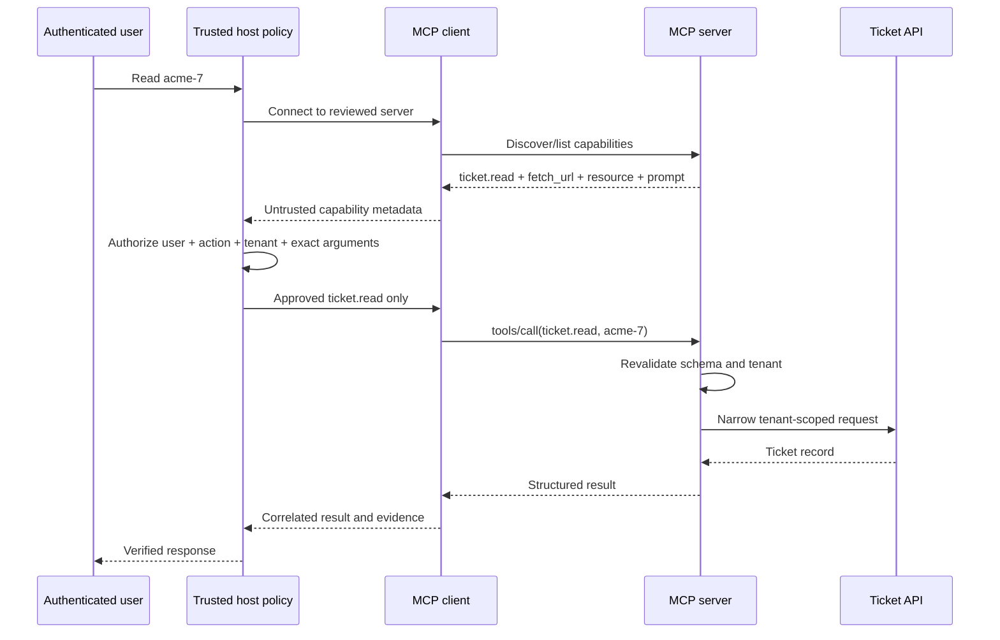

# MCP Architecture, Protocol Eras, and Trust Boundaries

Learn the current MCP architecture and protocol eras by inspecting a real SDK
session, enforcing a tenant-aware host policy, and proving that discovery never
grants authorization.

## Learning objectives

After this course, you can:

1. distinguish MCP host, client, server, tool, resource, and prompt responsibilities;
2. explain the modern stateless protocol and its compatibility path for legacy
   initialization-based implementations;
3. select an in-memory, stdio, or Streamable HTTP transport for a concrete use
   case and identify the boundary each transport creates;
4. inspect a real SDK session and separate discovery from authorization; and
5. produce evidence for principal, action, resource, policy decision, failure,
   and revocation at each boundary.

The central invariant for this curriculum is: **the model or agent proposes;
trusted application code validates, authorizes, executes, verifies, and records.**

## Scenario and success criteria

You are reviewing a support host that connects to a tenant-scoped ticket MCP
server. The server offers a narrow `ticket.read` tool, a policy resource, a
summary prompt, and an intentionally dangerous `fetch_url` tool. A safe host
may discover all four capabilities but must call only the reviewed operation
for the authenticated tenant.

You complete this course when you can:

- show the negotiated version, server identity, and declared capabilities;
- prove that `fetch_url` was visible but denied before server execution;
- reject additional arguments and cross-tenant identifiers at the host boundary;
- explain why the server must repeat its own validation; and
- diagnose a malformed legacy initialization trace without applying legacy
  assumptions to a modern server.

This lesson is offline and uses no credentials. OAuth, production policy
engines, sandboxing, and registry governance are developed in later courses.

## Architecture mental model

MCP uses a host–client–server architecture. The host creates and manages
clients; each client communicates with one server; and a server exposes focused
capabilities. The current architecture deliberately keeps full conversation
history in the host and expects the host to maintain isolation across servers.

| Component | Owns | Must not be mistaken for |
| --- | --- | --- |
| Host | User experience, server selection, consent, orchestration, policy | A passive protocol relay |
| Client | One server relationship and protocol mechanics | The authority to approve every advertised action |
| Server | Its tools, resources, prompts, input validation, downstream access | A trusted extension of the host |
| Tool | A typed operation proposed for invocation | Permission to perform that operation |
| Resource | URI-addressed context | A tenant-neutral blob |
| Prompt | A reusable message template | Trusted policy or executable authority |



## Protocol state of practice: modern and legacy eras

This distinction is essential when reading tutorials or packet captures.

### Modern MCP: 2026-07-28 and later

Modern MCP is stateless at the base protocol layer. There is no mandatory
`initialize` handshake. Every request declares its protocol version and client
capabilities in `_meta.io.modelcontextprotocol/*`; Streamable HTTP also mirrors
relevant metadata into headers. A server implements `server/discover`, and a
client may call it before another request or handle an
`UnsupportedProtocolVersionError` and retry with a mutually supported version.

The official Python SDK `Client` performs this protocol work. Application code
should observe the negotiated `protocol_version`, `server_info`, and
`server_capabilities`; it should not hard-code a version and infer trust from a
successful exchange.

### Legacy MCP: 2025-11-25 and earlier

Legacy revisions establish a session with:

1. client `initialize` request;
2. server result containing version, identity, and capabilities; and
3. client `notifications/initialized` notification.

Dual-era implementations can detect the other party's era and fall back. On
stdio, a dual-era client probes with `server/discover`; on Streamable HTTP it
inspects a modern request failure before choosing legacy behavior. Do not
silently label every modern exchange “initialization,” and do not omit the
initialized notification when reviewing a genuine legacy trace.

In both eras, version and capability agreement establishes interoperability,
not authorization.

## Transports and their security boundaries

Protocol meaning stays the same across transports; framing, metadata carriage,
cancellation, and termination differ.

| Transport | Good fit | Primary boundary controls |
| --- | --- | --- |
| In-memory | Unit/integration tests or an embedded server | Same protocol validation; no claim about process/network isolation |
| stdio | Host-launched local integration | Pinned executable, minimal environment, filesystem/process sandbox, stderr separation, bounded shutdown |
| Streamable HTTP | Independently deployed or multi-client server | TLS and origin identity, OAuth where needed, timeouts, origin-safe redirects, session/request protections, egress controls |
| HTTP+SSE | Compatibility with older deployments only | Migration plan; do not choose it for new systems |

The Python SDK supports all three current development paths. `Client(mcp)` uses
the real protocol layer in memory, `Client(StdioServerParameters(...))` launches
a subprocess with an allow-listed environment, and `Client("https://…/mcp")`
selects Streamable HTTP. Entering `async with Client(...)` opens the connection;
constructing the object does not.

## Trust-boundary review

| Boundary | Principal | Data and authority | Required evidence | Failure / revocation owner |
| --- | --- | --- | --- | --- |
| User → host | Authenticated user | Request, purpose, tenant, consent | Request/trace ID and user/tenant | Host ends session or revokes consent |
| Host → client | Host workload | Reviewed server configuration | Server identity/version/digest and selection decision | Integration owner disables server |
| Client → server | Client/request identity | Versioned messages and approved operation | Method, resource, decision, latency, result class | Client closes/blocks; registry revokes |
| Server → API | Server/delegated identity | Validated arguments and narrow action | Audience, tenant, purpose, tool audit | API denies; identity owner revokes credential |

Record correlation IDs, server identity/version, capability names, tenant,
policy decision, downstream destination, result class, and timing. Do not log
bearer tokens, raw secrets, or unbounded customer content.

## Practical lab: real SDK, real policy boundary

The [lab](lab.py) uses the official MCP Python SDK v2. It creates an
`MCPServer`, connects a `Client` through the SDK's in-memory transport, lists
tools/resources/prompts, reads one resource, and calls one tool. This is not a
mock transport: listing, schema validation, invocation, and version negotiation
go through the real protocol implementation.

The deliberate attack is an advertised `fetch_url(url)` pointed at a cloud
metadata address. `HostPolicy` rejects it before `Client.call_tool`; an execution
counter proves the server function did not run. The same gate requires an exact
argument set, a string identifier, and an `acme-` tenant prefix. The server then
repeats its own tenant check because host enforcement cannot replace
server/downstream authorization.

Install and run from the repository root:

```bash
python3 -m pip install -e '.[contributor]'
python3 curriculum/beginner/01-mcp-architecture-lifecycle-trust-boundaries/lab.py
python3 -m pytest -q tests/test_course_01_architecture.py
```

Expected evidence includes protocol `2026-07-28`, the server identity, three
capability families, `ticket.read` and `fetch_url`, one approved ticket call,
and a denied `fetch_url` decision. No network request is made.

### What to inspect

1. Change `ticket_id` to `other-7`; the host must deny before the server runs.
2. Add `debug: true`; exact-contract validation must deny schema drift.
3. Try `support://other/policy`; resource authorization must deny it.
4. Call `Client.list_tools()` before entering the context; the SDK rejects the
   invalid lifecycle.
5. Remove `notifications/initialized` from `build_legacy_trace()`; the legacy
   trace reviewer reports the missing transition.

## Common tools and methods

| Tool or method | Use in a professional workflow | What it does not prove |
| --- | --- | --- |
| Official Python SDK v2 | Typed server/client, in-memory tests, stdio/HTTP transports | Authorization, provenance, or isolation |
| Official TypeScript SDK | Equivalent ecosystem choice for Node/TypeScript services | That a third-party server is trustworthy |
| MCP Inspector v2 | Web, TUI, or CLI inspection of tools/resources/prompts and calls | That discovered operations are approved |
| Inspector `tools/list --strict` | Finds schema portability problems across clients | Business-level input or tenant correctness |
| JSON Schema plus application validation | Defines and enforces data shape | User entitlement or safe side effects |
| pytest integration tests | Turns trust-boundary claims into repeatable evidence | Production monitoring or incident response |
| Tracing/structured audit events | Correlates policy and execution paths | Permission to retain sensitive payloads |

For a deployable stdio server, the Inspector can list tools with a command such
as `npx @modelcontextprotocol/inspector --cli <server-command> --method tools/list
--strict`. For Streamable HTTP, specify `--transport http` and the reviewed MCP
endpoint. Never paste production tokens into shell history or issue reports.

## Failure analysis and controls

| Failure | Why it works | Preventive control | Proof |
| --- | --- | --- | --- |
| Model calls `fetch_url` because it was listed | Discovery is confused with approval | Host allow-list and destination/argument policy | Counter remains zero |
| Extra arguments pass through | Generated schema is treated as the whole business policy | Exact application contract and strict-schema checks | Parameterized negative test |
| `other-7` is read | Tenant is inferred from an opaque ID | Host and server tenant enforcement | Cross-tenant test denied |
| Prompt requests a secret | Server text is treated as instruction or authority | Treat prompt/resource/tool output as untrusted; reauthorize next action | Injection creates no side effect |
| Local server reads host secrets | “Local” is treated as “trusted” | Artifact verification, minimal environment, sandbox | Filesystem/process denial test |
| Cached capabilities outlive review | Identity/version/revocation are not bound to cache | Bind cache to server identity/digest and invalidate on change | Revoked or changed server blocked |
| Legacy trace is interpreted as modern (or reverse) | Protocol era is ignored | Record version and use a dual-era-aware SDK | Compatibility test matrix |

## Claim-to-proof map

| Security claim | Executable proof |
| --- | --- |
| The exercise uses the real protocol layer | `Client(mcp)` negotiates a current version and lists SDK objects |
| Discovery is not authorization | `fetch_url` is listed while its call counter stays zero |
| Tenant and contract drift are denied | Parameterized host-policy tests |
| Client lifecycle is enforced | Pre-context call raises `RuntimeError` |
| Legacy initialization remains understood | Trace mutation detects missing initialized notification |
| Evidence is useful without secrets | `SessionEvidence` contains identity, capabilities, decisions, and a random trace ID only |

## Production considerations

- Put explicit deadlines around connection, discovery, and calls; bound
  concurrency and output size.
- Retry read-only calls only under a defined policy. Require an idempotency
  contract before retrying side effects.
- Bind reviewed capability metadata to immutable server identity/version or
  artifact digest and exercise revocation.
- Validate outputs before they influence another prompt or action.
- Keep server credentials audience-bound, short-lived, tenant-scoped, and
  unavailable to the model.
- For HTTP, restrict redirects and outbound destinations; for stdio, minimize
  inherited environment and filesystem/process reach.
- Maintain compatibility tests across the modern/legacy versions you claim to
  support. Reject unsupported versions explicitly.

Established practice is typed schemas, application-owned authorization,
least-privilege credentials, protocol-aware testing, structured evidence, and
revocation. Current ecosystem capabilities include modern stateless requests,
dual-era SDK support, Inspector Web/CLI/TUI workflows, and schema portability
checks. Registries/gateways, portable provenance, and uniform authorization
semantics across MCP and agent-to-agent composition remain evolving areas and
are treated as explicit trade-offs later in the curriculum.

## Exercises

1. Add a reviewed `ticket.list_open` tool with no arguments. Prove that any
   supplied argument is rejected before execution.
2. Retrieve `summarize_ticket` and show that changing its text cannot change
   the host allow-list.
3. Replace in-memory transport with a stdio server. Define the exact executable,
   argument, environment, filesystem, timeout, and termination policy first.
4. Design the Streamable HTTP deployment. Identify TLS identity, OAuth audience,
   origin/redirect, egress, timeout, audit, and revocation owners.
5. Build a dual-era test table for a modern, legacy, and dual-era client/server.
   State the expected success, fallback, or actionable failure for each pair.

## Review questions

1. Where does modern MCP carry its protocol version and client capabilities?
2. When is `initialize` required, and when is it a compatibility path?
3. Why can the host reject a tool that the server validly advertises?
4. What additional boundary appears when moving from in-memory to stdio?
5. Which evidence proves denial happened before server execution?
6. Why must the server validate a request the host already approved?

## Primary references

- [MCP 2026-07-28 architecture](https://modelcontextprotocol.io/specification/2026-07-28/architecture)
- [MCP versioning and modern/legacy compatibility](https://modelcontextprotocol.io/specification/2026-07-28/basic/versioning)
- [MCP transport overview](https://modelcontextprotocol.io/specification/2026-07-28/basic/transports)
- [Official MCP Python SDK](https://github.com/modelcontextprotocol/python-sdk)
- [Python SDK client transports](https://github.com/modelcontextprotocol/python-sdk/blob/main/docs/client/transports.md)
- [Official MCP TypeScript SDK](https://github.com/modelcontextprotocol/typescript-sdk)
- [MCP Inspector](https://github.com/modelcontextprotocol/inspector)
- [MCP Inspector CLI and strict schema checks](https://github.com/modelcontextprotocol/inspector/blob/main/clients/cli/README.md)
- [MCP security best practices](https://modelcontextprotocol.io/docs/tutorials/security/security_best_practices)
- [JSON-RPC 2.0 specification](https://www.jsonrpc.org/specification)
