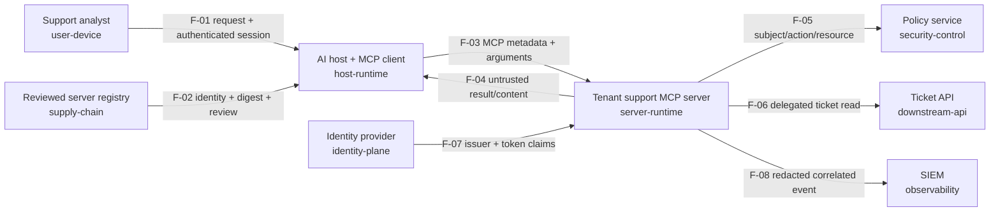

# Threat Modeling MCP and Agent Protocol Systems

Build a versioned, testable threat model for an MCP support platform and learn
to distinguish complete documentation from verified security controls.

## Course thesis and learning objectives

A useful threat model is a maintained engineering artifact that connects the
real system, plausible abuse paths, enforceable invariants, owned controls, and
independent evidence. It is not a diagram, a generic checklist, or a percentage
that claims the system is safe.

After this course, you can:

1. scope an MCP/agent system and inventory components, assets, principals,
   trust zones, data flows, control-plane flows, assumptions, and dependencies;
2. use STRIDE, attack trees, abuse cases, AI/agent taxonomies, and research
   benchmarks as complementary threat-discovery inputs;
3. trace an attack from a supply-chain or content entry point to downstream
   data or action authority;
4. turn each material threat into a deterministic invariant, control owner,
   test requirement, telemetry requirement, runbook, residual-risk statement,
   and review trigger; and
5. measure design traceability separately from verified control evidence.

The central boundary remains: **the model or agent may propose; trusted
application code validates, authorizes, executes, verifies, records, and owns
revocation.** Model text, role names, typed arguments, tool descriptions, and
server identity claims do not establish authority.

## Audience, prerequisites, and scope

Complete [Course 01](../01-mcp-architecture-lifecycle-trust-boundaries/README.md)
first. You should understand the host–client–server architecture, modern and
legacy protocol eras, tools/resources/prompts, and the difference between
capability discovery and authorization.

This course models the tenant support platform. The lab is credential-free and
offline; it does not attack a live endpoint. It evaluates the threat-model
artifact, not the effectiveness of production controls. Courses 03–13 implement
many of the controls; Courses 14–16 test and observe them; Courses 21–22 exercise
containment and recovery.

## The four-question workflow

The OWASP threat-modeling workflow uses four enduring questions:

1. **What are we working on?** Build the system model and state assumptions.
2. **What can go wrong?** Enumerate concrete threats and attack paths.
3. **What are we going to do about it?** Choose avoid, mitigate, transfer, or
   accept, with an accountable owner and enforceable control.
4. **Did we do a good enough job?** Validate the model, execute evidence, review
   residual risk, and set triggers for the next review.

Threat modeling is iterative. A new server, model, tool schema, prompt/resource
source, identity provider, delegated scope, transport, registry, or downstream
effect changes the system and can invalidate earlier assumptions.

## What are we working on?

Start with the system as deployed, not the architecture slide you wish were
true. The lab models eight components and eight directional flows:



For each component, record operator, trust zone, identity, credentials, data,
and permitted authority. For each flow, record direction, protocol, data,
boundary, authenticated identity source, authorization point, audit event,
timeouts, and sensitivity. Bidirectional protocols still need directional
flows: the server request and the untrusted server result have different threat
surfaces.

### Assets and security objectives

The scenario protects:

- ticket confidentiality, integrity, ownership, and availability;
- authenticated user, workload, tenant, audience, and delegated identity;
- host policy and next-action authority;
- reviewed server identity, endpoint, artifact digest, and capability contract;
- tool arguments and results, resource content, prompt text, and model context;
- trace, decision, test, telemetry, runbook, and risk-decision evidence; and
- budgets, latency, downstream quota, and incident containment capability.

State objectives as testable invariants. “Use OAuth” is a technology choice;
“the ticket API accepts only an audience-bound credential whose authenticated
tenant owns the requested ticket” is an invariant.

## What can go wrong?

### STRIDE is a prompt set, not a risk score

Use STRIDE on processes, data stores, entities, and flows:

| Category | MCP/agent question | Course scenario |
| --- | --- | --- |
| Spoofing | Can a user, host, server, issuer, registry, or downstream API be impersonated? | Rogue server uses trusted branding |
| Tampering | Can metadata, schema, arguments, policy, artifacts, results, or traces change? | Narrow tool becomes arbitrary URL tool |
| Repudiation | Can an actor deny a request, decision, approval, or effect? | Events lack principal/server/resource correlation |
| Information disclosure | Can one tenant, tool, prompt, log, or server expose another's data? | Broad server token reads another tenant |
| Denial of service | Can loops, parallel calls, retries, streams, or output size exhaust a budget? | Unbounded tool proposals consume quota |
| Elevation of privilege | Can untrusted content or a delegated component obtain broader authority? | Tool output causes a privileged next action |

STRIDE improves category coverage but does not establish likelihood, impact,
priority, or completeness. Follow it with attack trees, abuse cases, dependency
analysis, and domain-specific sources.

### Attack trees and misuse cases

For the goal “read another tenant's ticket,” branches include:

- accept tenant identity from a model-controlled argument;
- use a host or server credential with a broad audience/scope;
- omit the downstream ownership check;
- compromise policy deployment or identity metadata;
- substitute a server artifact or endpoint after review; or
- use injected content to induce a different tool or resource path.

For each branch, write prerequisites, steps, affected asset, primary enforcement
point, secondary containment, observable evidence, and recovery owner. A prompt
such as “never leak data” is not an enforcement point.

### AI, agent, and MCP-specific discovery inputs

Traditional application threats still apply. Add these system-specific prompts:

- tool-description or schema poisoning, name collision, preference manipulation,
  and capability drift;
- prompt/resource/tool-output injection and data-to-instruction confusion;
- confused deputy, identity propagation loss, delegation widening, and
  cross-tenant resource access;
- parasitic tool chaining, excessive autonomy, unsafe retry, and unbounded loops;
- server/package/registry substitution, dependency compromise, and stale cache;
- model/provider, memory, retrieval, UI extension, and cross-protocol trust
  boundaries; and
- false success/error results, missing effect verification, audit gaps, and
  containment/revocation failure.

Use the OWASP MCP and Agentic threat catalogs, NIST adversarial-ML taxonomy,
MITRE ATLAS, and current MCP research as discovery sources—not as proof that a
particular threat exists or that every listed mitigation works in your system.

## What will we do about it?

Every material threat needs a small but complete record:

| Field | Question it answers |
| --- | --- |
| Stable ID and version | Which threat and model revision are we discussing? |
| Flow and asset | Where can it occur, and what is harmed? |
| Attacker goal/preconditions/path | How could the abuse actually happen? |
| Invariant | What must always remain true? |
| Primary control/enforcement point | Which deterministic component can prevent it? |
| Owner and treatment | Who must mitigate, avoid, transfer, or formally accept it? |
| Test evidence | Can the preventive invariant be demonstrated? |
| Telemetry evidence | Can attempted and successful abuse be distinguished? |
| Runbook evidence | Can responders contain and recover? |
| Residual likelihood/impact | What remains after the evidenced control? |
| Review trigger | Which change invalidates this analysis? |

Controls belong at the component that possesses trustworthy state and authority.
The host can reject an unreviewed capability; the server can validate typed
arguments; the policy service can decide a subject/action/resource tuple; and
the ticket API must enforce resource ownership. No one prompt replaces them.

## Risk analysis without invented precision

The lab uses an explicit 1–5 ordinal likelihood and impact matrix only for
triage. The product maps to low (1–4), medium (5–9), high (10–15), or critical
(16–25). These numbers are not probabilities, loss estimates, or comparable
across organizations without shared definitions.

Document the evidence and rationale for each input. Assess impact across the
dimensions relevant to the system—confidentiality, integrity, availability,
privacy, safety, financial, legal, and operational. Residual likelihood should
not be lowered merely because a control appears in a diagram. The course lab
starts every test, telemetry, and runbook record as unverified.

Formal acceptance of residual risk needs a real governance record with the
accountable approver, rationale, exact scope, model/control versions, issuance,
expiry, and review triggers. A Boolean `approved=true` is not an acceptance
record and does not authorize runtime actions.

## Practical lab: threat model as code

The [lab](lab.py) provides:

- typed components, directional flows, threats, and evidence records;
- all six STRIDE prompts applied to a realistic MCP support platform;
- a linter for dangling references, duplicate IDs, missing boundaries, invalid
  risk inputs, missing owners/triggers, and incomplete evidence types;
- bounded graph traversal that exposes the registry → host → server → ticket API
  supply-chain path;
- an immutable evidence-recording gate that binds a receipt to the model
  version, evidence ID, configured producer, artifact URI/digest, and time; and
- metrics that keep **design traceability** separate from **verified control
  coverage**.

Run it from the repository root:

```bash
python3 -m pip install -e '.[contributor]'
python3 curriculum/beginner/02-threat-modeling-mcp-agent-protocols/lab.py
python3 -m pytest -q tests/test_course_02_threat_modeling.py
```

The baseline intentionally reports 100% design traceability and 0% verified
control coverage. That is the correct result: every threat has planned test,
telemetry, and runbook evidence, but none has a bound receipt from its configured
CI, telemetry-validation, or exercise producer. Three threats remain high after
the proposed control and require explicit treatment rather than a celebratory
score. The offline gate validates receipt structure; a production adapter must
authenticate the producer and verify the referenced artifact before constructing
the receipt. A producer name supplied by an untrusted caller is not identity.

### Metric definitions

| Metric | Numerator | Denominator | Direction and limitation |
| --- | --- | --- | --- |
| Design traceability | Threats with invariant, control, owner, trigger, and all three evidence requirements | All modeled threats | Higher is useful documentation; not control efficacy |
| Verified control coverage | Threats whose test passed, telemetry was verified, and runbook was exercised | All modeled threats | Higher is stronger evidence; still bounded to cases exercised |
| Open high residual threats | Threats rated high/critical after proposed controls | All modeled threats | Lower is preferable; requires risk-owner review |

The tests prove denominator behavior: two successful evidence types are not
enough, a failed test never counts, wrong artifact schemes, stale model versions,
and untrusted producers are rejected, and missing evidence reduces traceability
rather than disappearing from the denominator.

## Common tools and selection guidance

| Tool/method | Strength | Trade-off / use here |
| --- | --- | --- |
| OWASP Threat Dragon 2.x | Collaborative graphical DFDs, threats, mitigations, versionable model | Good workshop UI; review model-file compatibility and repository access |
| OWASP pytm | Python threat-model-as-code, DFD/sequence/report generation | Good for automation; generated catalogs still need system-specific review |
| Microsoft Threat Modeling Tool | STRIDE-per-element design analysis and reporting | Useful in Microsoft-centric teams; tool output is a prompt set, not priority proof |
| Threagile | YAML model-as-code and automated risk/report generation | Strong CI fit; generated risks require contextual validation |
| Mermaid / diagrams.net | Fast architecture communication | No threat engine, traceability schema, or evidence workflow by itself |
| Attack trees and abuse cases | Goal-oriented multi-step paths and assumptions | Manual quality depends on diverse reviewers and realistic attacker capability |
| OWASP/NIST/MITRE catalogs | Broad, maintained discovery vocabulary | Tailor to the actual flows; do not copy every entry into a backlog |
| MCP security benchmarks | Executable attack cases across parts of the tool-use pipeline | Research scope and harness results do not equal production risk likelihood |

Choose the simplest tool that teams will update and that can preserve stable
IDs, diffs, ownership, evidence locators, and review history. Export formats for
threat-model tools continue to evolve; test round-trips before standardizing an
enterprise workflow.

## Did we do a good enough job?

### Claim-to-proof map

| Claim | Proof in this course |
| --- | --- |
| The system model identifies every modeled boundary | Cross-zone flow linter and eight-flow fixture |
| STRIDE categories are represented | Exact category-set test |
| Supply-chain compromise can reach ticket data | Bounded graph path assertion |
| Identity is not model-controlled | Authenticated session source and tenant invariant test |
| Documentation is not verification | Baseline 100% traceability / 0% verified controls |
| Partial, stale, forged, or failed evidence cannot inflate metrics | Receipt-binding and evidence-status tests |
| Model references stay reviewable | Dangling evidence and missing-boundary tests |

### Review checklist

- Does the diagram match the deployed topology and both data/control planes?
- Are user, workload, server, model, tenant, delegated identity, and resource
  owner distinct where the system distinguishes them?
- Are all mutable artifacts and untrusted content sources represented?
- Does every threat identify an actual flow, asset, path, enforcement owner,
  evidence, residual risk, and review trigger?
- Can telemetry distinguish a blocked attempt from a forbidden outcome?
- Are risk-score inputs defined, evidenced, and reviewed by accountable owners?
- Do tests exercise negative, tenant, schema, identity, concurrency, retry,
  injection, dependency, and recovery cases relevant to the threat?
- Were the model and evidence updated after the last architecture change?

## Failure modes and corrections

| Failure | Impact | Correction |
| --- | --- | --- |
| Model only the happy-path API | Misses registry, identity, update, telemetry, and revocation attacks | Include control-plane and lifecycle flows |
| Treat the model/agent as the authenticated principal | Allows prompt-controlled identity or scope | Derive identity/tenant from authenticated application state |
| Copy a taxonomy wholesale | Large backlog without system relevance | Bind each threat to a real flow, asset, and abuse path |
| Call non-empty fields “100% secure” | Misstates documentation as efficacy | Separate traceability from executed evidence |
| Lower residual risk for a planned control | Hides unimplemented or broken mitigation | Require passed test, verified signal, and exercised response evidence |
| Score risk with unexplained numbers | Creates false precision | Define ordinal scales, rationale, uncertainty, and decision owner |
| Assign “logging” as a mitigation | Does not prevent or make response actionable | Specify event schema, correlation, admission, retention, detection, and runbook |
| Never revisit the model | Assumptions and topology silently drift | Set change-based and time-based review triggers |

## Production operating model

Store the model near architecture and code, but restrict sensitive diagrams and
attack details by need-to-know. Use stable threat IDs in design reviews, tests,
detections, incidents, exceptions, and changes. Have development, architecture,
security, identity, platform, SRE, privacy, and incident-response owners review
the parts they operate.

Automate structural linting and evidence-link checks in CI. Do not automatically
accept risk or block releases solely from a generated score. Release policy
should act on explicit criteria such as unresolved critical threats, missing
required evidence, expired exceptions, or an unreviewed material architecture
change. Preserve redacted evidence; never store access tokens, unnecessary
customer content, or hidden model reasoning in the threat model.

## State of practice and research frontier

Established practice combines system decomposition/DFDs, STRIDE or another
prompt set, attack trees/abuse cases, owned mitigations, risk treatment, review,
and validation. Current AI/agent practice adds untrusted semantic content,
dynamic capability discovery, tool chains, delegation, memory/retrieval, model
providers, and software/registry provenance as explicit boundaries.

Recent MCP research proposes broader threat taxonomies, layer-aligned defense
placement, and executable benchmark suites. These are valuable discovery and
evaluation inputs, but taxonomy counts and benchmark success rates depend on
their definitions, platforms, models, attacks, and harnesses. They do not prove
your system is complete or assign its residual risk. Machine-readable exchange
formats and consistently validated authorization semantics across MCP, A2A, and
agent runtimes remain evolving.

## Exercises

1. Add a `ticket.update` flow. Model approval binding, idempotency, uncertain
   outcomes, effect verification, audit, rollback, and replay threats.
2. Add a local stdio server deployment. Extend the DFD with package, executable,
   environment, filesystem, process, and egress boundaries.
3. Add a second MCP server and an A2A delegate. Find cross-server paths and show
   where identity, scope, provenance, or policy context can be lost.
4. Record concrete test, telemetry, and runbook evidence for one threat. Explain
   why the other five remain unverified and why this is not a release decision.
5. Import the scenario into Threat Dragon or pytm. Compare preserved IDs,
   boundaries, threat fields, evidence links, and round-trip loss.

## Review questions

1. Why does full STRIDE coverage not mean the threat model is complete?
2. Which boundary must enforce ownership for a cross-tenant ticket read?
3. Why is a passed test insufficient without verified telemetry and response?
4. What evidence justifies lowering residual likelihood?
5. Which change triggers a new review when a tool schema gains a URL argument?
6. Why must a benchmark result remain separate from production risk acceptance?

## Primary and authoritative references

- [OWASP Threat Modeling Cheat Sheet](https://cheatsheetseries.owasp.org/cheatsheets/Threat_Modeling_Cheat_Sheet.html)
- [NIST SP 800-154: Data-Centric System Threat Modeling](https://csrc.nist.gov/pubs/sp/800/154/final)
- [Microsoft Threat Modeling Tool and STRIDE-per-element](https://learn.microsoft.com/en-us/azure/security/develop/threat-modeling-tool)
- [OWASP Threat Dragon](https://github.com/OWASP/threat-dragon)
- [OWASP pytm](https://github.com/OWASP/pytm)
- [Threagile threat-model-as-code toolkit](https://github.com/Threagile/threagile)
- [MCP 2026-07-28 architecture](https://modelcontextprotocol.io/specification/2026-07-28/architecture)
- [MCP security best practices](https://modelcontextprotocol.io/docs/2026-07-28/tutorials/security/security_best_practices)
- [OWASP MCP Top 10](https://owasp.org/www-project-mcp-top-10/)
- [OWASP Agentic AI — Threats and Mitigations](https://genai.owasp.org/resource/agentic-ai-threats-and-mitigations/)
- [NIST AI 100-2e2025: Adversarial ML Taxonomy](https://csrc.nist.gov/pubs/ai/100/2/e2025/final)
- [MITRE ATLAS](https://atlas.mitre.org/)

### Current MCP research inputs

- [MCP-38 threat taxonomy](https://doi.org/10.48550/arXiv.2603.18063)
- [MCP-DPT defense-placement taxonomy](https://doi.org/10.48550/arXiv.2604.07551)
- [MCPSecBench](https://doi.org/10.48550/arXiv.2508.13220)
- [MCP Security Bench, ICLR 2026](https://openreview.net/forum?id=irxxkFMrry)
