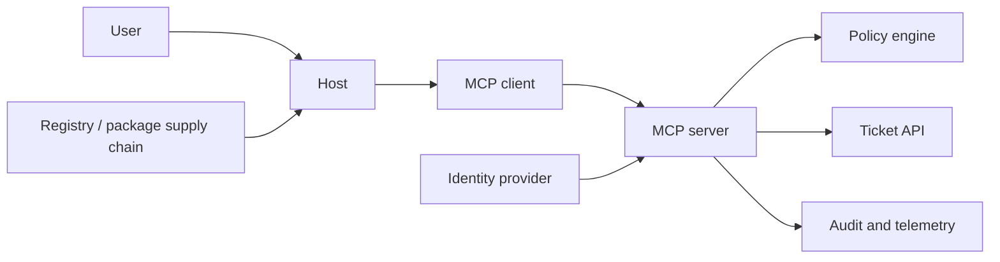

# Threat Modeling MCP and Agent Protocol Systems

## Learning objectives

Build a data-flow diagram for an MCP integration; name assets, principals,
boundaries, and assumptions; use STRIDE, attack trees, misuse cases, and
security invariants; and turn every material threat into a control, executable
test, telemetry signal, incident action, and accepted residual-risk decision.

## Why this topic matters

An MCP server is not merely an API wrapper. It may receive user context, expose
model-visible metadata, invoke privileged systems, and join a software supply
chain. A checklist that says “use OAuth” misses the key question: *which
principal is allowed to perform which action on which resource, through which
component, and what happens if that component is compromised?*

This workshop models the tenant support server introduced in Course 01. Its
assets include ticket data, user/agent identity, tokens, server artifact and
manifest, tool/resource/prompt metadata, policies, traces, registry entries,
and downstream APIs. Its success criterion is a reviewable threat model where
each high-risk path has an owner and a verification mechanism.

## Scope, prerequisites, and boundaries

Read [Course 01](../01-mcp-architecture-lifecycle-trust-boundaries/README.md)
first. This lesson models systems; it does not claim that threat modeling alone
implements a control. The lab is offline and represents adversarial behavior as
structured data—no endpoint, credential, package, or destructive command is
used.

## Mental model and data flow

Ask, at every arrow: what crosses it; who controls the sender; what authenticates
the receiver; which authority is exercised; what validates untrusted input; what
is logged; and which component can deny, revoke, or contain. Add control-plane
flows too: server onboarding, artifact update, capability caching, token issue,
policy deployment, and incident revocation are often the real attack paths.

## Method

1. Define the scenario and security objectives. For this system: one tenant may
   read only its tickets; no discovered capability grants itself permission;
   server artifacts must be reviewable; side effects require an explicit policy
   decision; and compromise must be detectable and containable.
2. Inventory assets and principals. Do not collapse “agent” into “user”: a user,
   host, client, server, downstream API, identity provider, registry, and policy
   engine can each have different identity and authority.
3. Draw trust boundaries and data/control flows, including local stdio process
   launch or remote transport, not only business APIs.
4. Enumerate STRIDE threats, then challenge them with attack trees and misuse
   cases. STRIDE makes categories visible; it does not rank risk automatically.
5. State an invariant in testable language. Map it to prevention, detection,
   response, ownership, and residual risk.

## Worked threat model

| Threat | Attack path | Invariant | Control | Test / telemetry / response |
| --- | --- | --- | --- | --- |
| Rogue server impersonation | Registry → host → client | Only reviewed identity and digest connect | Pin digest; verified registry allow-list | Deny unknown digest; log identity/digest; revoke and trace |
| Broad capability drift | Server → client | Tool schema remains narrow and approved | Capability diff plus host risk gate | Reject arbitrary URL/schema expansion; log diff; disable integration |
| Confused deputy | User → server → ticket API | Caller, tenant, audience, action, and resource agree | Delegated narrow credential + resource policy | Cross-tenant denial; log binding; revoke credential |
| Tool-output injection | Resource/tool output → host | Content cannot authorize a next action | Label untrusted content; independent authorization | Poisoned-output case; log risk; quarantine if malicious |

The [lab](lab.py) makes this mapping executable. It measures completeness, not
real-world safety: a 100% mapping score means every recorded threat has an
invariant, control, test, telemetry, and incident action. It does not mean the
controls are correctly deployed or attacks are impossible.

## Attack trees and abuse cases

For “read another tenant's ticket,” an attacker can obtain a broad token, trick
the model into selecting an over-broad tool, exploit a server that trusts a
client-supplied tenant, or alter the policy/registry supply chain. Each branch
needs a different control. A common anti-pattern is to add a prompt such as
“never leak data”; that has no enforcement power at the downstream resource
boundary. Courses 06–08 implement identity, policy, and delegation controls;
Courses 12–13 secure the release path.

## Evaluation and failure modes

Review quality with these questions:

- Does every external entity and mutable artifact appear in the diagram?
- Can an attacker influence tool descriptions, prompt text, resource content,
  schema, server identity, destination, or downstream credentials?
- Does every high-risk threat name a test and telemetry signal, rather than only
  a preventive control?
- Is residual risk explicitly accepted by a named owner with a review trigger?

Failure modes include modeling only the happy path, omitting the host/client
boundary, treating the model as a security principal, forgetting supply-chain
updates, and assigning “logging” without trace correlation or response action.
Re-run the model after a capability, identity provider, server artifact,
downstream API, or deployment topology changes.

## Production considerations

Keep a versioned threat model near architecture and deployment changes. Link
threat IDs to tests, detections, runbooks, control owners, and risk exceptions.
Capture assumptions—such as registry integrity or tenant identifier provenance—
because breached assumptions invalidate a model. Use redacted traces and retain
forensic integrity; do not put tokens, customer content, or model hidden
reasoning in the worksheet.

Established practice combines DFDs, STRIDE, abuse cases, and security design
reviews. Emerging practice models agent delegation and untrusted model context
as first-class flows. Open problems include shared, machine-readable threat
models for cross-protocol agent ecosystems; a diagram never substitutes for
runtime testing and policy enforcement.

## Exercises and review questions

1. Add an external knowledge resource to the diagram. Model URI traversal,
   stale content, classification, and prompt injection threats.
2. Add a proposed `ticket.update` tool. Define its approval, idempotency,
   authorization, telemetry, and rollback requirements.
3. Write an attack tree for a compromised local stdio server, including package,
   environment, filesystem, process, and network branches.
4. Which threat-model artifact lets an incident responder identify the affected
   server artifact and traces? Why is a tool description insufficient?

## References

- [NIST SP 800-154: Data-Centric System Threat Modeling](https://csrc.nist.gov/pubs/sp/800/154/final)
- [NIST SP 800-218: Secure Software Development Framework](https://csrc.nist.gov/pubs/sp/800/218/final)
- [MCP architecture](https://modelcontextprotocol.io/specification/latest/architecture)
- [OWASP Agentic Security Initiative](https://genai.owasp.org/initiatives/agentic-security-initiative/)
