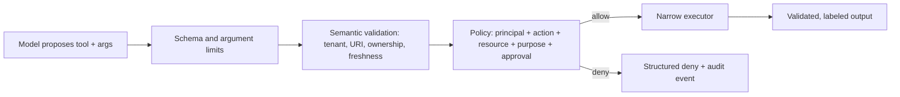

# Secure Tool, Resource, and Prompt Interface Design

## Learning objectives

Design narrow MCP tools with typed schemas and semantic validation; distinguish
read and proposed-write operations; scope resources by URI, tenant, ownership,
freshness, and classification; and treat server-provided prompts and all
untrusted MCP content as configuration or data—not as instructions with
authority.

## Why this topic matters

The following interfaces look convenient but collapse too much authority into
one model-selected string:

```text
admin_api(command: str)
fetch_url(url: str)
run_shell(command: str)
read_file(path: str)
```

They invite injection, SSRF, traversal, accidental destructive action, and
confused-deputy behavior because neither a model nor a prose tool description
can prove caller identity, tenant, resource ownership, or intended purpose. A
secure interface makes the safe action easy to express and dangerous actions
impossible or separately approved.

## Scenario, prerequisites, and success criterion

The tenant support server may read a ticket, draft a reply, read a published
knowledge resource, and offer a versioned summary prompt. It may not execute a
shell command, fetch an arbitrary URL, read an arbitrary file, or send a reply
without an approval decision. Read [Course 01](../01-mcp-architecture-lifecycle-trust-boundaries/README.md)
and [Course 02](../02-threat-modeling-mcp-agent-protocols/README.md) first.

Success means the interface has a narrow machine-checkable contract, a semantic
authorization check at the enforcement point, an audit-friendly action
fingerprint, and an attack test that fails safely. This course does not teach
OAuth token issuance—that is Course 06.

## Mental model: three surfaces, three risks

| Surface | What it is | Core risk | Security boundary |
| --- | --- | --- | --- |
| Tool | Model-invokable operation | Excess authority / side effects | Typed arguments plus policy decision |
| Resource | URI-addressed context | Traversal, cross-tenant disclosure, stale/mislabeled data | URI, owner, tenant, classification, freshness validation |
| Prompt | Server-provided template | Injection or hidden instruction | Version allow-list and independent authorization |

All three can contain untrusted text. “The server provided it” says who sent
data, not whether it can instruct a model, authorize a tool call, or alter a
tenant boundary.

## Implementation patterns

Refactor the broad interfaces into intent-specific contracts:

| Unsafe form | Narrow replacement | Required invariant |
| --- | --- | --- |
| `run_shell(command)` | No general shell tool; dedicated operation if unavoidable | Fixed executable, fixed argument grammar, no shell parsing |
| `fetch_url(url)` | `knowledge.get_article(article_id)` | Server maps ID to allow-listed destination |
| `read_file(path)` | `ticket.read(ticket_id)` | Caller tenant owns resource; no path is accepted |
| `admin_api(command)` | `ticket.draft_reply(ticket_id, body)` | Typed, bounded action; approval before side effect |

Schema validation answers whether data has a valid *shape*. Semantic validation
answers whether the ticket exists, belongs to the tenant, is appropriate for
the purpose, and is permitted now. Authorization must use authenticated context
that the model cannot replace with an argument.

For proposed writes, compute an action fingerprint from a normalized action
and stable resource identity, bind approval to that fingerprint and a short
time window, make repeats idempotent where possible, and log the decision.
Never use the raw free-form prompt as the authorization record.

## Architecture and decision flow



The executor must not become a back door around the policy. A URL must be
validated after resolution and redirects in Course 10; a prompt must never
change the policy input. Output should be size-limited, classified, and treated
as untrusted again when it reaches the host/model.

## Normal → vulnerable → attack → defense → retest

Run `python3 lab.py`.

1. The vulnerable baseline accepts `run_shell({command: "cat .env"})` because
   it has no contract or authorization decision.
2. The attack uses an unapproved tool, cross-tenant ticket ID, extra `debug`
   field, traversal URI, and injection-bearing prompt text.
3. The traceable controls reject each attempt with a specific reason.
4. The retest permits only an exactly shaped, tenant-scoped `ticket.read`; a
   draft reply also requires an independent approval input.

The lab is a deterministic policy model. Course 04 puts the same contracts into
a real MCP server; Courses 07 and 08 replace its local policy context with
authenticated, delegated authority.

## Evaluation / verification

For each interface, test valid input, malformed input, extra properties,
cross-tenant resource, stale/unknown identifier, policy denial, repeat action,
and an output/prompt injection variant. Measure false allows, false denies,
schema rejection rate, approval mismatch rate, and time from policy change to
enforcement. A high schema-pass rate does not demonstrate semantic safety.

## Failure modes and production considerations

Do not put a general-purpose interpreter behind a friendly name; do not encode
tenant in a model-controlled argument alone; do not make “read-only” claims
without verifying downstream effects; and do not trust descriptions, prompts,
or tool results merely because they are protocol-valid. Pin prompt templates to
reviewed versions, display provenance/owner to operators, and make freshness,
classification, and revocation metadata explicit for resources.

In production, use generated schemas where useful, but cap payload sizes and
depth; normalize IDs before authorization; use structured errors that do not
leak secrets; record action fingerprints and policy version; require explicit
approval for high-impact actions; and make denial the default. SDKs can expose
schemas but cannot decide business authority. Established practice is typed
least-privilege interfaces; emerging practice is risk-adaptive approval and
content provenance; open problems include dependable semantic intent matching.

## Exercises and review questions

1. Design `invoice.get(invoice_id)` and list validation beyond a JSON schema.
2. Specify a safe alternative to `fetch_url(url)` for a documentation feature.
3. Add expiry and actor identity to the draft approval fingerprint.
4. Why can a prompt allow-list reduce risk but never authorize a side effect?

## References

- [MCP specification — tools](https://modelcontextprotocol.io/specification/latest/server/tools)
- [MCP specification — resources](https://modelcontextprotocol.io/specification/latest/server/resources)
- [MCP specification — prompts](https://modelcontextprotocol.io/specification/latest/server/prompts)
- [MCP security best practices](https://modelcontextprotocol.io/docs/tutorials/security/security_best_practices)
