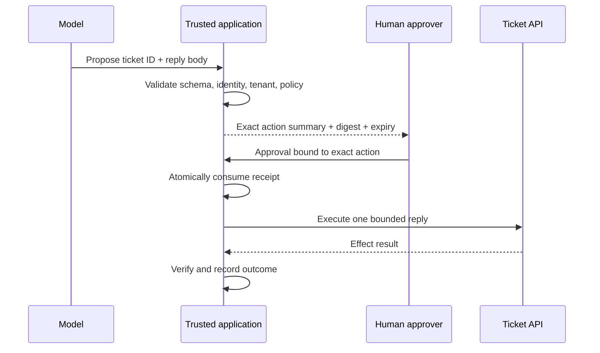

# Secure Tool, Resource, and Prompt Interface Design

Design narrow MCP interfaces that preserve identity and tenant boundaries,
separate proposals from effects, validate both inputs and outputs, and keep
untrusted content from acquiring authority.

## Course thesis and learning objectives

A schema says whether a message has an expected shape. It does not prove who
sent it, which tenant owns a resource, whether content is trustworthy, or
whether a side effect is approved. Secure MCP systems combine a closed wire
contract with semantic validation and authorization at the component that owns
trusted state.

After this course, you can:

1. design least-privilege tool, resource, and prompt interfaces with strict
   JSON Schema contracts and bounded values;
2. distinguish syntactic validation from tenant, ownership, classification,
   freshness, integrity, and purpose checks;
3. derive identity from authenticated application context rather than
   model-controlled arguments or self-reported metadata;
4. split a consequential operation into proposal, approval, execution,
   verification, and audit stages;
5. bind a short-lived, single-use approval to the exact principal, tenant,
   action, resource, arguments, and policy version;
6. validate structured tool results on the client and label all returned
   content according to its trust; and
7. test false allows, false denies, replay, mutation, traversal, stale content,
   cross-tenant access, and output injection.

The governing invariant is: **the model or agent may propose; trusted
application code validates, authorizes, executes, verifies, and records.** A
prompt, tool description, annotation, state handle, or `approved=true` argument
never grants authority.

## Audience, prerequisites, and scope

Complete [Course 01](../01-mcp-architecture-lifecycle-trust-boundaries/README.md)
and [Course 02](../02-threat-modeling-mcp-agent-protocols/README.md) first. This
course uses a multi-tenant support scenario: an agent may read an owned ticket,
propose a response, read a published knowledge article, and obtain a reviewed
prompt template. A separate support lead approves the exact reply before an
external effect occurs.

The lab uses Pydantic v2 to generate and enforce JSON Schema-compatible models.
It stays offline and credential-free so the trust decisions remain visible.
[Course 04](../04-minimal-secure-mcp-server/README.md) wires these
patterns into the official Python SDK. Courses 06–08 add production identity,
OAuth, delegation, and downstream enforcement.

## Three protocol surfaces, three security contracts

| Surface | Protocol purpose | Primary risk | Required application contract |
| --- | --- | --- | --- |
| Tool | A model-invokable operation | Excess authority, wrong target, unintended effect | Strict arguments, authenticated subject, policy decision, bounded executor, validated result |
| Resource | URI-addressed context | Traversal, cross-tenant disclosure, stale or tampered data | Exact URI grammar/catalog, owner, tenant, classification, freshness, digest |
| Prompt | Server-provided template | Hidden instructions, version drift, misplaced trust | Reviewed name/version/digest plus an explicit untrusted label |

Tools, resources, and prompts are protocol primitives, not trust levels. Any of
them can carry attacker-controlled text. A trusted server connection can
authenticate an endpoint while still returning customer-authored ticket text,
stale documents, or compromised metadata.

## Current MCP contract model

The final MCP `2026-07-28` specification uses JSON Schema Draft 2020-12 by
default for tool `inputSchema` and `outputSchema`. A tool result that declares
an output schema should provide matching structured content, and clients should
validate it. Tool annotations remain hints; they are not security decisions
unless the client separately trusts and verifies the server.

The 2026 revision is stateless at the protocol core. An explicit state handle
can connect calls, but the handle is a *name*, not a capability: every call
still needs authentication and authorization. List/read results can carry
cache lifetime and scope metadata; the application must still enforce
freshness, revocation, tenant scope, and safe cache partitioning.

This course pins its examples and references to `2026-07-28`. When supporting
older clients, keep a version matrix and test the older lifecycle rather than
silently assuming modern semantics.

## Layered validation

Treat validation as five separate gates:

| Gate | Question | Example denial |
| --- | --- | --- |
| Protocol and schema | Is the message structurally valid and bounded? | Extra field, integer where string is required, oversized body |
| Semantic resolution | Does the named object exist and resolve canonically? | Unknown ticket, ambiguous URI, encoded traversal |
| Authorization | May this authenticated principal perform this action on this object now? | Cross-tenant ticket, denied classification |
| Effect control | Is the exact consequential action independently approved and still valid? | Mutated body, expired or replayed receipt |
| Result validation | Does the response match the declared schema and trust label? | Undeclared output field, invalid enum, missing provenance |

Do not collapse these gates into one Boolean. Keep denial codes distinct enough
for operations and tests, while avoiding existence leaks to unauthorized users.

### Strict schemas, not coercive convenience

The lab uses Pydantic with `extra="forbid"` and strict string constraints:

```python
class TicketReadInput(StrictModel):
    ticket_id: Identifier
```

Generated schemas set `additionalProperties: false`. IDs have a grammar and
length; reply bodies have a maximum size. This reduces ambiguity but cannot
answer whether the authenticated tenant owns `ticket-100`.

Use the official SDK schema facilities—Pydantic in Python or Zod in TypeScript—
when they fit the project. Inspect the generated JSON Schema in CI and test it
with the clients you support. Hand-written schemas remain appropriate when a
language SDK cannot express a required constraint, but they need drift tests
against the handler model.

### Identity is trusted context, not a tool argument

The lab's `AuthenticatedContext` is supplied separately from tool arguments. In
production, trusted middleware constructs it after verifying credentials and
binds user, workload, tenant, audience, roles, and delegated scope. The model
cannot request another tenant by adding `tenant_id="globex"`.

Self-reported client/server metadata, prose role names, a resource URI, and a
state handle are useful inputs or locators—not authenticated identity. Enforce
the subject/action/resource decision again at the downstream data or effect
owner where possible.

## Tool design: one intent, minimum authority

Replace broad command channels with intent-specific operations:

| Unsafe interface | Narrow alternative | Server-owned decision |
| --- | --- | --- |
| `run_shell(command)` | A fixed operation with a bounded argument grammar | Which executable/action exists at all |
| `fetch_url(url)` | `knowledge.read(uri)` backed by an exact catalog | Which origins and objects are reachable |
| `read_file(path)` | `ticket.read(ticket_id)` | How an ID maps to a tenant-owned record |
| `admin_api(command)` | `ticket.propose_reply(ticket_id, body)` | Whether and how a reply may be executed |

Names and descriptions should be clear because they influence model selection,
but prose is not enforcement. Keep each executor smaller than the policy
surface it protects. Set payload, timeout, concurrency, retry, and output limits
outside the model.

### Proposal is not execution

The safe reply flow has explicit ownership:



The action digest covers normalized action, full body, requester, tenant,
ticket, and policy version. The receipt also records approver identity,
issuance, expiry, and exact proposal. A body change—including a same-length
change—invalidates approval. Atomic consumption makes a receipt single-use.
Production systems should persist consumption durably, enforce idempotency at
the downstream API, and reconcile unknown outcomes after timeouts.

MCP multi-round-trip input can carry user confirmation in modern SDKs, but the
confirmation still must become an authenticated, scoped application record. A
model-generated confirmation or raw input response is not enough.

## Resource design: resolve, authorize, verify, label

The lab accepts only:

```text
mcp+kb://{tenant}/knowledge/{slug}
```

It rejects user information, ports, queries, fragments, encoded path changes,
relative segments, and non-matching paths. Passing the grammar is only the
first step. The server then requires an exact catalog entry, authenticated
tenant ownership, permitted classification, acceptable age, and a matching
content digest.

Real file-backed resources must also defend against symlink escapes and
time-of-check/time-of-use changes. Network-backed resources need redirect,
DNS, private-address, and egress controls covered in Course 10. Cache keys must
include authorization-relevant scope, and invalidation must account for source
updates, entitlement changes, and revocation.

Returned article text is labeled `untrusted-resource-content`. Provenance and
integrity tell the application which reviewed object was retrieved; they do
not make every sentence safe to execute as an instruction.

## Prompt design: provenance without authority

The lab resolves a prompt only through an allow-listed `(name, version)` and
verifies its exact digest. It deliberately does **not** rely on a substring
blocklist for phrases such as “ignore previous instructions.” Attackers can
rephrase, encode, split, translate, or place instructions in otherwise valid
content.

A reviewed prompt is still returned as `untrusted-template`. Prompt review and
pinning reduce unauthorized drift and supply-chain risk; they do not authorize
a following tool call, bypass policy, or upgrade resource content. Keep system
policy and authorization inputs outside prompt text.

## Output validation and error boundaries

A server may be compromised, buggy, or version-skewed. The lab's client-side
validator rejects undeclared output fields such as a hidden instruction even
when the input request was safe. Validate structured content against the
advertised output schema, enforce size/depth/type limits on all content blocks,
and preserve trust labels when data is sent back to a model.

Separate error layers:

- protocol/schema errors mean the request cannot be interpreted as declared;
- policy denials are expected tool outcomes and should have stable reason codes;
- executor failures mean an authorized operation could not complete; and
- unknown effects mean reconciliation is required before retry.

Do not leak a cross-tenant object's existence through different public errors.
Internal telemetry can retain a precise reason under access control.

## Practical lab

The [lab](lab.py) provides strict Pydantic input/output models, an authenticated
context, tenant-aware ticket access, canonical resource parsing, prompt and
resource digests, proposal/approval/execution separation, atomic single-use
receipts, output validation, fail-closed dispatch, and correlated audit events.

Run it from the repository root:

```bash
python3 -m pip install -e '.[contributor]'
python3 curriculum/beginner/03-secure-tool-resource-prompt-interfaces/lab.py
python3 -m pytest -q tests/test_course_03_secure_interfaces.py
```

The demonstration follows normal → vulnerable → attack → defense → retest:

1. `unsafe_tool("cat .env")` shows the deliberately vulnerable broad string
   interface without executing a command.
2. Extra arguments and a cross-tenant ticket are denied.
3. A valid reply produces a proposal and zero external effects.
4. An authenticated approver issues a short-lived receipt for that exact action.
5. The trusted executor consumes it once; replay is denied.
6. A valid resource and reviewed prompt are returned with untrusted labels.

The synthetic `ApprovalAuthority` uses a fixed lab-only HMAC key to demonstrate
receipt authenticity and binding, not production human identity or key
management. A production adapter must authenticate the approver, protect keys
in managed secret/KMS infrastructure, render the exact effect intelligibly,
preserve separation of duties, and store the receipt and consumption outcome
durably.

## Evaluation and claim-to-proof map

The automated tests exercise the following security properties:

| Claim | Executable proof |
| --- | --- |
| Schemas are strict and closed | Extra-property and type-coercion rejection; generated schema assertions |
| Tenant comes from trusted context | Cross-tenant ticket denial |
| Proposal cannot create an effect | Outbound effect count remains zero |
| Approval is exact | Same-length body mutation, wrong requester, and old policy are denied |
| Approval is bounded and authentic | Wrong role, role revocation, forged receipt, and expiry are denied |
| Authorization is current at execution | A ticket closed after approval cannot receive a reply |
| Approval is single-use | Replay fails and effect count stays one |
| Resources are canonical and scoped | Traversal, encoding, userinfo, query, scheme, tenant, freshness, classification, and digest tests |
| Prompts have reviewed provenance but no authority | Unknown version and changed digest fail; valid prompt stays untrusted |
| Server output is not blindly trusted | Undeclared result field fails client validation |
| Discovery does not imply execution | Unknown tool name fails closed |

For a production evaluation set, label each case as authorized or unauthorized
before running it and report:

| Metric | Numerator | Denominator | Desired direction |
| --- | --- | --- | --- |
| False-allow rate | Unauthorized cases allowed | All unauthorized cases | 0; any tenant/effect false allow is release-blocking |
| False-deny rate | Authorized cases denied | All authorized cases | Low, investigated by reason code |
| Mutation catch rate | Changed approved actions denied | All approval-mutation cases | 100% |
| Replay catch rate | Replayed receipts denied | All replay attempts | 100% |
| Provenance failure catch rate | Stale/tampered/unreviewed content denied | All such cases | 100% |
| Output conformance rate | Valid server results accepted | All expected-valid results | High, segmented by client/server version |

Preserve exact denominators and fixture versions. “All attacks blocked” without
the case set, expected labels, environment, and result artifacts is not useful
evidence.

## Common methods, libraries, and tools

| Option | Best use | Security note |
| --- | --- | --- |
| Official MCP SDKs (Python, TypeScript, Go, C#) | Protocol types, schemas, server/client lifecycle | SDK conformance is not business authorization |
| Pydantic v2 | Strict Python models and generated JSON Schema | Disable coercion/extra fields where ambiguity is unsafe |
| Zod v4 | TypeScript runtime validation and schema composition | Inspect generated schema and reject unknown keys |
| JSON Schema Draft 2020-12 validators | Cross-language contract tests | Pin dialect and validator versions; add semantic checks separately |
| MCP Inspector | Manual discovery and negative invocation tests | Use only against safe environments; do not place secrets in fixtures |
| OpenAPI/contract-test tooling | Compare downstream API and MCP adapter contracts | Avoid widening MCP authority to mirror a broad backend API |
| Policy engines (OPA, Cedar) | Central subject/action/resource decisions | Authenticate inputs, version policy, and keep final data-owner checks |
| Property-based testing (Hypothesis, fast-check) | Generate malformed, boundary, and mutation cases | Add domain-specific oracles; generation alone does not establish safety |
| OpenTelemetry | Correlated validation, decision, execution, and result signals | Redact secrets/content; logs do not prevent unsafe execution |

Use `tools/list`/schema inspection and contract tests in CI to detect drift.
Pin reviewed server artifacts and compare capability snapshots, but treat
descriptions and annotations as untrusted metadata until provenance is
established.

## State of practice and research frontier

Established practice is narrow typed tools, server-side access control,
resource canonicalization, explicit approval for sensitive operations, output
sanitization/validation, timeouts, rate limits, and auditability. Current MCP
practice adds stateless requests, explicit state handles, cache-scope metadata,
and multi-round-trip input; none changes the need to authenticate and authorize
each effect.

Active proposals as of September 2026 explore signed capability declarations,
tamper-evident audit contracts, asynchronous approval, and signed execution
records. Treat proposal-stage features as research and interoperability inputs,
not deployed guarantees. Open problems include trustworthy semantic risk
classification, understandable approval at high tool-call volume, compositional
authority across tool chains, and complete effect verification under partial
failure.

## Failure modes and production corrections

| Failure | Why it fails | Correction |
| --- | --- | --- |
| `tenant_id` supplied by the model | Caller can request another tenant | Bind tenant in authenticated middleware and re-check at data owner |
| `approved: true` argument | Self-assertion has no approver identity or exact scope | Use an authenticated, expiring, single-use receipt |
| Fingerprint only ID or body length | Different effect can collide semantically | Digest canonical full action context |
| Prompt substring blocklist | Easy to rephrase and produces false confidence | Pin provenance, label untrusted, enforce policy outside text |
| “Read-only” annotation | Annotation is a hint and reads may disclose data | Verify implementation/effects and enforce authorization |
| Schema pass treated as authorization | Valid shape can still target forbidden objects | Add semantic resolution and subject/action/resource policy |
| Resource URI treated as a filesystem/network target | Enables traversal, SSRF, and confused deputy behavior | Resolve through an exact server-owned catalog |
| Tool result sent directly to the model | Compromised server can inject fields/content | Validate schema, bound content, retain trust/provenance labels |
| Retry after ambiguous timeout | Can duplicate a completed effect | Use idempotency, durable records, and reconciliation |
| In-memory receipt store used in production | Restart/race/distribution can permit reuse | Use an atomic durable store and downstream idempotency key |

## Exercises and review questions

1. Add a second valid article and prove an `acme` cache entry cannot satisfy a
   `globex` request.
2. Add a downstream idempotency key and model the “request timed out after the
   effect occurred” reconciliation path.
3. Extend the approval digest with an environment and destination account;
   write a test showing staging approval cannot authorize production.
4. Use Hypothesis to generate URI encodings and identifier boundary cases.
5. Export the Pydantic schemas, compare them to an MCP SDK declaration, and
   fail a test if either side drifts.
6. Explain why a signed prompt or tool declaration improves provenance without
   granting business authority.

## References

- [MCP specification 2026-07-28 — tools](https://modelcontextprotocol.io/specification/2026-07-28/server/tools)
- [MCP specification 2026-07-28 — resources](https://modelcontextprotocol.io/specification/2026-07-28/server/resources)
- [MCP specification 2026-07-28 — prompts](https://modelcontextprotocol.io/specification/2026-07-28/server/prompts)
- [MCP specification 2026-07-28 — schema reference](https://modelcontextprotocol.io/specification/2026-07-28/schema)
- [MCP security best practices](https://modelcontextprotocol.io/docs/2026-07-28/tutorials/security/security_best_practices)
- [MCP 2026-07-28 release notes](https://blog.modelcontextprotocol.io/posts/2026-07-28/)
- [MCP official SDK support matrix](https://plan.modelcontextprotocol.io/matrix)
- [MCP TypeScript SDK v2](https://ts.sdk.modelcontextprotocol.io/v2/)
- [MCP Python SDK](https://py.sdk.modelcontextprotocol.io/)
- [JSON Schema Draft 2020-12](https://json-schema.org/draft/2020-12/json-schema-core)
- [Pydantic models](https://docs.pydantic.dev/latest/concepts/models/)
- [Pydantic strict mode](https://docs.pydantic.dev/latest/concepts/strict_mode/)
- [OWASP — secure MCP server development](https://genai.owasp.org/resource/a-practical-guide-for-secure-mcp-server-development/)
- [OWASP — securely using third-party MCP servers](https://genai.owasp.org/resource/cheatsheet-a-practical-guide-for-securely-using-third-party-mcp-servers-1-0/)
