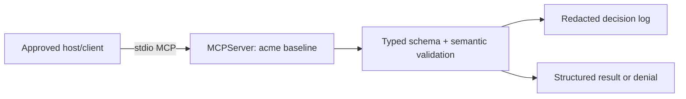

# Building a Minimal Secure MCP Server

## Learning objectives

Build and inspect a real MCP server with the official Python SDK; expose a
resource, prompt, two read-only tools, and a proposed side-effect tool; use
typed interfaces, stable IDs, structured denials, approval binding, and
security-relevant logs; and explain which controls this baseline deliberately
defers to later identity, policy, isolation, and supply-chain courses.

## Scenario and safety boundary

The `tenant-support-secure-baseline` server is a single-tenant (`acme`)
teaching deployment. It runs over stdio by default, contains no secret or
network client, and does not send replies: `ticket_draft_reply` returns a draft
only after a deterministic approval identifier binds to the exact action. This
is a real `MCPServer` from the official SDK, not a simulator. It is not a
production multi-tenant authorization design—Course 06 adds authenticated
identity and Course 07 adds policy enforcement.

## Architecture and trust boundaries



The SDK derives JSON schemas from typed functions and handles protocol framing.
The application still owns tenant/resource checks, output shaping, approval,
and logging. The host still owns whether to launch this artifact. A prompt or
tool description is metadata, never authorization.

## Run and inspect

Use Python 3.10+ and install the teaching dependency:

```bash
python3 -m pip install -e '.[mcp]'
python3 curriculum/beginner/04-minimal-secure-mcp-server/lab.py
```

The second command starts a real stdio server. Inspect it with the official
SDK CLI (`mcp dev curriculum/beginner/04-minimal-secure-mcp-server/lab.py`) or
connect an approved host. Its resource is `support://acme/policy`; its prompt
is `summarize_ticket`; its read-only tools are `ticket_read` and
`ticket_list_open`; and its proposed side-effect tool is `ticket_draft_reply`.

## Normal → vulnerable → attack → defense → retest

An unsafe server would export `run_shell(command)` or accept a caller-supplied
tenant and blindly use it. An attacker could request `.env`, another tenant's
ticket, or a draft without an approval. This baseline exposes no general shell,
filesystem, URL, or environment tool; accepts only one deployment tenant;
returns a neutral not-found-or-forbidden denial for unavailable ticket IDs; and
requires a fingerprint-bound approval identifier before constructing a draft.

Retest with `ticket_read("acme-7")`, then try `ticket_read("other-7")`. The
first returns structured ticket data; the second returns a structured denial.
For a draft body `Hello`, calculate the action fingerprint with the same code
path and supply `demo-approval-<fingerprint>`; changing either ticket or body
invalidates approval. No call sends an email or changes a ticket.

## Evaluation and production upgrade

Verify discovery returns exactly the intended capabilities; valid and invalid
arguments produce bounded structured results; logs include decision, tool, and
stable resource ID but no token/body; and every proposed write is denied until
the approval is bound to its action. Add integration tests with `mcp.Client`
after installing dependencies.

Production upgrades: verify artifact provenance before launch; run in a minimal
environment and sandbox; authenticate callers; derive tenant from trusted
identity rather than deployment constant; enforce policy with principal,
action, resource, purpose, risk, and approval; use persistent approved actions
and idempotency keys; add timeouts, rate limits, output limits, correlated
traces, egress policy, revocation, and rollback. Do not expose this instructional
approval mechanism as a real authorization system.

## Exercises

1. Add a maximum result size and demonstrate that logs stay redacted.
2. Move tenant selection from the deployment constant to an authenticated
identity context without accepting it as a model-controlled argument.
3. Add a second resource and define classification, freshness, and revocation.
4. Write an integration test that proves the server exposes no broad execution
or arbitrary fetch tool.

## References

- [Official MCP Python SDK](https://github.com/modelcontextprotocol/python-sdk)
- [MCP server tools](https://modelcontextprotocol.io/specification/latest/server/tools)
- [MCP resources](https://modelcontextprotocol.io/specification/latest/server/resources)
- [MCP prompts](https://modelcontextprotocol.io/specification/latest/server/prompts)
