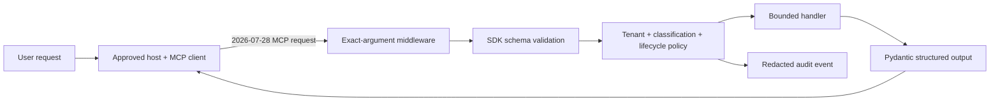

# Building a Minimal Secure MCP Server

Build, inspect, attack, and test a real Model Context Protocol server with the
official Python SDK. The result is intentionally small enough to audit: three
bounded tools, one versioned resource, one reviewed prompt, and no execution,
filesystem, shell, or arbitrary-network capability.

## Course thesis and learning objectives

An SDK implements protocol mechanics; it does not decide business authority.
A defensible MCP server combines the SDK with narrow capabilities, strict
application contracts, deployment-owned policy, semantic authorization,
structured output, honest errors, bounded results, redacted evidence, and
end-to-end protocol tests.

After this course, you can:

1. create and run an `MCPServer` using the official Python SDK v2.2 and the
   final MCP `2026-07-28` protocol;
2. register tools, resources, and prompts and inspect exactly what a client
   discovers;
3. generate bounded input and output schemas from Python/Pydantic types and
   identify what those schemas do not authorize;
4. enforce exact tool argument names before handlers execute;
5. use `ToolError` so expected denials are represented as failed tool results
   rather than successful error-shaped data;
6. keep tenant, classification, and policy state in trusted deployment code
   rather than model-controlled arguments;
7. return structured, trust-labeled results and verify server-side output
   conversion;
8. correlate redacted decisions without logging ticket bodies or secrets; and
9. test discovery, calls, errors, resources, and prompts through a real
   in-memory MCP client.

The central boundary remains: **a model proposes arguments; the trusted server
validates, authorizes, resolves, returns or executes, verifies, and records.**
Tool descriptions and annotations improve usability; they do not enforce that
boundary.

## Audience, prerequisites, and scope

Complete [Course 01](../01-mcp-architecture-lifecycle-trust-boundaries/README.md),
[Course 02](../02-threat-modeling-mcp-agent-protocols/README.md), and
[Course 03](../03-secure-tool-resource-prompt-interfaces/README.md) first. You
should understand protocol roles, threat modeling, strict interface contracts,
untrusted content, and proposal-versus-execution separation.

This lab is a single-tenant `acme` teaching deployment. It is credential-free,
offline, and deterministic. It has no downstream API client and cannot send a
reply. `ticket.propose_reply` returns an immutable description of a proposed
effect with `executed=false`; no `ticket.send_reply` tool exists. Course 06 adds
authenticated identities, Course 07 adds policy enforcement, and Course 08 adds
delegation. Course 03 contains the full approval-receipt pattern.

## Architecture and trust boundaries



| Boundary | Trusted input | Untrusted input | Enforcement owner |
| --- | --- | --- | --- |
| Host → server | Reviewed endpoint/artifact configuration | Tool name, arguments, self-reported client metadata | Host admission plus server validation |
| Protocol → handler | SDK-parsed request context and request ID | Model-selected arguments | Exact-field middleware and generated schema |
| Handler → ticket fixture | Deployment policy constant | Ticket identifier | Server semantic policy |
| Server → client/model | Declared output shape and policy version | Customer summary, prompt/resource text | Output model plus client revalidation |
| Server → logs | Request ID, reason code, stable resource ID, digest | Bodies, secrets, tokens | Redaction and log schema |

The fixed deployment tenant is trustworthy only because it is server
configuration. It is not user identity and does not make this a production
multi-tenant design.

## Current protocol and SDK baseline

The repository pins `mcp>=2.2,<2.3`. Version 2.2 is the current stable Python
SDK line and implements MCP `2026-07-28`. The pin matters because this lesson
uses the SDK's middleware interface, currently documented as provisional within
the v2 minor line.

MCP `2026-07-28` is stateless at the protocol core. Every request carries its
own protocol/client metadata; a server must not infer authorization from a
transport session or state handle. The revision also supports full JSON Schema
Draft 2020-12 for tool schemas. Roots, sampling, and protocol logging are
deprecated for new designs; use explicit parameters/resource URIs, direct model
integration, and stderr/OpenTelemetry respectively.

### Choose the right SDK layer

| Layer | Strength | Use here |
| --- | --- | --- |
| `MCPServer` | Decorators, generated schemas, Pydantic structured output, resources/prompts, in-memory tests | Primary server implementation |
| Middleware | Observe or refuse raw inbound requests before high-level dispatch | Reject undeclared/missing tool fields |
| Low-level `Server` | Exact hand-written schemas/results and custom handlers | Use when the high-level layer cannot express a required contract |

The high-level SDK v2.2 validates declared argument types and constraints but
its generated top-level argument model does not advertise or enforce
`additionalProperties: false`. The lab therefore maintains an exact
tool-to-field map in middleware and proves an extra field never reaches the
handler. This is a deliberate, version-pinned control—not a hidden claim that
the decorator does it automatically.

## Server construction

The server identity and instructions are explicit:

```python
mcp = MCPServer(
    "tenant-support-course-04",
    version="2.0.0",
    instructions="This server exposes bounded reads and pure proposals only...",
    middleware=[enforce_exact_tool_arguments],
)
```

`instructions` is server-supplied metadata. Hosts may display it or include it
in context, but it cannot grant permission. The host still decides whether the
artifact may launch or connect, and the server still checks every call.

## Tools: bounded inputs, semantic checks, structured outputs

The server publishes exactly:

| Tool | Effect | Arguments | Result |
| --- | --- | --- | --- |
| `ticket.read` | Read one deployment-owned record | bounded `ticket_id` | `TicketReadResult` |
| `ticket.list_open` | Read a maximum of 100 open records | none | `TicketListResult` |
| `ticket.propose_reply` | Compute a proposal only | bounded `ticket_id`, 1–500 character body | `ReplyProposalResult` with `executed=false` |

It publishes no arbitrary URL, path, command, code, SQL, email, or admin tool.
The proposal tool does not persist state and cannot send a reply. Adding an
execution tool would require the authenticated, exact, expiring, single-use
approval receipt from Course 03 plus downstream idempotency and effect
verification.

### Schema validation is the first gate

The SDK derives input schemas from constrained Python annotations. It derives
output schemas from strict Pydantic return models. Output models use
`extra="forbid"`; `tools/list` therefore exposes closed output schemas and the
server validates handler results before serialization.

The exact-argument middleware runs before the handler and rejects extra or
missing names. The SDK then rejects type, pattern, and length violations. Only
after those two gates does application code resolve the ticket and enforce
deployment tenant, classification, and lifecycle state.

### Semantic denial without disclosure

`globex-9` exists in the fixture, while `acme-404` does not. Both calls receive
the same `ticket is unavailable` tool error and no structured content. Internal
audit evidence records `NOT_FOUND_OR_FORBIDDEN` without revealing which
condition applied to an unauthorized client.

### Expected versus unexpected failures

Raise `ToolError` for expected domain failures. The client receives
`is_error=true`, and a model can revise its arguments. Returning
`{"ok": false}` would be a successful tool result and misrepresent the outcome.

Unexpected exceptions and output-model failures also become error results, but
they are operational defects: preserve the internal traceback in controlled
telemetry and expose only a generic message. Protocol errors, tool errors, and
business denials should remain distinguishable for operators.

## Structured results and content trust

Every successful tool returns a Pydantic model. For example, a ticket includes:

- the stable ticket ID and lifecycle state;
- a bounded summary and classification;
- `content_trust="untrusted-customer-content"`; and
- the exact `policy_version` that admitted the read.

The client receives both `structuredContent` and a compatible text rendering.
A production host should validate `structuredContent` against `outputSchema`
before use. A valid shape still does not make customer text safe to follow as
instructions.

The proposal digest covers the action, full normalized body, tenant, ticket,
and policy version. Same-length body changes produce different digests. The
digest is evidence of exact content—not approval, identity, or execution.

## Tool annotations are hints

All three tools are honestly marked:

```python
ToolAnnotations(read_only_hint=True, open_world_hint=False)
```

They do not mutate durable or external state and operate on a closed ticket
fixture. Clients may use annotations for UI and confirmation decisions. A
malicious server can lie, so hosts must base trust on reviewed implementation,
artifact provenance, sandboxing, policy, and runtime evidence rather than the
annotation alone.

## Resources and prompts

The resource `support://acme/policy/2026-09-21` is exact, versioned JSON with a
digest, permitted tool names, prohibited effects, and
`content_trust="untrusted-server-resource"`. The server accepts no arbitrary
resource path or template.

The `support_summary` prompt includes a visible template version and
`trust=untrusted-template`. Prompts are user-controlled selections in MCP and
their arguments are flat strings rather than tool schemas. Prompt text can
guide presentation; it cannot authorize a tool or alter deployment policy.

## Transport choices and serving

| Mode | Appropriate use | Security boundary |
| --- | --- | --- |
| In-memory `Client(mcp)` | Fast deterministic protocol integration tests | Same process; no process/network isolation proof |
| stdio | Local server launched as a subprocess by an approved host | Protect executable/config/environment; stdout is protocol-only |
| Streamable HTTP | Remote service behind normal HTTP infrastructure | TLS, authentication, origin controls, gateway limits, authorization |
| Legacy HTTP+SSE | Compatibility only | Deprecated; maintain an explicit retirement plan |

The lab defaults to a safe self-test instead of blocking on stdio:

```bash
python3 -m pip install -e '.[contributor]'
python3 curriculum/beginner/04-minimal-secure-mcp-server/lab.py
```

Start stdio only when an MCP host or Inspector will own the pipe:

```bash
python3 curriculum/beginner/04-minimal-secure-mcp-server/lab.py serve
```

Or inspect the exported `mcp` object with the official development CLI:

```bash
mcp dev curriculum/beginner/04-minimal-secure-mcp-server/lab.py
```

For stdio, application logs go to stderr; never print diagnostics to stdout.
Remote deployment requires explicit Streamable HTTP configuration, auth, safe
reverse-proxy settings, timeouts, body limits, and origin policy. Do not expose
the teaching server directly to an untrusted network.

## Practical lab: normal → vulnerable → attack → defense → retest

The [lab](lab.py) follows this sequence:

1. **Normal:** an in-memory `Client` negotiates `2026-07-28`, discovers the
   exact tools/resource/prompt, reads `acme-7`, lists one open ticket, and gets a
   non-executing reply proposal.
2. **Vulnerable comparison:** a broad execution tool or caller-computable
   “approval” would confuse input with authority; neither exists in the server.
3. **Attack:** calls try an extra field, wrong type, oversized body,
   cross-tenant ID, missing ID, closed ticket, and output-model violation.
4. **Defense:** middleware, SDK validation, tenant/classification/lifecycle
   checks, `ToolError`, strict output models, result bounds, and trust labels
   deny or contain each case.
5. **Retest:** handlers are not invoked for malformed contracts, forbidden IDs
   return no structured data, proposal mutations change their digest, and the
   external-effect ledger remains empty.

The in-memory client is the same official client used for HTTP or subprocess
connections; only the transport boundary changes. This proves protocol behavior
without claiming process, network, or production-identity assurance.

## Evaluation and claim-to-proof map

| Claim | Executable proof |
| --- | --- |
| The real current protocol is exercised | Negotiated version, server identity, and all protocol verbs asserted |
| Capability surface is least privilege | Exact discovered-name set and absence of execution/network/filesystem names |
| Invalid wire inputs do not reach handlers | Extra, missing, type, format, and size tests plus handler counters |
| Tenant/classification boundary is neutral | Cross-tenant and missing IDs produce identical tool errors and no data |
| Outputs match declared contracts | Pydantic validation, closed `outputSchema`, and injected bad-output test |
| Listing is bounded and isolated | Sorted count, maximum, status, classification, and tenant assertions |
| Proposal is not execution | `executed=false`, empty external-effect ledger, no execute tool |
| Digests bind exact content | Same-length body mutation changes the digest |
| Resource and prompt provenance is visible | Exact URI/name plus version, digest, and trust-label tests |
| Audit evidence is redacted | Request/reason/resource/digest checks and secret-body absence test |

### Metrics for a production adapter

| Metric | Numerator | Denominator | Direction |
| --- | --- | --- | --- |
| Invalid-input pre-handler rate | Malformed calls blocked before handler | All malformed calls | 100% |
| Forbidden disclosure rate | Forbidden calls returning protected fields | All forbidden calls | 0% |
| Output conformance rate | Successful results valid against advertised schema | All successful results | 100% |
| Valid-call success rate | Authorized valid calls completed | All authorized valid calls | High, sliced by tool/version |
| Effect escape count | External effects from proposal-only tools | All proposal calls | 0 |
| Audit coverage | Calls with correlated decision evidence | All admitted handler calls | 100%, with redaction checks |

Record exact fixtures, client/server/SDK versions, case labels, and denominators.
An in-memory green test does not measure network latency, auth correctness,
sandbox strength, downstream availability, or model quality.

## Observability and operations

The application records request ID, decision, tool, stable resource ID, reason
code, argument digest, and policy version. It does not record reply bodies,
ticket summaries, access tokens, or hidden model reasoning. The SDK provides
OpenTelemetry support for protocol spans; production systems should correlate
those spans with application policy and downstream effect evidence.

Bound request body size, schema complexity, result size, concurrency, execution
time, and downstream retries. Use a stable logical operation ID for retryable
effects and reconcile unknown outcomes before retry. This lab has no effect, so
it does not pretend to demonstrate idempotency or recovery.

## Common tools and methods

| Tool/method | Best use | Limitation |
| --- | --- | --- |
| Official Python SDK `MCPServer` | Typed high-level servers, resources, prompts, structured output | Business authorization remains application-owned |
| Official `Client` | In-memory, stdio, and Streamable HTTP integration | A client connection does not establish server trust |
| MCP Inspector / `mcp dev` | Manual discovery, schema, and negative calls | Manual success is not regression evidence |
| Pydantic v2 | Runtime constraints and output schemas | Typed data is not authenticated or authorized |
| JSON Schema Draft 2020-12 | Cross-language contract exchange | Semantic policy remains separate; bound validation cost |
| SDK middleware | Cross-cutting request validation/observation | Python SDK v2.2 interface is provisional; pin and test |
| Low-level SDK `Server` | Exact schemas/results or custom protocol behavior | You must validate arguments and construct errors/results yourself |
| pytest + in-memory client | Fast deterministic protocol regression suite | Does not prove process/network deployment controls |
| OpenTelemetry | Protocol and handler correlation | Redact data and add policy/effect semantics |
| Container/sandbox + SBOM/signing | Runtime and supply-chain containment | Covered in later courses; not replaced by code review |

## Failure modes and corrections

| Failure | Impact | Correction |
| --- | --- | --- |
| Caller computes `demo-approval-<hash>` | Caller self-authorizes | Expose proposal only; use trusted approval receipt outside model arguments |
| Return `{"ok": false}` for denial | Protocol reports successful tool call | Raise `ToolError` for expected failure |
| Rely on function types for authorization | Valid input can still target forbidden data | Enforce tenant/classification/lifecycle after validation |
| Accept undeclared arguments silently | Contract drift and ambiguous client behavior | Exact-field middleware or low-level validated schema |
| Return `dict[str, object]` | Broad output schema hides drift | Return strict Pydantic models |
| Trust `readOnlyHint` | Malicious/buggy server can mislabel effects | Verify implementation and runtime evidence |
| Log request or ticket bodies | Secrets and customer data enter telemetry | Log IDs, decisions, reason codes, and digests |
| Treat server prompt/resource as policy | Untrusted metadata can steer authority | Label content and keep policy in trusted code |
| Test Python functions directly only | Misses discovery, conversion, errors, and protocol behavior | Use `Client(mcp)` integration tests |
| Start stdio during automated lab execution | Test hangs waiting for a host | Default to self-test; require explicit `serve` |
| Use an in-memory test as deployment proof | Misses process, TLS, proxy, and auth boundaries | Add subprocess/HTTP staging and security tests |

## Production upgrade checklist

- Verify signed artifact provenance before the host launches or connects.
- Isolate the server process/container with minimal filesystem, environment,
  network, and OS privileges.
- Authenticate user and workload; derive tenant/roles/audience from verified
  context, never tool arguments.
- Enforce subject/action/resource/purpose policy and repeat ownership checks at
  the downstream data owner.
- Replace fixtures with a bounded async downstream client, timeouts, egress
  allow-lists, circuit breaking, and safe error translation.
- For effects, add exact approval receipts, atomic consumption, idempotency,
  unknown-outcome reconciliation, verification, and revocation.
- Revalidate structured results at the client, retain trust/provenance labels,
  and bound all content blocks.
- Add rate, cost, concurrency, deadline, and output budgets.
- Export redacted traces, metrics, alerts, and runbooks; test containment and
  rollback.
- Maintain a protocol/SDK compatibility matrix and migration plan for deprecated
  features and transports.

## Exercises and review questions

1. Add `ticket.read_metadata` without returning customer summary text. Compare
   its capability and disclosure surface with `ticket.read`.
2. Replace the fixed deployment policy with an SDK dependency resolved from
   authenticated middleware. Prove no tenant field appears in the tool schema.
3. Add a resource template for knowledge articles with canonical identifiers,
   classification, freshness, and digest checks.
4. Create a low-level `Server` version of one tool with an exact hand-written
   schema. Add the argument validation the low-level API does not supply.
5. Add a subprocess stdio integration test and state what additional boundary
   it proves over `Client(mcp)`.
6. Design a Streamable HTTP staging checklist covering TLS, auth, origins,
   proxy buffering, timeouts, body limits, tracing, and rate limits.
7. Explain why a correct output schema, `readOnlyHint`, or proposal digest does
   not authorize a reply to be sent.

## References

- [MCP Python SDK v2 documentation](https://py.sdk.modelcontextprotocol.io/)
- [Python SDK — get started and in-memory testing](https://py.sdk.modelcontextprotocol.io/get-started/)
- [Python SDK — tools](https://py.sdk.modelcontextprotocol.io/servers/tools/)
- [Python SDK — structured output](https://py.sdk.modelcontextprotocol.io/servers/structured-output/)
- [Python SDK — handling errors](https://py.sdk.modelcontextprotocol.io/servers/handling-errors/)
- [Python SDK — resources](https://py.sdk.modelcontextprotocol.io/servers/resources/)
- [Python SDK — prompts](https://py.sdk.modelcontextprotocol.io/servers/prompts/)
- [Python SDK — client](https://py.sdk.modelcontextprotocol.io/client/)
- [Python SDK — middleware](https://py.sdk.modelcontextprotocol.io/advanced/middleware/)
- [Python SDK — OpenTelemetry](https://py.sdk.modelcontextprotocol.io/run/opentelemetry/)
- [Python SDK — low-level server](https://py.sdk.modelcontextprotocol.io/advanced/low-level-server/)
- [MCP specification 2026-07-28 — tools](https://modelcontextprotocol.io/specification/2026-07-28/server/tools)
- [MCP specification 2026-07-28 — resources](https://modelcontextprotocol.io/specification/2026-07-28/server/resources)
- [MCP specification 2026-07-28 — prompts](https://modelcontextprotocol.io/specification/2026-07-28/server/prompts)
- [MCP security best practices](https://modelcontextprotocol.io/docs/2026-07-28/tutorials/security/security_best_practices)
- [JSON Schema Draft 2020-12](https://json-schema.org/draft/2020-12/json-schema-core)
- [Pydantic strict mode](https://docs.pydantic.dev/latest/concepts/strict_mode/)
