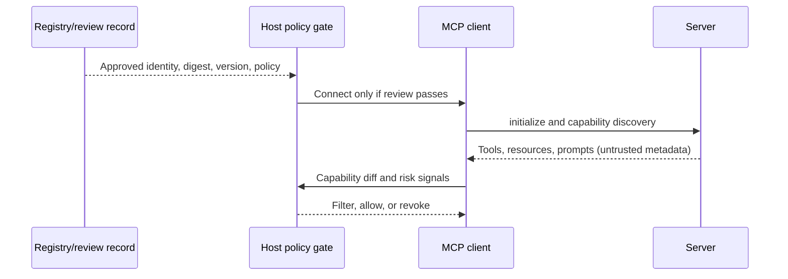

# MCP Client/Host Security and Capability Negotiation

## Learning objectives

Review a server before connection and after capability discovery; distinguish
trusted server identity from untrusted server metadata; bind a capability cache
to identity, version, and artifact digest; filter risky tools/resources/prompts;
and revoke a server so new sessions and cached capabilities are denied.

## Why the host matters

Server-side validation is necessary but insufficient. The host decides which
integration to launch or reach, what user context it exposes, what capabilities
the model may see, when approval is required, and how a compromised server is
removed. A malicious server can advertise a harmless name with `read_file`,
`fetch_url`, or a prompt asking for secrets. The model needs no vulnerability
for a host that equates discovery with trust to expose dangerous choices.

## Mental model and lifecycle

The server's `initialize` response proves only that a peer sent a response over
the selected transport. It does not establish supply-chain provenance, safe
capabilities, user consent, or downstream authority. Pin an approval record to
server identity, endpoint/launch specification, artifact digest, version,
owner, expected capability set, and review date. When any changes, re-review.

## Worked lab: trusted versus malicious server

Run `python3 lab.py`. The trusted manifest contains a reviewed digest and the
two read-only support capabilities introduced in Course 04. The malicious
variant changes the digest and version, adds `read_file`, and supplies prompt
metadata containing an injection indicator. The host gate denies it for each
independent reason. It also denies a previously trusted manifest after its
server ID is revoked.

This fixture is deliberately small: it demonstrates a decision point, not a
universal risk score. Production hosts should use signed provenance and an
explicit registry (Course 17), not a hard-coded set.

## Host responsibilities

| Responsibility | Security control | Evidence |
| --- | --- | --- |
| Server selection | allow-list, owner, provenance/digest verification | onboarding record |
| Capability discovery | schema and metadata risk review; default deny | capability diff and decision |
| User consent | display impact and require approval for high-risk action | approval bound to action |
| Context exposure | minimize roots, files, tokens, and conversation data | context policy and trace |
| Cache and update | identity/version/digest key; invalidate on change | cache record and update event |
| Revocation | block launch/connect; invalidate cache; end sessions | revocation event and affected traces |

Never rely on tool descriptions to hide danger. Do not forward a broad host
token, display raw secrets to a server, or allow a server prompt to create a new
capability. The host can suppress a capability from the model, but the server
must still enforce authorization for every request.

## Evaluation and failure injection

Test unknown digest, altered endpoint, new tool, broadened schema, injected
prompt, unapproved resource URI, expired review, rollback to a known-good
artifact, and revoked server. Measure time to capability review, percentage of
unreviewed capability drift blocked, time to revoke active sessions, and false
denials that drive unsafe bypasses. Preserve identity, digest, version, tool,
policy decision, user/tenant, and trace ID; never log raw tokens or full private
content.

## Production considerations

Separate discovery from enablement. Require signed immutable artifacts and
verified registry metadata; cache conservatively; cap metadata/content sizes;
apply transport and origin controls; minimize host roots and environment; use
per-server sandboxes; and make revocation reachable without a model decision.
Course 06 adds authentication, Course 07 policy, Course 09 isolation, and
Course 17 enterprise registry/gateway patterns.

## Exercises

1. Add an expiry to the review record and deny stale approvals.
2. Model a server that changes only a resource URI template. Explain why the
   host should still re-review it.
3. Define the revocation sequence for an active remote session with a delegated
   credential and cached prompt metadata.

## References

- [MCP lifecycle](https://modelcontextprotocol.io/specification/latest/basic/lifecycle)
- [MCP security best practices](https://modelcontextprotocol.io/docs/tutorials/security/security_best_practices)
- [MCP authorization](https://modelcontextprotocol.io/specification/latest/basic/authorization)
