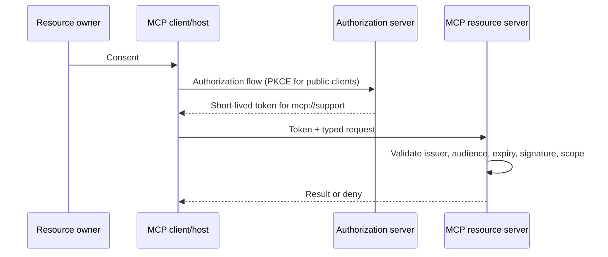

# MCP Authentication and OAuth Security

## Learning objectives

Validate a token's issuer, audience, expiry, scopes, and revocation state;
separate OAuth authentication from authorization; explain authorization server,
resource server, client, and resource owner roles; and reject token passthrough
and confused-audience patterns in MCP integrations.

## Why this topic matters

A bearer token is not a portable permission slip. If a host forwards a token
minted for itself to an MCP server or downstream API, that service can become a
confused deputy and token theft has a larger blast radius. The support-server
scenario needs a token intended for the support resource, short-lived, scoped
to the requested operation, and validated at the resource server.

## Mental model

Authentication establishes who presented a credential. Authorization decides
whether that authenticated principal may perform an action on a resource. A
valid token with the wrong audience is still invalid for the receiving resource;
a valid access token does not by itself authorize every tool call.

## Protocol mechanics and controls

Use a standards-compliant authorization server and validate signature/key,
issuer, audience/resource indicator, expiry/not-before, token type, and scopes
at the resource server. Use authorization-code flow with PKCE for public/native
clients; keep refresh tokens out of servers that do not need them; send tokens
only to their intended resource over protected transport; rotate/revoke and
audit token IDs without recording the token value. Token binding and sender
constrained credentials can reduce bearer replay where the deployment supports
them, but do not replace audience and policy validation.

## Normal → attack → defense → retest

Run `python3 lab.py`. It models a validated read token, then rejects the same
token at a downstream ticket API because `aud` is `mcp://support`, rejects an
expired token, and rejects a revoked token. This is intentionally an offline
claim-validation model, not cryptography or an IdP. In production, use a vetted
OIDC/OAuth library and the authorization server's JWKS/discovery metadata; do
not hand-roll JWT verification.

## Common failures

| Failure | Defense |
| --- | --- |
| Forward host token to every server | Acquire/exchange a token for the target audience |
| Validate only signature | Also validate issuer, audience, expiry, type, and scope |
| Long-lived broad token | Short lifetime, least scopes, rotation and revocation |
| Trust caller-provided tenant claim without policy | Bind tenant/resource to validated identity and authorization |
| Treat OAuth login as tool authorization | Apply per-action policy in Course 07 |

## Evaluation and production upgrade

Test wrong issuer, unknown key, wrong audience, missing scope, expired/not-yet-
valid token, replay/revocation, tenant mismatch, and attempted refresh-token
forwarding. Measure validation failures by reason without logging tokens. Add
key rotation, clock-skew policy, discovery hardening, secure token storage,
audience-specific token exchange, and incident revocation runbooks.

## Exercises

1. Add `nbf` and explain bounded clock skew.
2. Model two downstream APIs and show why each needs its own audience.
3. Describe when a refresh token may be held and why an MCP server usually
should not receive a host's refresh token.

## References

- [MCP authorization specification](https://modelcontextprotocol.io/specification/latest/basic/authorization)
- [OAuth 2.0 Security Best Current Practice (RFC 9700)](https://www.rfc-editor.org/rfc/rfc9700)
- [PKCE (RFC 7636)](https://www.rfc-editor.org/rfc/rfc7636)
- [JWT Best Current Practices (RFC 8725)](https://www.rfc-editor.org/rfc/rfc8725)
