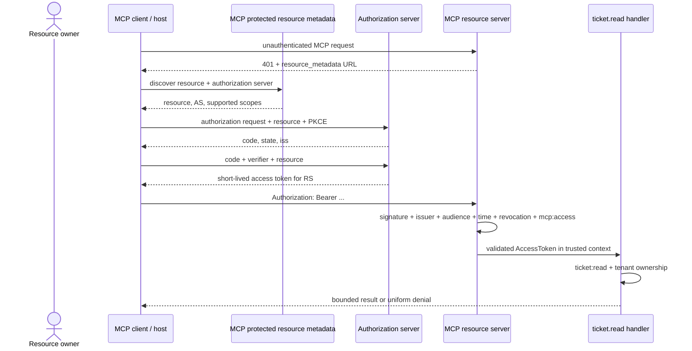

# MCP Authentication and OAuth Security

Build and attack-test an OAuth-protected MCP resource server. The finished lab
uses signed JWT access tokens, PyJWT, the official MCP Python SDK authorization
middleware, protected-resource metadata, real HTTP status codes, trusted
identity context, tenant-aware tool checks, key rotation, revocation, and
redacted evidence.

## Learning objectives

After this course, you should be able to:

1. distinguish the resource owner, MCP client, authorization server, and MCP
   resource server roles;
2. explain why MCP authorization applies to HTTP transports and why stdio uses
   local process and environment controls instead;
3. discover an authorization server from OAuth Protected Resource Metadata;
4. select authorization-code plus PKCE, client credentials, or enterprise
   identity assertion for the correct actor and deployment;
5. validate signature, algorithm, token type, key ID, issuer, audience,
   timestamps, lifetime, subject, client, scope, tenant, and revocation state;
6. use `MCPServer`, `AuthSettings`, `TokenVerifier`, `AccessToken`,
   `get_access_token`, `PyJWT`, and an ASGI HTTP test client;
7. separate authentication at the HTTP boundary from authorization at the tool
   and resource boundary;
8. prevent token passthrough, confused-audience acceptance, tenant enumeration,
   and token leakage in telemetry; and
9. test key rollover, denial semantics, and bearer replay limitations.

## Prerequisites and scope

Complete Courses 01–05 first. Course 05 admits an MCP server into a trusted
host; this course authenticates callers at a remote HTTP server. Course 07 owns
deeper policy design, Course 08 owns delegation and token exchange, and Course
12 owns secrets management. This course does not pretend those later controls
already exist.

The lab is credential-free and offline. It creates ephemeral 2048-bit RSA keys,
signs test access tokens, and drives a real MCP Streamable HTTP application
through an in-process ASGI transport. It does not contact an identity provider,
run TLS, fetch remote JWKS, persist revocations, or implement an authorization
server. Ephemeral test keys and the issuer fixture are not production
substitutes.

## The core security claim

> Only a bearer access token cryptographically issued by the trusted issuer,
> specifically for this MCP resource, currently valid, not revoked, and carrying
> the transport scope may cross the HTTP boundary. A tool then derives the
> subject and tenant from that validated token and independently authorizes the
> requested resource.

This is a claim-to-proof chain:

| Claim | Implementation evidence | Negative test |
| --- | --- | --- |
| Tokens are authentic | PyJWT verifies RS256 with a selected issuer public key | altered signature and attacker key fail |
| Token is an access token | protected `typ=at+jwt` header check | generic `JWT` is denied |
| Token belongs here | exact `iss` and `aud`, plus SDK resource validation | wrong issuer/audience return 401 |
| Token is current | `exp`, `nbf`, `iat`, bounded skew, five-minute max lifetime | expired, future, and long-lived tokens fail |
| Token is usable | required claims, well-formed scopes/tenant, revocation lookup | missing/invalid/revoked claims fail |
| Authentication precedes protocol work | SDK HTTP bearer middleware | missing/invalid tokens never call a tool |
| Global access is least privilege | `required_scopes=["mcp:access"]` | valid token without it returns 403 |
| Tool access is narrower | handler checks `ticket:read` and tenant ownership | missing tool scope and cross-tenant ID fail |
| Evidence is safe | token fingerprint and reason, never bearer value | raw-token absence is asserted |

## OAuth roles and trust boundaries


```mermaid
sequenceDiagram
  actor U as Resource owner
  participant C as MCP client / host
  participant PRM as MCP protected resource metadata
  participant AS as Authorization server
  participant RS as MCP resource server
  participant T as ticket.read handler

  C->>RS: unauthenticated MCP request
  RS-->>C: 401 + resource_metadata URL
  C->>PRM: discover resource + authorization server
  PRM-->>C: resource, AS, supported scopes
  C->>AS: authorization request + resource + PKCE
  AS-->>C: code, state, iss
  C->>AS: code + verifier + resource
  AS-->>C: short-lived access token for RS
  C->>RS: Authorization: Bearer ...
  RS->>RS: signature + issuer + audience + time + revocation + mcp:access
  RS->>T: validated AccessToken in trusted context
  T->>T: ticket:read + tenant ownership
  T-->>C: bounded result or uniform denial
```

The resource owner grants access. The client requests and holds credentials.
The authorization server authenticates the actor, obtains or evaluates consent
and policy, and issues tokens. The MCP server is an OAuth resource server: it
validates tokens and protects tools/resources. Do not merge these roles merely
because a tutorial can place them in one process.

MCP authorization is defined for HTTP-based transports. A stdio server is
launched locally and should receive only narrowly selected environment and
process authority; adding OAuth messages to the stdio protocol does not create
a network resource-server boundary. Likewise, `Client(mcp_server)` is excellent
for protocol unit tests but intentionally bypasses HTTP authentication. This
lab therefore uses Streamable HTTP over an ASGI test transport.

## Current MCP authorization flow

The MCP `2026-07-28` authorization specification builds on OAuth 2.1-era
practices and several focused RFCs:

1. The client receives a 401 challenge with a Protected Resource Metadata URL.
2. The metadata identifies the canonical resource and one or more authorization
   servers. It is discovery data, not permission.
3. The client obtains authorization-server metadata. New deployments should use
   Client ID Metadata Documents (CIMD); Dynamic Client Registration remains a
   compatibility mechanism and is deprecated by the current MCP specification.
4. The client sends the RFC 8707 `resource` parameter in authorization and token
   requests so the resulting access token is audience-bound.
5. Public/native clients use authorization code with PKCE, validate `state`, and
   validate the authorization-response `iss` value to resist mix-up attacks.
6. The client sends the access token in the HTTP `Authorization` header on every
   MCP request. Tokens never belong in a URL or query string.
7. The server returns 401 for absent/invalid credentials and 403 when a valid
   token lacks required scope or permission. A challenge can advertise the
   scopes required for bounded step-up; clients must prevent infinite retries.

An MCP resource server must accept only tokens issued for itself. It must not
accept a token merely because the signature is valid, and it must never pass an
incoming MCP token through to a downstream API. If a tool needs another API,
obtain or exchange for a separate, narrower token whose audience is that API;
Course 08 implements that boundary.

## Choosing a client flow

| Situation | Preferred pattern | Security notes |
| --- | --- | --- |
| User-present interactive host | Authorization code + PKCE | system browser; exact redirect; `state`, PKCE, and `iss`; securely store refresh token if issued |
| Confidential service acting as itself | Client credentials | no user identity; authenticate client strongly; narrow audience/scope/lifetime |
| Enterprise host already has workforce identity | MCP Identity Assertion Authorization Grant (ID-JAG) | exchanges an enterprise IdP assertion for an MCP token; audience-bound; avoids browser and MCP refresh token in supported deployments |
| MCP server calling downstream API for a user | Token exchange/delegation | never forward inbound token; reduce audience, scope, lifetime, and delegation depth |
| Legacy or incompatible provider | Standards adapter/gateway | isolate deviations; do not weaken every resource server |

Do not use the resource-owner password grant. Do not use implicit flow. Avoid a
client secret in a public desktop or mobile client. A refresh token is a highly
sensitive client credential, not a resource-server requirement; the MCP server
should not advertise `offline_access` as a scope needed to invoke its tools.

## Access-token formats and validation

An authorization server may issue an opaque token or a JWT access token.

| Format | Validation | Advantages | Operational risks |
| --- | --- | --- | --- |
| Opaque | RFC 7662 introspection over authenticated server-to-server channel | centralized status and revocation; minimal client-visible claims | availability/latency dependency; secure caching and fail-closed behavior needed |
| JWT | local signature and claim verification, commonly following RFC 9068 | low latency; works during short issuer outages | revocation lag; careful JWKS caching/rotation and strict claim validation required |

For a JWT access token, validate all applicable properties—not just the
signature:

- pin an algorithm allowlist; never accept the token's requested algorithm by
  itself and never allow `none`;
- require an access-token type such as `at+jwt` when the issuer contract uses
  it, so an ID token is not accepted as an API credential;
- select a known `kid` from an issuer-bound key set and reject unknown IDs;
- verify the signature with an asymmetric public key;
- compare issuer exactly with configured issuer metadata;
- require this MCP server's canonical resource in `aud`;
- enforce `exp`, `nbf`, and `iat` with small, explicit clock skew;
- bound maximum lifetime even when `exp` is syntactically valid;
- validate `sub`, `client_id`, `jti`, scopes, and application claims by type and
  policy;
- check revocation/status when the deployment promises immediate containment;
  and
- fail closed on missing, duplicate, malformed, or unexpected security claims.

JWT decoding without signature verification is useful only for untrusted hints
such as choosing a candidate issuer. It is never authentication. Key discovery
must be bound to a preconfigured/validated issuer; do not fetch arbitrary
`jku`, `x5u`, or issuer URLs from an untrusted token without SSRF controls.

## Authentication is not authorization

The SDK's bearer middleware answers: “is this request carrying a currently
valid token for this resource and the required global scopes?” The
`ticket.read` handler still answers: “may this subject, client, and tenant read
this particular ticket now?”

The lab obtains identity only through `get_access_token()` after verification.
The model supplies `ticket_id`; it cannot supply `tenant_id`, `subject`, or
scopes. The handler applies `ticket:read` and compares the ticket's tenant with
the validated tenant. A nonexistent ticket and another tenant's ticket receive
the same external error to reduce enumeration.

Course 07 expands this into policy decisions, relationship/attribute checks,
approvals, obligations, and policy-version evidence. OAuth scopes remain coarse
grants; they do not prove ownership, business purpose, human approval, or the
safety of a proposed effect.

## SDK and library map

The practical lab uses common, maintained interfaces:

| Component | Purpose in the lab | Production extension |
| --- | --- | --- |
| `MCPServer` | hosts the protected MCP Streamable HTTP endpoint | run behind hardened TLS ingress and trusted proxy policy |
| `AuthSettings` | publishes resource metadata, issuer, resource URL, global scopes | configure exact public canonical URLs |
| `TokenVerifier` | SDK seam for JWT verification or introspection | issuer-specific JWKS cache or RFC 7662 client |
| `AccessToken` | passes validated identity/scopes into trusted request context | minimize claims and document their semantics |
| `get_access_token()` | retrieves trusted identity inside a handler | centralize per-tool policy and audit |
| PyJWT + cryptography | RS256 signature and registered-claim verification | pin versions; monitor advisories; use managed/HSM issuer keys |
| `httpx2.ASGITransport` | drives real HTTP middleware without external network | add reverse-proxy/TLS integration tests in staging |
| `OAuthClientProvider` | official SDK client OAuth orchestration (covered conceptually) | durable encrypted token storage, PKCE callback, CIMD/client authentication |

Other common Python options include Authlib for OAuth/OIDC client and server
integrations, and provider SDKs for managed identity systems. Common providers
include Microsoft Entra ID, Okta, Auth0, Keycloak, and cloud workload identity
services. Select based on standards support, key and incident operations,
tenant isolation, audit export, regional requirements, and lifecycle—not brand
familiarity. Keep token validation in a reviewed library and the authorization
decision in your trusted application.

## Run the lab

From the repository root:

```bash
python -m pip install -e '.[contributor]'
python curriculum/intermediate/06-mcp-authentication-oauth-security/lab.py
python -m pytest -q tests/test_course_06_oauth_security.py
```

Expected result:

```text
PASS: signed OAuth access tokens are enforced at the HTTP MCP boundary
```

The scenario performs this progression:

1. request without a token → HTTP 401 plus protected-resource discovery;
2. signed token for another audience → HTTP 401 before a tool handler;
3. valid token → real MCP `ticket.read` succeeds for the token tenant;
4. same valid identity requests another tenant's ticket → tool denial;
5. issuer revokes the token ID → next HTTP request returns 401; and
6. evidence is serialized and checked to ensure the raw token never appears.

The focused test suite also covers absent query-token support, 403 global scope,
wrong issuer, expiry, `nbf`, type confusion, algorithm confusion, missing
claims, attacker signatures, unknown keys, long lifetimes, malformed tenants,
duplicate scopes, key rollover, per-tool scope, uniform resource denial, bearer
replay behavior, and redaction.

## Read the lab in five passes

1. **Issuer fixture:** `EphemeralAuthorizationServer` creates keys and test
   tokens. In production this is an external authorization server.
2. **Verifier:** `JwtAccessTokenVerifier` performs cryptographic and semantic
   validation and converts accepted claims into the SDK's `AccessToken`.
3. **HTTP boundary:** `AuthSettings` enables protected-resource metadata,
   resource validation, and global scope middleware.
4. **Tool boundary:** `ticket.read` derives identity and tenant from trusted
   context, then checks tool scope and ownership.
5. **Adversarial harness:** `request_boundary`, `call_ticket`, and the tests
   exercise actual HTTP/MCP behavior and inspect evidence.

## Key rotation, revocation, and replay

During planned rotation, publish the new public key before issuing tokens with
its `kid`; retain the old verification key until old tokens expire, then remove
it. Unknown keys fail closed. Cache JWKS with bounded freshness, handle issuer
outages explicitly, and prevent a token-controlled URL from selecting the key
source.

JWTs are not automatically revocable. Options include short lifetimes, an
issuer status/revocation lookup, introspection, a bounded denylist for urgent
incidents, or opaque tokens. The lab's in-memory `jti` set demonstrates the
decision point, not a distributed revocation service.

A bearer token is replayable by whoever possesses it until expiry or effective
revocation. A `jti` identifies the token; it does not make the token one-time.
For higher-risk deployments, consider sender-constrained access tokens such as
DPoP (RFC 9449) or mutual-TLS-bound tokens (RFC 8705), where ecosystem support
exists. Those controls reduce stolen-token utility but do not replace audience,
scope, tenant, or business authorization.

## Production hardening checklist

- [ ] HTTPS only, with trusted-proxy and canonical public-URL configuration.
- [ ] Protected Resource Metadata is reachable and names the exact resource.
- [ ] Authorization-server and key discovery are issuer-bound and SSRF-safe.
- [ ] Client uses PKCE, `state`, authorization-response `iss`, and exact redirect
      matching; CIMD/client authentication is appropriate for its type.
- [ ] Access tokens are audience-bound via RFC 8707 `resource`.
- [ ] JWT algorithms, types, keys, claims, clock skew, and lifetime are pinned.
- [ ] Opaque-token introspection is authenticated, bounded, cached safely, and
      fails closed according to documented availability policy.
- [ ] Global scopes and per-tool/resource policy are separately enforced.
- [ ] Identity and tenant come from validated application context, never model
      text or caller-controlled duplicate arguments.
- [ ] Incoming MCP access/refresh tokens are never forwarded downstream.
- [ ] Tokens are absent from URLs, application logs, traces, errors, analytics,
      model context, and tool results.
- [ ] Client token storage is encrypted and refresh-token rotation/reuse
      detection is supported where applicable.
- [ ] Key rollover, issuer outage, credential theft, revocation, and rollback
      runbooks have been exercised.
- [ ] Metrics separate invalid signature, issuer, audience, time, scope,
      revocation, and policy denials without leaking credentials.
- [ ] Rate limits and anomaly detection cover discovery, token failures, scope
      step-up loops, and resource enumeration.

## Common failure modes

| Failure | Why it fails | Defense |
| --- | --- | --- |
| Verify signature only | a genuine token for another issuer/resource is accepted | exact issuer, audience/resource, type, time, scope, and claim contract |
| Trust `alg`/key URL from token | algorithm confusion or attacker-controlled key retrieval | allowlist algorithm; issuer-bound JWKS; reject token-supplied key sources |
| Accept an ID token | login assertion is confused with API authority | require access-token profile/type and audience |
| Forward MCP token downstream | expands authority and creates a confused deputy | acquire/exchange a narrower token for the downstream audience |
| Put token in query parameter | leaks via histories, logs, referrers, and caches | bearer header only |
| Treat scope as record ownership | coarse grant bypasses tenant/resource policy | authorize subject/client/action/resource in trusted code |
| Take tenant from tool arguments | model or caller selects another tenant | derive tenant from validated identity; reject duplicate scope-shaping fields |
| Log raw bearer token | logs become a credential store | fingerprint plus reason; secret scanning and log redaction |
| Assume `jti` prevents replay | bearer remains reusable | short TTL, revocation, sender constraint where justified |
| Remove old key immediately | valid in-flight tokens fail during rollover | overlap keys until bounded token expiry |
| Keep old keys forever | compromised/stale keys remain trusted | documented retirement deadline and tests |
| Retry authorization forever | scope challenge becomes a loop/DoS | bounded step-up attempts and user-visible failure |

## Exercises

### 1. Scope-aware challenge

Add a second endpoint or middleware boundary requiring `ticket:export`. Assert a
valid `ticket:read` token receives 403 and a `WWW-Authenticate` challenge; cap
the client's step-up attempts. Do not implement the retry with recursion.

### 2. JWKS cache model

Replace direct key lookup with a bounded issuer-key cache. Model refresh on an
unknown `kid`, maximum cache age, an issuer outage, and a rotation overlap.
Prove that an attacker-controlled issuer or key URL is never fetched.

### 3. Opaque-token alternative

Implement a fake RFC 7662 introspection client behind `TokenVerifier`. Include
authenticated introspection, `active`, audience/resource, expiry, client,
subject, scopes, and tenant. Compare outage and revocation behavior with JWTs.

### 4. Incident drill

Simulate a leaked token. Revoke its `jti`, prove the next request is denied,
rotate the signing key only if the key itself is suspected, preserve redacted
evidence, and write the criteria for invalidating every token versus one token.

### 5. Production integration test

Run the server behind a local TLS reverse proxy and a real development identity
provider. Test metadata URLs, forwarded-host policy, redirect URIs, PKCE,
audience binding, token storage, logout/revocation behavior, and sanitized
proxy/application logs. Never commit credentials or captured tokens.

## Assessment rubric

| Level | Evidence |
| --- | --- |
| Baseline | valid signed token succeeds; missing/invalid token returns 401; required global scope returns 403 |
| Proficient | wrong issuer/audience/time/type/key and cross-tenant/resource tests pass; evidence is redacted |
| Advanced | rotation, revocation, issuer outage, bounded JWKS/introspection behavior, and replay limitations are demonstrated |
| Production-ready | real provider and TLS integration, secure client storage, operational telemetry, incident runbook, and rollback evidence are independently reviewed |

Passing unit tests is necessary evidence, not proof of production readiness.
Transport, proxy, provider, key-management, storage, monitoring, and incident
controls need deployment-specific validation.

## Knowledge check

1. Why can a token with a valid signature still be invalid for an MCP server?
2. What does Protected Resource Metadata let a client discover, and what does
   it not authorize?
3. Why are `mcp:access` and `ticket:read` separate in the lab?
4. Why does `jti` support revocation evidence but not prevent bearer replay?
5. When should a deployment choose introspection over local JWT validation?
6. What must change before the MCP server calls a downstream ticket API?

Suggested answers: issuer/audience/type/time/policy still matter; metadata finds
the canonical resource and authorization server but grants nothing; transport
admission is coarser than action/resource policy; a copied bearer token remains
usable; introspection trades latency/availability for centralized status; and a
separate audience-specific downstream credential is required.

## Authoritative references

- [MCP Authorization specification, revision 2026-07-28](https://modelcontextprotocol.io/specification/2026-07-28/basic/authorization)
- [MCP Python SDK: server authorization](https://github.com/modelcontextprotocol/python-sdk/blob/main/docs/run/authorization.md)
- [MCP Python SDK: OAuth clients](https://github.com/modelcontextprotocol/python-sdk/blob/main/docs/client/oauth-clients.md)
- [MCP Python SDK: enterprise identity assertion](https://github.com/modelcontextprotocol/python-sdk/blob/main/docs/client/identity-assertion.md)
- [OAuth 2.0 Security Best Current Practice (RFC 9700)](https://www.rfc-editor.org/rfc/rfc9700)
- [OAuth 2.0 Authorization Server Metadata (RFC 8414)](https://www.rfc-editor.org/rfc/rfc8414)
- [OAuth 2.0 Protected Resource Metadata (RFC 9728)](https://www.rfc-editor.org/rfc/rfc9728)
- [OAuth 2.0 Resource Indicators (RFC 8707)](https://www.rfc-editor.org/rfc/rfc8707)
- [OAuth 2.0 Authorization Server Issuer Identification (RFC 9207)](https://www.rfc-editor.org/rfc/rfc9207)
- [PKCE (RFC 7636)](https://www.rfc-editor.org/rfc/rfc7636)
- [OAuth 2.0 Token Introspection (RFC 7662)](https://www.rfc-editor.org/rfc/rfc7662)
- [JWT Profile for OAuth Access Tokens (RFC 9068)](https://www.rfc-editor.org/rfc/rfc9068)
- [JWT Best Current Practices (RFC 8725)](https://www.rfc-editor.org/rfc/rfc8725)
- [OAuth 2.0 DPoP (RFC 9449)](https://www.rfc-editor.org/rfc/rfc9449)
- [OAuth 2.0 Mutual-TLS Client Authentication and Certificate-Bound Tokens (RFC 8705)](https://www.rfc-editor.org/rfc/rfc8705)
