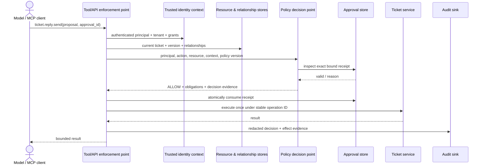

# Authorization and Policy Enforcement

Build and attack-test a deterministic authorization layer for MCP tools. The
finished lab combines role, attribute, and relationship checks; derives
identity from trusted session state; evaluates principal/action/resource/context
inputs; enforces obligations; binds high-impact approval to an exact proposal;
and proves fail-closed, single-use, and idempotent behavior with the official MCP
Python SDK.

## Learning objectives

After this course, you should be able to:

1. distinguish authentication, capability discovery, coarse OAuth scope, and
   fine-grained application authorization;
2. identify the policy administration, decision, information, and enforcement
   responsibilities in an authorization architecture;
3. model a request as principal, action, resource, and trusted context (PARC);
4. combine RBAC, ABAC, and ReBAC without allowing roles or model text to become
   unconditional authority;
5. apply default deny, deny-overrides, complete-mediation, least privilege, and
   uniform resource-denial rules;
6. keep principal, tenant, roles, permissions, resource state, relationships,
   device posture, risk, purpose, and time outside model-controlled arguments;
7. issue and atomically consume a trusted approval receipt bound to an exact
   principal, tenant, action, resource version, operation, proposal digest,
   approver, policy version, and expiry;
8. enforce decision obligations such as field redaction instead of merely
   returning them;
9. design policy versioning, distribution, consistency, failure, cache,
   observability, and rollback behavior; and
10. evaluate policy regressions with labelled allow/deny cases and correctly
    defined false-allow and false-deny rates.

## Prerequisites and course boundary

Complete Courses 01–06 first. Course 05 establishes which server and
capabilities a host may expose. Course 06 authenticates an HTTP caller and
produces validated subject, client, tenant, and scope context. This course
decides whether that authenticated actor may perform a specific action on a
specific current resource. Course 08 handles delegated/downstream authority.

The lab is credential-free and deterministic. It uses strict Pydantic models,
the official MCP Python SDK, and in-memory policy, relationship, resource,
approval, audit, and execution stores. These stores demonstrate invariants;
they do not prove distributed durability, external policy-engine correctness,
TLS, database transactions, or production delivery of a reply.

## The course thesis

> A model or MCP client may propose an action. A trusted application must derive
> identity and current resource facts, evaluate versioned policy, enforce the
> resulting obligations, authorize any effect with a bound approval, execute at
> most once, verify the result, and record redacted evidence.

```text
model / agent       proposes tool, resource ID, and content
authenticated app  supplies principal, tenant, roles, permissions, purpose,
                   device posture, risk, time, and active policy version
resource/PIP        supplies current owner, tenant, classification, status,
                   version, and relationship revision
PDP                returns ALLOW/DENY + reason + obligations + policy evidence
PEP                denies or enforces obligations, executes, verifies, audits
```

A JSON-schema-valid tool call is still untrusted input. An OAuth token with a
valid `ticket:reply:send` scope is only a candidate grant. A role named
`admin`, a model message saying “approved,” a caller-supplied tenant, or a
receipt ID alone grants nothing.

## From authentication to authorization

| Question | Control | Course |
| --- | --- | --- |
| Is this the reviewed server and capability contract? | host admission and capability policy | 05 |
| Is this token valid for this MCP resource? | OAuth resource-server authentication | 06 |
| May this actor perform this action on this object now? | application authorization | 07 |
| What narrower authority may cross into another service? | token exchange/delegation | 08 |

Every layer narrows authority. None replaces the next layer. The MCP
authorization specification primarily defines OAuth protection for HTTP
transport; it does not define your ticket ownership, purpose, lifecycle,
approval, or field-level rules.

## Authorization architecture: PAP, PDP, PIP, and PEP



- **PAP — Policy Administration Point:** authors, validates, reviews, versions,
  signs, distributes, activates, and rolls back policy.
- **PDP — Policy Decision Point:** evaluates a complete authorization request
  against policy and returns a decision plus diagnostics/obligations.
- **PIP — Policy Information Point:** supplies trusted identity, resource,
  relationship, device, risk, and environmental facts.
- **PEP — Policy Enforcement Point:** ensures every protected path invokes the
  PDP, denies on failure, applies obligations, controls execution, and audits.

The PDP does not execute tools. The PEP must not treat an `ALLOW` string from
an arbitrary source as a decision. The application owns the integration:
mapping routes/tools to actions, loading the correct entity slice, choosing
consistency, handling diagnostics, enforcing obligations, and preventing bypass.

## PARC: principal, action, resource, context

The lab follows the same four-part request shape used by Cedar:

| Part | Trusted examples | Never accept solely from |
| --- | --- | --- |
| Principal | subject, tenant, workload identity, roles, permissions, suspension | prompt, tool args, agent name, server description |
| Action | application mapping for `ticket.read`, `ticket.reply.draft`, `ticket.reply.send` | arbitrary model-defined verb |
| Resource | ticket tenant, assigned subjects, classification, state, version | caller-supplied ownership/tenant fields |
| Context | purpose, device posture, risk, current UTC time, request ID | free-form prompt claims or mutable client flags |

Normalize and validate each input before evaluation. Use stable immutable IDs,
not display names or email addresses, in policy and relationship records. For a
create action where the target does not exist, authorize against its container
and the proposed immutable attributes. For move/copy operations, check both the
source and destination. For lists/search/RAG, authorize before data leaves the
system; use authorized filtering or batch checks rather than fetching every
tenant's rows and filtering after model access.

## RBAC, ABAC, and ReBAC work together

| Model | Question | Useful for | Failure when used alone |
| --- | --- | --- | --- |
| RBAC | Is the principal in a role that can perform this class of work? | understandable job-function grants | role explosion; weak object/tenant context |
| ABAC | Do trusted principal, resource, action, and environment attributes satisfy policy? | tenant, classification, purpose, device, risk, time | attribute quality and policy complexity |
| ReBAC | What relationship connects this principal to this resource? | ownership, assignment, groups, parent containers, sharing | graph freshness, consistency, and tuple lifecycle |

The lab requires all relevant layers. A `support_agent` role grants candidacy,
the permission grants an action family, tenant and purpose attributes narrow
scope, assignment establishes a relationship, resource state blocks replies to
closed tickets, device/risk guardrails constrain sending, and a bound approval
authorizes the exact high-impact effect.

Avoid a generic “role can do anything” meta-model. Model business-domain
actions and relationships explicitly. A permission such as
`ticket:reply:send` is clearer and safer than `execute` or `admin`.

## Decision semantics

The lab's policy combines decisions as follows:

1. begin at **DENY**;
2. deny if policy/action is missing or stale;
3. apply guardrails—suspension, tenant, purpose, role, permission,
   relationship, lifecycle, device, risk, approval;
4. allow only after every required condition is satisfied; and
5. return named obligations and evidence with the allow.

This resembles Cedar's default-deny and forbid-overrides approach, but engines
have different error semantics. Cedar can skip a policy that errors and expose
diagnostics; the integrating application may choose to deny when diagnostics
make its safety case incomplete. OPA can be configured for strict built-in
errors. The lab catches any decision-engine exception and records
`POLICY_EVALUATION_ERROR` as a denial. Choose, document, and test the failure
contract for the selected engine—do not assume every engine behaves identically.

Reason codes are stable machine evidence, not secret-rich explanations. External
errors intentionally collapse missing and unauthorized tickets into “ticket is
unavailable” to reduce enumeration. Detailed reason codes belong in access-
controlled audit telemetry.

## Obligations must be enforced

An authorization decision may require work beyond allow/deny:

- redact `customer_email`;
- omit `internal_note`;
- cap result fields/rows;
- label output as a proposal with `execute=false`;
- consume an approval atomically;
- emit an effect audit record; or
- verify a downstream result.

Returning `ALLOW` with `redact:customer_email` but releasing the raw field is
an authorization failure. The Course 07 PEP applies both read obligations and
tests the resulting output. In larger systems, define an obligation vocabulary,
reject unsupported mandatory obligations, and test every enforcement adapter.

## Approval is a capability, not a boolean

The old course used `approved: bool`. That pattern is unsafe: the caller can set
it, it binds to no proposal, and it can be replayed. The lab now issues a
trusted approval receipt out of band. It binds:

- receipt ID and state;
- tenant and requesting subject;
- exact action and ticket;
- stable logical operation ID;
- SHA-256 digest of the canonical proposal;
- resource version;
- policy version;
- approver identity and required role;
- issue and expiry timestamps; and
- separation of duties between requester and approver.

The approval-issuance function is not an MCP tool. A client may present the
opaque receipt ID, but the trusted store verifies every binding. Any changed
reply, operation, ticket version, policy version, subject, tenant, expiry, or
receipt state denies. The receipt is consumed under the execution lock.

The lab also separates the stable logical `operation_id` from request IDs.
Repeating the exact completed operation returns the recorded result without a
second effect. Reusing the operation ID with changed content returns
`IDEMPOTENCY_CONFLICT`. This is the minimum credible pattern for retries; a
real external API also needs durable idempotency keys and reconciliation of
unknown outcomes.

## MCP tool boundary

The lab registers three real SDK tools:

- `ticket.read(ticket_id)`
- `ticket.reply.prepare(ticket_id, operation_id, body)`
- `ticket.reply.send(proposal, approval_id)`

Principal, tenant, roles, and permissions do not appear in their input schemas.
`build_mcp_server` captures a `TrustedSession`, standing in for the validated
HTTP access-token context established in Course 06. A production server should
retrieve that context from its authentication middleware on every request.

The model may create reply text, but `ReplyProposal` normalizes it, enforces
length and structure, and recomputes its digest. Preparing the proposal requires
authorization but does not execute it. Sending revalidates current ticket
version and policy, checks the approval, atomically consumes it, records one
execution, and returns bounded evidence.

## Common policy technologies

The lab deliberately keeps the policy adapter local so every learner can run it
offline. Production teams should evaluate established engines and services:

| Technology | Model and integration | Best fit | Important operations |
| --- | --- | --- | --- |
| Open Policy Agent (OPA) / Rego | general structured policy; sidecar/daemon, Go library, or Wasm | policy across APIs, infrastructure, admission, and services | signed/versioned bundles, status, decision logs, strict errors, data freshness |
| Cedar / Amazon Verified Permissions | typed principal-action-resource-context policies; permit/forbid | application authorization with schema validation and analyzable policies | schema/policy validation, entity slices, diagnostics, policy-store lifecycle |
| OpenFGA | Zanzibar-inspired authorization models and relationship tuples | object-level sharing, groups, parent/child, agents, multi-tenant products | model IDs, tuple lifecycle, contextual tuples/conditions, consistency, check/list tests |
| SpiceDB / Authzed | Zanzibar-inspired relationship graph with consistency controls | high-scale ReBAC and hierarchical permissions | ZedTokens, read-after-write semantics, caveats, schema tests, datastore/cluster operations |
| Embedded application policy | language-native module behind a stable PDP interface | bounded domains and low operational overhead | central enforcement, reviews, versioning, regression tests, migration path |

Google's Zanzibar paper established an influential model for globally
consistent relationship authorization. OpenFGA and SpiceDB implement related
ideas, but “Zanzibar-inspired” is not a standard compatibility guarantee.
Compare semantics, APIs, consistency, hosting, migration, and operations rather
than assuming interchangeable tuples.

OPA and Cedar are primarily policy evaluators; OpenFGA and SpiceDB focus on
relationship graphs. Real systems often combine coarse identity claims,
resource attributes, and graph relationships. Minimize round trips and semantic
splits: decide which system owns each fact and how one auditable application
decision combines them.

## Consistency, caching, and the “new enemy” problem

Authorization data changes: users are removed, tickets reassigned, policies
roll back, approvals expire, and resources close. A stale **allow** can disclose
or modify data after access was revoked.

For each fact, define:

- source of truth and stable version/revision;
- maximum tolerated staleness;
- read-after-write requirement;
- cache key dimensions (tenant, subject, action, resource, policy, relationship
  revision, relevant context);
- invalidation and revocation path; and
- behavior when the fact is unavailable.

SpiceDB exposes consistency modes and ZedTokens so a check can be at least as
fresh as a relationship write. Similar causal tokens/revisions should travel
with the protected resource when necessary. A time-to-live alone is not a
revocation guarantee. Do not cache approvals, high-risk decisions, or mutable
resource allows without a safety argument. Never cache an allow across tenants,
principals, policy versions, or relationship revisions.

## Policy lifecycle and control plane

A policy engine does not provide governance by itself. A production lifecycle
should cover:

1. requirements and domain-action inventory;
2. schema/model validation and static analysis;
3. positive, negative, boundary, mutation, and differential tests;
4. peer/security review and provenance;
5. immutable version/digest and signed distribution where supported;
6. staged shadow evaluation against representative decisions;
7. false-allow/false-deny and latency/cost review by tenant/action/resource
   slice;
8. canary activation with an owner and rollback threshold;
9. activation/status evidence at every PDP; and
10. tested rollback that does not silently re-enable revoked authority.

OPA supports bundles, bundle signing, discovery, status, and decision-log
management APIs, but does not ship a complete control plane. Cedar and FGA
deployments have their own policy-store/model lifecycle. Record the exact active
policy/model ID in decisions, not merely “latest.”

## Run the lab

From the repository root:

```bash
python -m pip install -e '.[contributor]'
python curriculum/intermediate/07-authorization-policy-enforcement/lab.py
python -m pytest -q tests/test_course_07_authorization_policy.py
```

Expected result:

```text
PASS: trusted policy—not model choice—authorizes and constrains MCP effects
```

The end-to-end path:

1. an assigned Acme agent reads an Acme ticket;
2. policy obligations redact email and remove the internal note;
3. the same agent is denied a Globex ticket despite a matching assignment name;
4. the agent prepares a validated reply proposal;
5. sending without a real receipt is denied;
6. a different Acme supervisor issues a short-lived bound receipt;
7. policy allows the exact send, the PEP consumes the receipt, and one simulated
   execution is recorded;
8. an identical retry returns the prior result without a second execution; and
9. audit evidence contains decision/policy/relationship IDs but not reply text.

The 32 focused test cases additionally cover hidden identity fields, missing role or
permission, suspension, tenant/purpose/relationship/resource-state denials,
default deny, obligation enforcement, policy/PIP outages, evaluator exceptions,
fabricated/expired/revoked/misbound approvals, separation of duties, proposal
tampering, stale resources, policy rollout, device/risk guardrails,
idempotency conflicts, concurrent retries, redaction, and metric denominators.

## Read the implementation in six passes

1. **Strict contracts:** principal, context, ticket, request, decision, proposal,
   receipt, and execution types reject unexpected input.
2. **PIP/PAP fixtures:** versioned policy, ticket relationships/state, and
   approval lifecycle live in trusted stores.
3. **PDP:** default-deny checks combine RBAC, ABAC, ReBAC, lifecycle, risk,
   device, and approval rules with stable reasons and obligations.
4. **PEP:** facts are assembled, evaluator failure denies, decisions are
   audited, output obligations are enforced, and effects are guarded.
5. **MCP tools:** the official SDK exposes only model-appropriate arguments;
   identity remains in trusted session state.
6. **Evaluation:** labelled cases count false allows over expected denies and
   false denies over expected allows.

## Evaluation that answers the right question

An overall “authorization accuracy” can conceal a catastrophic false allow.
Maintain labelled, representative cases and report at least:

```text
false_allow_rate = false allows / expected denies
false_deny_rate  = false denies / expected allows
```

Report raw numerator and denominator, not only percentages. Slice by action,
tenant, role, resource class, relationship pattern, policy version, decision
path, and failure mode. A blocked forbidden request is a successful control
outcome; it is not the same metric as a forbidden effect that actually occurred.

Also measure PDP/PEP latency percentiles, timeouts, cache hit/staleness, policy
activation skew, missing attributes, diagnostic errors, obligation failures,
approval consumption conflicts, and decision-log delivery. Load tests must
preserve correctness checks—low latency from skipped authorization is failure.

## Failure behavior and bypass review

| Failure | Required behavior |
| --- | --- |
| policy/model unavailable | deny protected action; emit availability signal; use only a deliberately approved bounded break-glass path |
| relationship/resource attributes unavailable | deny rather than reuse an unbounded stale allow |
| evaluator diagnostic/error | apply documented integration policy; this lab denies and records `POLICY_EVALUATION_ERROR` |
| unknown action/resource type | default deny |
| unsupported mandatory obligation | deny; never ignore it |
| stale policy/model ID | deny or route through a controlled compatibility policy, never silently use “latest” |
| audit sink unavailable | follow risk-based backpressure/spooling policy; do not leak secrets into fallback logs |
| approval store unavailable | deny consequential effect |
| execution outcome unknown | reconcile by stable operation/idempotency key before retry |

Review every path to the protected effect: MCP tool, direct API, queue consumer,
batch job, admin endpoint, webhook, legacy route, and internal service call. One
unmediated path defeats an otherwise excellent policy engine. Enforce again at
the downstream system of record when the trust boundary requires it.

## Observability and privacy

Record observable evidence such as:

- request and stable operation IDs;
- decision ID and effect;
- authenticated subject/client and tenant IDs;
- action and stable resource ID;
- policy/model version and relationship revision/consistency token;
- reason code and obligations;
- approval receipt ID/state (not its sensitive payload if avoidable);
- idempotency/retry result;
- PDP latency/error and PIP freshness; and
- verified effect outcome.

Do not record tokens, reply bodies, customer email, internal notes, prompt text,
hidden model reasoning, or complete resource snapshots unless a separately
approved forensic policy requires them. Protect decision logs: they expose the
shape of identities, resources, roles, and denials.

## Production hardening checklist

- [ ] Every protected entry point invokes a central PEP.
- [ ] Identity, tenant, role, permission, purpose, device, and risk come from
      authenticated/trusted application state.
- [ ] Action names map explicitly to domain operations and resource types.
- [ ] Resource attributes and relationships are current enough for the risk.
- [ ] Default deny and guardrail/forbid precedence are tested.
- [ ] List, search, create, move, batch, and downstream authorization patterns
      are designed—not inferred from single-object reads.
- [ ] Mandatory obligations have tested enforcement adapters.
- [ ] Approval receipts are exact, expiring, revocable, single-use, and consumed
      atomically with durable idempotent execution.
- [ ] Policy/model versions are immutable, validated, reviewed, distributed,
      observable, canaried, and rollback-capable.
- [ ] Cache keys include every relevant authorization dimension and have a
      revocation/freshness strategy.
- [ ] Engine/PIP/approval/audit/downstream outages have explicit fail behavior.
- [ ] False-allow and false-deny suites include cross-tenant, stale, malformed,
      concurrency, and bypass cases.
- [ ] Decision evidence is useful, access-controlled, retained appropriately,
      and free of credentials and unnecessary content.
- [ ] Break-glass access is narrow, time-bound, strongly authenticated,
      independently approved, monitored, and exercised.

## Common failure modes

| Failure | Why it fails | Defense |
| --- | --- | --- |
| `approved=true` argument | caller manufactures authority | trusted bound receipt with atomic consumption |
| principal/tenant in tool arguments | model selects identity or scope | authenticated request context only |
| role-only admin rule | broad role bypasses object and tenant policy | combine action, tenant, resource, relation, context, guardrails |
| authorize in UI/host only | direct API/tool path bypasses control | server-side complete mediation and downstream defense in depth |
| decision without obligations | sensitive fields/effects escape after allow | typed mandatory obligations and PEP enforcement tests |
| use “latest” policy | decision cannot be reproduced or rolled back safely | immutable active version/model ID in request and audit |
| cache by resource only | one user's allow leaks to another | full authorization-context key and revision/freshness bounds |
| filter after retrieval/model input | unauthorized data has already crossed boundary | authorize before release; authorized query/batch check |
| return detailed denial externally | enables resource/relationship enumeration | uniform external result, detailed protected telemetry |
| retry send after timeout | duplicate external effect | stable operation ID, durable idempotency, reconciliation |
| treat schema validation as trust | typed attacker input remains attacker input | trusted sources plus policy and current state checks |

## Exercises

### 1. Container authorization for create

Add `ticket.create` where the ticket does not yet exist. Authorize against the
Acme support queue container and validated proposed classification. Prove that a
caller cannot choose another tenant or an unapproved classification.

### 2. Listing without data leakage

Implement `ticket.search`. Compare application-side per-object checks, policy-
aware database filters, and ReBAC `ListObjects`. Test pagination, changing
relationships during the list, maximum result budgets, and zero unauthorized
records reaching the model.

### 3. OPA/Rego adapter

Implement the `PolicyDecisionPoint` interface with an OPA sidecar or CLI in an
optional integration test. Pin a policy bundle revision, enable strict errors,
test signed bundle activation/rollback, and preserve the same PEP obligations
and failure contract.

### 4. Cedar policy

Express the PARC rules in Cedar with a schema. Add `permit` policies for role,
permission, relationship, and lifecycle conditions plus `forbid` guardrails for
tenant, suspension, device, and risk. Inspect diagnostics and decide how the
application handles any evaluation error.

### 5. OpenFGA or SpiceDB relationship adapter

Move assignment and tenant hierarchy into a local relationship engine. Version
the model/schema, write positive and negative model tests, and propagate a
consistency token so reassignment/revocation is reflected before a sensitive
read or send.

### 6. Unknown downstream outcome

Replace the in-memory execution with a fake downstream service that can return
success, deterministic denial, transient failure, or timeout-after-commit. Add
durable operation records and reconcile before retrying. Prove no duplicate
reply under concurrency and restart.

## Assessment rubric

| Level | Evidence |
| --- | --- |
| Baseline | default deny; identity absent from tool args; role, permission, tenant, relationship, and purpose tests |
| Proficient | obligations enforced; stale state and evaluator/PIP failures deny; labelled false-allow/false-deny report |
| Advanced | exact expiring single-use approval, separation of duties, policy/resource binding, concurrent idempotency |
| Production-ready | external engine/store integration, versioned distribution, consistency strategy, durable execution/reconciliation, bypass review, operational telemetry and rollback exercise |

Passing the local suite proves the in-process invariants. It does not prove the
correctness, availability, or durability of a chosen policy engine, identity
provider, resource database, approval workflow, message broker, or downstream
service.

## Knowledge check

1. Why is `ticket:reply:send` scope insufficient to send a particular reply?
2. Which PARC fields may the model safely propose, and which must come from
   trusted state?
3. Why must an obligation be tested at the PEP rather than only at the PDP?
4. What makes an approval receipt different from an approval ID or boolean?
5. How can a stale authorization cache create a “new enemy” problem?
6. Why are false-allow and false-deny rates reported with different
   denominators?

Suggested answers: scope is coarse and lacks current resource/policy/approval;
the model may propose action arguments/content but not identity or authority;
only enforcement changes released data/effects; a receipt is trusted, bound,
expiring, stateful, and single-use; stale allows survive revocation; and each
rate measures errors within a different expected population.

## Authoritative references

- [MCP Authorization specification, revision 2026-07-28](https://modelcontextprotocol.io/specification/2026-07-28/basic/authorization)
- [OWASP Authorization Cheat Sheet](https://cheatsheetseries.owasp.org/cheatsheets/Authorization_Cheat_Sheet.html)
- [NIST SP 800-162: Guide to Attribute Based Access Control](https://csrc.nist.gov/pubs/sp/800/162/upd2/final)
- [Cedar: how authorization works](https://docs.cedarpolicy.com/auth/authorization.html)
- [Cedar authorization best practices](https://docs.cedarpolicy.com/bestpractices/bp-overview.html)
- [Cedar security and shared responsibility](https://docs.cedarpolicy.com/other/security.html)
- [Open Policy Agent documentation](https://www.openpolicyagent.org/docs)
- [OPA policy language (Rego)](https://www.openpolicyagent.org/docs/policy-language)
- [OPA management architecture](https://www.openpolicyagent.org/docs/management-introduction)
- [OPA bundles and signing](https://www.openpolicyagent.org/docs/management-bundles)
- [OpenFGA modeling guides](https://openfga.dev/docs/modeling)
- [OpenFGA authorization for agents](https://openfga.dev/docs/modeling/agents)
- [OpenFGA model testing](https://openfga.dev/docs/modeling/testing)
- [SpiceDB consistency and ZedTokens](https://authzed.com/docs/spicedb/concepts/consistency)
- [SpiceDB schema validation and testing](https://authzed.com/docs/spicedb/modeling/validation-testing-debugging)
- [Zanzibar: Google's Consistent, Global Authorization System](https://research.google/pubs/zanzibar-googles-consistent-global-authorization-system/)
