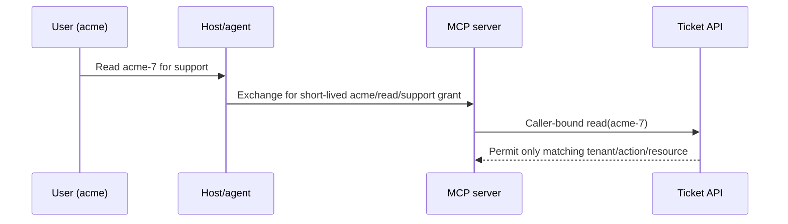

# Delegation, Token Exchange, and Confused Deputy

## Learning objectives

Trace authority from user to agent to MCP server to downstream API; exchange a
parent grant for a strictly narrower child grant; enforce audience, tenant,
resource, action, purpose, expiry, and maximum depth; and detect a confused
deputy before a privileged server accesses another caller's data.

## Why this is a flagship security problem

An MCP server may hold useful downstream access. If it uses that broad access
because a model or another user asks, it becomes a confused deputy: User A can
cause the server to read User B's resource. Authentication of the server is not
enough. Every downstream action must remain bound to the original caller and
its authorized task.

## Delegation invariants

A child grant may only narrow the parent: `child.actions ⊆ parent.actions`, its
expiry cannot outlive the parent, depth cannot exceed the parent limit, its
tenant and purpose must remain bound, and its audience must identify the actual
receiving resource. The server must not accept a caller-supplied tenant as proof
of authority, forward a broad bearer token, or use its own privileged identity
without caller-bound policy.

## Normal → confused deputy → defense → retest

Run `python3 lab.py`. A user has only `ticket.read` for the `acme` support
purpose. Exchange creates a short-lived child for `mcp://support`; it may read
`acme-7`. The attack tries to use the same child for `other-7`, and tries to
escalate it to `ticket.draft_reply`; both fail. The trace demonstrates the
essential fix: downstream authorization evaluates caller, audience, tenant,
resource, action, purpose, expiry, and delegation depth—not the server's broad
credential or the model's chosen tool.

This deterministic fixture is not an OAuth token exchange endpoint. Use a
standards-compliant authorization server and vetted libraries in production;
Course 06 covers token validation and Course 07 covers policy enforcement.

## Evaluation and production upgrade

Test wrong audience, scope expansion, tenant/resource mismatch, purpose drift,
expired parent/child, repeated exchange, depth overflow, token replay, missing
approval, and server-identity compromise. Record redacted grant ID, parent ID,
subject, audience, action, tenant, policy decision, expiry, and trace ID. Add
short lifetime, revocation, sender constraints where supported, audit linkage,
idempotency, and incident containment that invalidates outstanding grants.

## Exercises

1. Add a capability envelope carrying a maximum result size and egress target.
2. Model a two-agent chain and show why each hop must preserve or narrow intent.
3. Design revocation when the downstream API has already received a child grant.

## References

- [OAuth Token Exchange (RFC 8693)](https://www.rfc-editor.org/rfc/rfc8693)
- [OAuth Security BCP (RFC 9700)](https://www.rfc-editor.org/rfc/rfc9700)
- [MCP authorization](https://modelcontextprotocol.io/specification/latest/basic/authorization)
