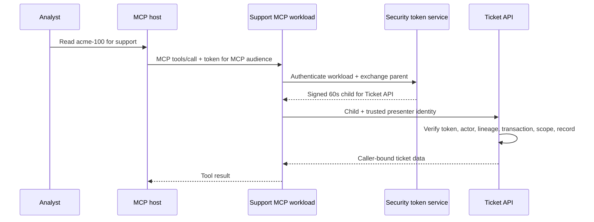

# Delegation, Token Exchange, and Confused-Deputy Prevention

> **Course 08 · Intermediate · 90–120 minutes**
> Build a signed, audience-bound delegation path from an MCP host through an MCP
> server to a downstream API—and prove that it fails closed.

## Learning objectives

By the end of this course, you will be able to:

1. distinguish delegation, impersonation, and a workload acting as itself;
2. map OAuth 2.0 Token Exchange (RFC 8693) fields to an MCP-to-API call;
3. exchange a parent access token for a shorter-lived, audience-specific child;
4. preserve the user subject while identifying the current workload actor;
5. prevent scope, resource, purpose, lifetime, transaction, and depth expansion;
6. make the downstream API independently enforce token and record policy;
7. test token passthrough, confused-deputy use, replay, revocation, and multi-hop
   delegation; and
8. explain which guarantees come from a standard, a local security profile, or
   a production identity platform.

## Prerequisites

- Course 06: OAuth access-token validation
- Course 07: authorization policy and trusted enforcement points
- Familiarity with JWT claims and MCP tool calls

Run commands from this course directory unless a command says otherwise.

## The security thesis

An MCP server often has useful downstream connectivity or credentials. That
does not entitle it to use its authority for every caller or every model-selected
argument. A safe delegation path carries the original subject forward, identifies
the workload currently acting, and narrows authority at every hop.

For this lab, the effective child authority is:

```text
requested authority
∩ parent grant
∩ authenticated actor's exchange policy
∩ target API policy
∩ current downstream record policy
```

The child must never be broader than any set in that intersection. The final API
still checks the current ticket assignment and tenant; a signed token is not a
substitute for object-level authorization.

## Scenario: Northstar support assistant

Northstar's analyst asks an MCP support service to read ticket `acme-100`.

- The host has an access token for the MCP resource.
- The token names analyst `analyst-42`, tenant `acme`, the support purpose, and
  the two ticket IDs the session may use.
- The MCP workload authenticates to a security token service (STS).
- The STS exchanges the parent for a child token whose audience is the ticket
  API and whose authority is only `ticket:read` on `acme-100`.
- The ticket API verifies the child independently and checks its live ticket
  record before returning data.


```mermaid
sequenceDiagram
    participant U as Analyst
    participant H as MCP host
    participant M as Support MCP workload
    participant S as Security token service
    participant T as Ticket API
    U->>H: Read acme-100 for support
    H->>M: MCP tools/call + token for MCP audience
    M->>S: Authenticate workload + exchange parent
    S-->>M: Signed 60s child for Ticket API
    M->>T: Child + trusted presenter identity
    T->>T: Verify token, actor, lineage, transaction, scope, record
    T-->>M: Caller-bound ticket data
    M-->>H: Tool result
```

The lab uses the official Python MCP SDK for a real in-memory protocol call,
PyJWT for signed access tokens, Pydantic for strict request models, and ephemeral
RSA keys. It requires no cloud account or long-lived credential.

## Delegation, impersonation, and workload identity

These modes are not interchangeable.

| Mode | Token subject | Actor information | Security meaning |
|---|---|---|---|
| Workload acts as itself | workload | optional | service's own authority; no user delegation |
| Delegation | original user | current workload in `act` | workload acts on behalf of the user |
| Impersonation | represented user | may omit original actor | service acts as the user; use only when explicitly intended |

The lab implements delegation. The child keeps `sub=analyst-42` and adds an
RFC 8693 `act` claim for `workload:support-mcp`. A multi-hop exchange nests the
previous `act` value so investigators can reconstruct the chain.

RFC 8693 says authorization decisions concern the current actor in the outer
`act` claim. Nested prior actors are informational history; do not accidentally
grant them current authority.

## RFC 8693 token exchange

The standard token-exchange grant uses:

- `grant_type=urn:ietf:params:oauth:grant-type:token-exchange`;
- `subject_token` and `subject_token_type` for the presented security context;
- optional `actor_token` when the actor is represented by a separate token;
- `resource` or `audience` to identify the target service;
- `scope` for requested OAuth scopes; and
- `requested_token_type` for the desired output token type.

A successful response includes `access_token`, `issued_token_type`, `token_type`,
`expires_in`, and possibly `scope`. This lab deliberately returns no refresh
token: a delegated child should be short-lived and reacquired under current
policy rather than become a second durable authority root.

### What RFC 8693 does not guarantee

RFC 8693 defines a protocol. It does **not** by itself guarantee that:

- requested scopes are a strict subset of the parent;
- a child expires before its parent;
- exchanging or revoking one token revokes another;
- an authorization server supports a particular delegation policy; or
- the target API performs tenant and object checks.

Those are authorization-server, deployment-profile, and resource-server duties.
Our STS implements them explicitly and the tests prove the intended behavior.

### The lab's local exchange profile

RFC 8693 allows multiple resource or audience parameters. This learning profile
accepts exactly one target resource per exchange to avoid accidentally issuing
a token usable across a Cartesian product of audiences and scopes.

The following fields and claims are local controls, not standardized RFC 8693
parameters:

- `exchange_id` for idempotent retry detection;
- `resource_ids` for individual ticket bounds;
- `purpose` for purpose limitation;
- `transaction_id` for one workflow context;
- delegation depth and parent-token lineage; and
- recursive online lineage status.

Production systems may encode these constraints differently or keep them in
server-side state. The invariant matters more than this claim vocabulary.

## Preventing the confused deputy

A confused deputy has legitimate authority but applies it for the wrong caller
or purpose. Common failure modes include:

| Failure | Example | Required defense |
|---|---|---|
| Token passthrough | MCP forwards its incoming token to the ticket API | exchange for a ticket-API audience; downstream rejects wrong audience |
| Server credential substitution | MCP uses a broad service token for any user | preserve caller subject and authorize the current record |
| Caller-controlled identity | model supplies `tenant=acme` | derive tenant and subject only from validated identity context |
| Scope expansion | child asks for `ticket:write` | intersect request, parent, actor, and target policies |
| Resource drift | child asks for another tenant's ticket | restrict resource IDs and re-check current ownership downstream |
| Purpose drift | support grant becomes analytics access | bind and compare purpose at exchange and resource server |
| Cross-service replay | ticket token sent to audit API | validate exact audience at every resource server |
| Multi-hop laundering | agent chain hides the prior actor | preserve `act` history and cap delegation depth |

The MCP authorization specification prohibits token passthrough. Each MCP server
is a resource server for its own token; downstream access needs a separate token
whose audience names the downstream resource.

## Trust boundaries and independent checks

The lab separates four decisions:

1. **Host authorization** obtains a token for the MCP resource.
2. **Workload authentication** identifies the MCP actor to the STS.
3. **Exchange policy** decides whether that actor may derive a requested child.
4. **Resource authorization** verifies the child and current ticket policy.

The downstream API does not trust the MCP server's claim that exchange occurred.
It verifies:

- allowed algorithm, key ID, signature, issuer, exact audience, and token type;
- required times and bounded clock skew;
- current actor `sub` and trust-domain `iss` against the authenticated presenter;
- active parent/child lineage;
- transaction, purpose, scope, resource, and delegation depth; and
- live tenant and subject assignment for the requested ticket.

Unknown, mismatched, expired, or unavailable state fails closed. Client-facing
denials intentionally say only that the resource is unavailable; structured
reason codes remain in protected telemetry.

## Workload authentication

The lab passes a trusted `WorkloadIdentity` object because it runs entirely in
one process. That object represents authentication performed before exchange or
downstream authorization. A production deployment should use a method such as:

- mutual TLS with certificate-to-workload mapping;
- OAuth private-key JWT client authentication;
- a workload identity system such as SPIFFE/SPIRE; or
- the cloud provider's workload identity federation mechanism.

Never accept a workload ID or trust domain from a model, tool argument, or
unverified header. Registration binds an exact workload identity to its source
audience and allowed target policies.

## Lifetime, retry, depth, and revocation

The child expiry is the earliest of the requested lifetime, target maximum, and
parent expiry. The lab caps exchange lifetime at 120 seconds and the support
target at 90 seconds.

`exchange_id` is an idempotency key. Repeating the same authenticated request
returns the same response; reusing the key with different security parameters
is denied. This prevents a transport retry from minting an uncontrolled series
of child credentials.

Every child increments `delegation_depth`. A grant cannot be exchanged after its
maximum depth is reached. A nested `act` history makes the chain observable but
does not replace depth policy.

JWTs are normally valid offline until expiry. This lab adds an online lineage
store and defines an explicit policy: revoking any ancestor invalidates every
descendant. That recursive behavior is **not** automatic in RFC 8693 or JWT. A
production design must choose and operate revocation semantics, status latency,
availability behavior, and incident-response procedures.

## Replay and sender constraints

The lab intentionally proves a limitation: the same valid child bearer token is
accepted twice. A `jti`, short lifetime, transaction claim, and audit fingerprint
improve containment and detection, but they do not make a bearer token
non-replayable.

For higher-risk APIs, consider sender-constrained access tokens:

- DPoP (RFC 9449) binds requests to a proof-of-possession key; or
- mutual-TLS certificate-bound tokens bind them to a client certificate.

Sender constraints require end-to-end issuer, client, gateway, and resource
server support. They do not remove the need for audience, scope, object, and
purpose checks.

## State of the art and common platforms

### Identity platforms

- **Keycloak** supports standards-based token exchange in its current V2
  implementation. Its documentation notes product-specific behavior: audience
  downscoping can remove audiences and associated client scopes, while a custom
  downscope executor may be needed where default scope resolution could add
  authority. Verify the exact version and enabled features; legacy V1 exchange
  is deprecated, and some delegation modes remain experimental.
- **Microsoft Entra ID** implements the OAuth on-behalf-of flow for an API that
  calls another API for a user. Its incoming token must target the middle-tier
  API; forwarding it directly to the downstream API is not the flow.
- **Google Cloud Workload Identity Federation** uses an RFC 8693 exchange to
  turn an external workload credential into Google access. This is workload
  federation, not automatically user delegation.
- **Auth0** documents token exchange for custom token and federation scenarios.
  Tenant features, profiles, and policy behavior must be verified before using
  it as a delegation design.

### Libraries and SDKs

Use the provider-supported OAuth library when one exists—for example MSAL for
Microsoft identity—and use a mature OAuth/OIDC library such as Authlib when
building standards-based clients or servers in Python. PyJWT is appropriate for
the focused JWT signing and verification exercise here; it is not a complete
authorization server.

The lab uses the official MCP Python SDK and keeps authority out of the tool
schema. `ticket.read` accepts only `ticket_id`; token, actor, tenant, scope,
audience, and approval state come from trusted application context.

### Transaction tokens

The IETF OAuth working group is developing Transaction Tokens, a short-lived,
signed representation of identity and authorization context for a specific
transaction across trusted services. As of this course revision, the document
is an Internet-Draft—not a finished RFC—and explicitly distinguishes a
transaction token from an OAuth access token. Treat it as emerging architecture,
not a drop-in standardized replacement for the child access token in this lab.

## Lab walkthrough

### 1. Install and run

From the repository root:

```bash
python -m pip install -r requirements.txt
python curriculum/intermediate/08-delegation-token-exchange-confused-deputy/lab.py
```

Expected result:

```text
PASS: token exchange narrows authority and blocks confused-deputy use
```

The JSON evidence should show:

- the valid MCP read succeeded;
- the delegated subject and workload actor remained distinct;
- cross-tenant resource exchange was denied;
- the parent token was not accepted by the ticket API;
- bearer replay was observed as a documented limitation;
- ancestor revocation invalidated the child; and
- neither raw token appeared in audit events.

An expected MCP denial may log `ticket is unavailable`. That is the intentionally
generic domain error for the cross-tenant call.

### 2. Explore the notebook

Open `delegation_security.ipynb` and run all cells. The notebook:

1. inspects the MCP tool schema;
2. exchanges and decodes a signed child;
3. compares parent and child authority;
4. calls the independently enforcing ticket API;
5. executes a negative authorization matrix;
6. demonstrates passthrough rejection and bearer replay;
7. builds a nested actor chain; and
8. revokes the root and retests the descendant.

### 3. Run focused tests

From the repository root:

```bash
python -m pytest -q tests/test_course_08_delegation_security.py
```

The test suite covers valid exchange and at least these denial classes:

- unregistered or spoofed actor;
- source or target audience mismatch;
- scope, resource, purpose, transaction, lifetime, or depth expansion;
- expired or revoked parent and child;
- exchange ID conflict;
- parent-token passthrough;
- wrong downstream presenter;
- missing scope or current assignment;
- invalid signature and workload-only token; and
- unavailable STS.

## Evaluation

Do not score a security lab only by its happy path. For the negative matrix,
calculate:

```text
unexpected allow rate = unexpected allows / expected denials
```

The target is `0`. Also distinguish:

- **blocked attempts**: attacks denied by a control;
- **actual violations**: unauthorized actions that reached the downstream effect;
- **false denials**: valid caller-bound operations that were rejected; and
- **detection latency**: time from a suspicious event to alert or containment.

An attempted attack is not a security incident if the control denied it, but it
is still valuable telemetry. A green test demonstrates the fixture's behavior,
not universal production effectiveness.

## Production hardening checklist

- [ ] Use a maintained authorization server instead of the in-process STS.
- [ ] Authenticate workloads with mTLS, private-key JWT, or workload identity.
- [ ] Publish, rotate, cache, and refresh verification keys safely.
- [ ] Pin issuer and canonical audience; reject ambiguous multi-audience tokens.
- [ ] Define exact scope, resource, purpose, and actor exchange policies.
- [ ] Keep access tokens out of prompts, tool arguments, logs, traces, and errors.
- [ ] Make each resource server validate tokens and current object policy.
- [ ] Define fail-closed behavior for STS, policy, and lineage-store outages.
- [ ] Cap token lifetime and delegation depth.
- [ ] Make exchange retries idempotent and security-parameter conflicts fatal.
- [ ] Decide whether ancestor revocation invalidates descendants and test it.
- [ ] Add DPoP or mTLS sender constraints where replay risk warrants it.
- [ ] Rate-limit exchange and detect unusual targets, fan-out, or denial bursts.
- [ ] Protect audit integrity and restrict access to structured reason codes.
- [ ] Exercise key compromise, actor compromise, rollback, and emergency revoke.

## Common implementation mistakes

1. **Forwarding the parent token.** A valid token for the MCP server is invalid
   for the ticket API and must not be passed through.
2. **Trusting model-selected authority.** Tenant, user, actor, scopes, and purpose
   must come from validated context and policy—not tool input.
3. **Checking only the signature.** Exact issuer, audience, token type, time,
   actor, lineage, and application policy also matter.
4. **Treating exchange as automatic downscoping.** The authorization server must
   enforce the intersection deliberately.
5. **Using the server's own broad token.** That loses caller binding and creates
   the classic confused deputy.
6. **Assuming `jti` prevents replay.** It is an identifier unless a stateful
   one-time-use or sender-constrained design gives it stronger semantics.
7. **Assuming nested actors all authorize the call.** Only the current actor is
   the actor for the present delegation decision.
8. **Logging raw credentials.** Store redacted claim subsets, IDs, decisions,
   reason codes, and token fingerprints instead.

## Exercises

### Exercise 1: result and egress envelope

Add maximum result size and approved egress destination to the local delegation
profile. Make the downstream API enforce them and add one positive and two
negative tests.

### Exercise 2: proof-of-possession design

Write a DPoP upgrade plan. Identify where the client key lives, which service
creates the proof, how `htu`, `htm`, `iat`, `jti`, and nonce are checked, and
how replay state is partitioned.

### Exercise 3: revocation trade-off

Replace online lineage lookup with short-lived offline tokens. Measure the
maximum unauthorized window after root revocation and document the availability,
latency, and containment trade-off.

### Exercise 4: platform mapping

Map this lab to Keycloak, Entra OBO, or another identity platform. For every
invariant, label it native, configurable, custom, or unsupported. Do not assume
that a feature named “token exchange” implements this course's local profile.

## Knowledge check

1. Why does a valid signature not authorize a ticket read?
2. Which component authenticates the current actor, and which component checks
   the current ticket assignment?
3. Does RFC 8693 require a child to be narrower or automatically revoke it with
   its parent?
4. Why is forwarding the MCP access token to the ticket API both an audience
   error and an MCP security violation?
5. What does nested `act` history prove, and what does it not authorize?
6. Why can the child bearer token be replayed in this lab?

## Assessment rubric

| Criterion | Meets expectations |
|---|---|
| Protocol | Uses RFC-shaped request/response and exact target audience |
| Narrowing | Proves scope, resource, purpose, lifetime, transaction, and depth bounds |
| Identity | Separates original subject from authenticated workload actor |
| Enforcement | Downstream independently validates token and live record policy |
| Adversarial tests | Covers passthrough, confused deputy, replay, revocation, and multi-hop cases |
| Evidence | Emits structured redacted decisions without secrets |
| Limitations | States what the lab, RFC 8693, and bearer tokens do not guarantee |

## Lab limitations

This is deterministic instructional code, not a production OAuth server. It
uses one in-memory issuer, generated keys, direct method calls for workload
authentication, manual time control, and an in-memory status store. It does not
implement HTTP token endpoints, discovery, client registration, key rotation,
DPoP, mTLS, distributed consistency, durable audit storage, or high availability.

## References

### Standards and specifications

- [OAuth 2.0 Token Exchange (RFC 8693)](https://www.rfc-editor.org/rfc/rfc8693)
- [OAuth 2.0 Security Best Current Practice (RFC 9700)](https://www.rfc-editor.org/rfc/rfc9700)
- [OAuth 2.0 Demonstrating Proof of Possession (RFC 9449)](https://www.rfc-editor.org/rfc/rfc9449)
- [MCP authorization specification](https://modelcontextprotocol.io/specification/latest/basic/authorization)
- [IETF Transaction Tokens Internet-Draft](https://datatracker.ietf.org/doc/draft-ietf-oauth-transaction-tokens/)

### Platform documentation

- [Keycloak token exchange](https://www.keycloak.org/securing-apps/token-exchange)
- [Keycloak DPoP](https://www.keycloak.org/securing-apps/dpop)
- [Microsoft identity platform on-behalf-of flow](https://learn.microsoft.com/en-us/entra/identity-platform/v2-oauth2-on-behalf-of-flow)
- [Google Cloud Workload Identity Federation](https://docs.cloud.google.com/iam/docs/workload-identity-federation)
- [Auth0 token exchange](https://auth0.com/docs/authenticate/custom-token-exchange)

### Libraries

- [MCP Python SDK](https://github.com/modelcontextprotocol/python-sdk)
- [PyJWT](https://pyjwt.readthedocs.io/)
- [Authlib OAuth documentation](https://docs.authlib.org/en/latest/client/oauth2.html)
- [Microsoft Authentication Library (MSAL)](https://learn.microsoft.com/en-us/entra/msal/)
