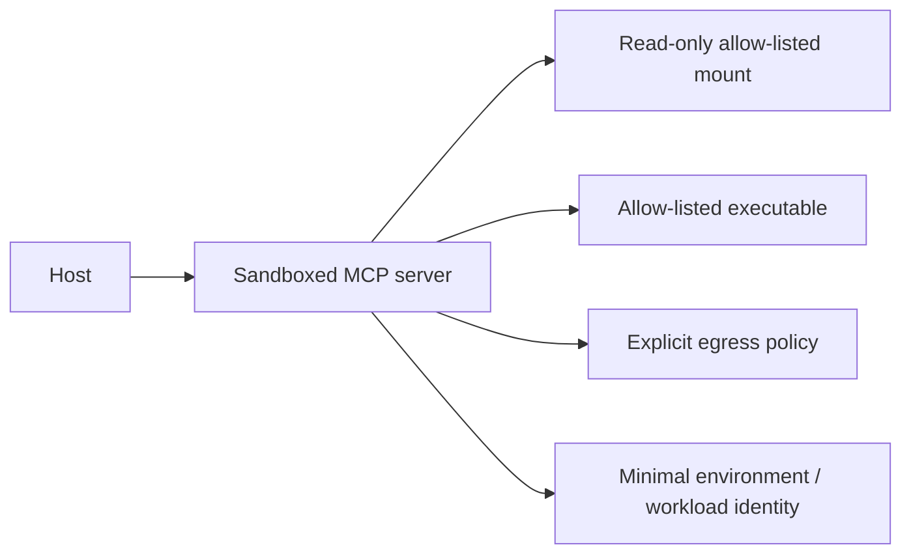

# Runtime Isolation and Sandboxing

## Learning objectives

Define a sandbox boundary for a local or remote MCP server; constrain
filesystem, process, environment, network, and identity; distinguish policy
simulation from enforcement; and collect evidence for a denied escape attempt.

## Why isolation is a separate control

Even a reviewed server can be compromised by a dependency, malformed input, or
operator error. Authorization limits intended actions; isolation limits what the
process can reach when its logic fails. Local stdio does not make a process
trusted: it can inherit host files, environment variables, network access, and
the ability to spawn children unless those are explicitly constrained.

## Baseline policy and attack exercise

Run `python3 lab.py`. The fixture allows only an application worker, a
read-only workspace path, one ticket API destination, and two non-secret
environment keys. It then blocks `/etc/passwd`, `/bin/sh`, and an unapproved
destination. This is a deterministic policy model—not a container, VM, or
kernel sandbox. It demonstrates what must be enforced by a concrete runtime.

## Controls and trade-offs

Use immutable signed images, a non-root workload identity, read-only root
filesystem, explicit writable scratch space, dropped Linux capabilities, seccomp
or equivalent syscall policy, process limits, resource quotas, network default
deny, DNS/IP-aware egress controls, minimal injected configuration, and secret
brokers rather than ambient environment tokens. Containers provide packaging and
some isolation but share a kernel; stronger workloads may require microVMs or
dedicated boundaries. Choose based on blast radius, tenancy, host sensitivity,
and operational maturity.

## Evaluation and production considerations

Test traversal, symlink escape, privileged process spawn, shell injection,
metadata/redirect egress, DNS rebinding, excessive CPU/memory, child process
survival, secret discovery, and logging under failure. Record policy version,
artifact digest, workload identity, denied operation class, trace ID, and
containment action—never secret values. Course 10 deepens filesystem/network
and SSRF mechanics; Course 12 verifies the artifact before it enters the
sandbox.

## Exercises

1. Add a write-only scratch mount with size and lifecycle limits.
2. Define the response when an egress denial repeats three times.
3. Compare container and microVM isolation for an unreviewed third-party server.

## References

- [MCP security best practices](https://modelcontextprotocol.io/docs/tutorials/security/security_best_practices)
- [NIST SP 800-190: Application Container Security Guide](https://csrc.nist.gov/pubs/sp/800/190/final)
