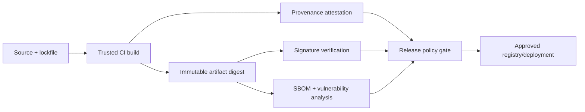

# Supply-Chain Provenance, SBOMs, Signing, and Dependencies

## Learning objectives

Verify an immutable server artifact; distinguish integrity, provenance, and
vulnerability evidence; generate and use SBOM inventory; enforce trusted build
provenance; and reject a signed artifact when its release evidence is incomplete
or unacceptable.

## Why this matters for MCP

An MCP server is executable authority. A reviewed tool schema says little if a
mutable image, dependency, registry entry, or local executable changes after
review. Signing proves a relationship between bytes and signer; it does not
prove the signer is authorized, dependencies are safe, or the artifact matches
the intended source/build. SBOMs make components visible; they do not patch
vulnerabilities. Controls must be combined into a release decision.

## Evidence model

## Normal → failure → defense → retest

Run `python3 lab.py`. The release gate requires an approved digest, signature
evidence, SBOM digest, trusted builder, and no unresolved findings. It rejects a
missing signature and a signed artifact with a known vulnerability. The fixture
does not verify real signatures or parse a real SBOM; use Sigstore/Cosign,
in-toto/SLSA provenance, and an SBOM tool such as Syft in production.

## Production controls and evaluation

Pin dependencies and base images; keep lockfiles; build hermetically where
possible; generate provenance and SBOM in CI; verify identity and attestations
at promotion/deploy time; use an approved registry; scan continuously because
new vulnerabilities appear after release; and require time-bounded, owned
exceptions. Test tampered bytes, substituted builder, stale SBOM, missing
transitive dependency, revoked signer, critical vulnerability, and rollback to
a known-good digest. Record digest, signer identity, builder, SBOM/provenance
references, policy decision, exception, and trace—never secrets.

## Exercises

1. Add signer allow-lists and expiry/revocation to the lab.
2. Define an exception record for a vulnerability that cannot be immediately
patched.
3. Explain why a host should pin the server digest even after CI approved it.

## References

- [SLSA specification](https://slsa.dev/spec/v1.0/)
- [Sigstore](https://docs.sigstore.dev/)
- [CycloneDX SBOM standard](https://cyclonedx.org/specification/overview/)
- [SPDX specification](https://spdx.dev/specifications/)
