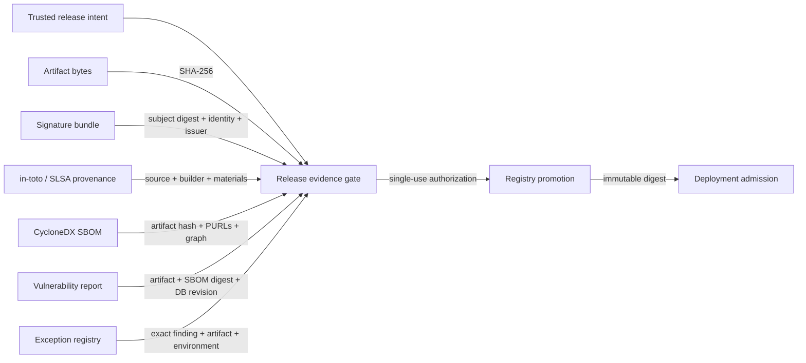

# Supply-Chain Provenance, SBOMs, Signing, and Dependencies

An MCP server is executable authority. This course builds a release gate that
admits only the exact server bytes supported by authenticated, mutually bound,
fresh supply-chain evidence—and then promotes those bytes once by digest.

## Course thesis

By the end, you should be able to explain what each supply-chain artifact does
and does not prove, implement a deterministic evidence verifier, evaluate its
false-allow and false-block behavior, and productionize the design with common
signing, provenance, SBOM, scanning, policy, registry, and admission tools.

Level: intermediate. You should already understand SHA-256 digests, public-key
signatures, dependency lockfiles, container registries, and CI/CD. Course 13
turns this verifier into a full CI/CD release workflow.

## Learning objectives

You will learn to:

1. distinguish artifact integrity, signer identity, provenance, inventory,
   vulnerability, license, VEX, policy, and deployment evidence;
2. verify the artifact digest before trusting any attached document;
3. authenticate keyless-style signer identity and issuer with preconfigured
   roots rather than trusting identities embedded in evidence;
4. validate an in-toto Statement carrying SLSA provenance and bind its subject,
   source revision, builder, build type, lockfile, and base image;
5. parse a CycloneDX SBOM, validate its subject, completeness claim, dependency
   graph, PURLs, exact locked inventory, and license data;
6. bind a vulnerability report to that exact artifact and SBOM, then enforce
   scanner and advisory-database freshness;
7. use narrowly bound, owned, expiring vulnerability exceptions without making
   critical findings silently disappear;
8. mint and atomically consume a short-lived promotion authorization; and
9. evaluate the gate using labelled attacks and observable registry state.

## 1. The evidence is a graph, not a checklist

“Signed, scanned, and has an SBOM” is not a defensible decision. Every item must
refer to the same artifact and the intended release context.


```mermaid
flowchart LR
  I[Trusted release intent] --> G[Release evidence gate]
  A[Artifact bytes] -->|SHA-256| G
  S[Signature bundle] -->|subject digest + identity + issuer| G
  P[in-toto / SLSA provenance] -->|source + builder + materials| G
  B[CycloneDX SBOM] -->|artifact hash + PURLs + graph| G
  V[Vulnerability report] -->|artifact + SBOM digest + DB revision| G
  X[Exception registry] -->|exact finding + artifact + environment| G
  G -->|single-use authorization| R[Registry promotion]
  R -->|immutable digest| D[Deployment admission]
```

The decisive boundary is:

```text
producer tools -> make signed claims and observations
trusted release application -> validates, correlates, authorizes, promotes, verifies
```

A typed JSON document, a valid signature, a passing scanner, a trusted workflow
name, or a mutable image tag does not authorize production deployment by itself.

## 2. Evidence types and their limits

| Evidence | Establishes when verified | Does not establish |
|---|---|---|
| SHA-256 digest | identity of exact bytes | origin, safety, or policy compliance |
| signature | approved signer signed a payload | that the signer was authorized for this artifact or that claims are true |
| transparency proof | signed material was logged at a time | source correctness or vulnerability absence |
| provenance | claimed source, builder, build parameters, and materials for a subject | that all dependencies are safe or the builder is trusted by your policy |
| SBOM | declared component inventory and relationships | completeness unless measured; exploitability; remediation |
| vulnerability scan | matches known to one tool/database snapshot | absence of unknown, newly disclosed, or misidentified vulnerabilities |
| VEX status | producer assertion about exploitability for product + vulnerability | truth without authenticated issuer, evidence, scope, and freshness |
| policy decision | evidence satisfied a specific policy version | future safety after evidence or policy changes |
| registry tag | convenient mutable name | immutable artifact identity |

The gate therefore verifies evidence *and the edges between evidence*. The
vulnerability report names the SBOM digest; the SBOM root names the artifact
digest; provenance names the same artifact; the release intent fixes source,
revision, materials, environment, and repository.

## 3. Threat model for an MCP server release

### Assets

- production MCP server bytes and their tool capabilities;
- CI identities, signing roots, registry credentials, and admission policy;
- source revision, lockfiles, build definitions, and base images;
- SBOM, scan, exception, promotion, and audit records; and
- the mapping from a user-visible release/tag to an immutable digest.

### Adversaries and failures

- a compromised dependency, build step, maintainer, registry, or runner;
- dependency confusion, typosquatting, lockfile drift, or mutable tag movement;
- a legitimate signer used from an unapproved workflow or issuer;
- a signed artifact built from the wrong source, revision, builder, or base;
- an incomplete SBOM that omits a vulnerable transitive dependency;
- a fresh report over the wrong SBOM, or a stale report over an old database;
- a broad, expired, revoked, or cross-environment vulnerability exception;
- a time-of-check/time-of-use artifact swap during promotion; and
- replay of a previously valid release decision after policy changes.

### Security invariants

1. Artifact bytes are rehashed at verification and promotion.
2. Trust roots and allowed identities come from policy, never from evidence.
3. Every evidence document is schema-valid, authenticated, and subject-bound.
4. Source, revision, builder, build type, lockfile, and base image match trusted
   release intent exactly.
5. The SBOM graph covers exactly the locked component population for this lab.
6. Scan and advisory-database timestamps satisfy explicit freshness windows.
7. Exceptions are trusted records bound to one artifact, vulnerability, PURL,
   environment, policy version, owner, approval, and expiry.
8. Critical affected findings cannot use the lab's exception path.
9. Promotion uses a server-side, exact, expiring, single-use authorization.
10. The registry stores the verified bytes by digest; tags are only pointers.

## 4. Current standards and common tooling

The following snapshot was reviewed on 2026-09-27. Pin tool versions and revisit
their release/security notes rather than copying “latest” into production.

### Provenance and attestations

- [SLSA 1.2](https://slsa.dev/spec/v1.2/) defines current source/build tracks,
  provenance guidance, and Verification Summary Attestations. A level is a set
  of properties; do not infer a level merely because a JSON field says so.
- The [in-toto Attestation Framework v1.0](https://in-toto.io/docs/specs/)
  supplies the Statement/subject/predicate model used by SLSA and other claims.
- [Sigstore Cosign](https://docs.sigstore.dev/cosign/verifying/verify/) verifies
  container/blob signatures and attestations. Identity-based verification must
  constrain certificate identity and OIDC issuer. Current Cosign 3 workflows
  use Sigstore bundles by default; a bundle carries verification material, not
  automatic policy approval.
- [GitHub artifact attestations](https://docs.github.com/en/actions/how-tos/secure-your-work/use-artifact-attestations/use-artifact-attestations)
  can produce and verify build provenance and SBOM attestations. Verification
  still needs expected repository/identity and subject digest.

### Inventory and relationships

- [CycloneDX 1.7](https://cyclonedx.org/specification/overview/) represents
  components, services, dependency graphs, compositions, vulnerabilities,
  formulations, citations, and other transparency data.
- [SPDX 3.0.1](https://spdx.github.io/spdx-spec/v3.0.1/scope/) is an open BOM
  data model covering software composition, builds, AI models, datasets,
  provenance, licensing, security, relationships, and lifecycle data.
- [Syft](https://oss.anchore.com/docs/guides/sbom/getting-started/) generates
  SBOMs for images and filesystems in Syft JSON, SPDX, and CycloneDX formats.
  Conversion can lose format-specific data, so retain the native source report.
- [GUAC](https://docs.guac.sh/guac/) ingests supply-chain metadata into a graph
  for transitive queries and organizational analysis. It complements rather
  than replaces artifact-specific verification policy.

### Vulnerabilities, VEX, and project posture

- [OSV-Scanner](https://github.com/google/osv-scanner/blob/main/docs/scan-source.md)
  scans source, lockfiles, SPDX/CycloneDX SBOMs, and images against OSV data.
- [Grype](https://oss.anchore.com/docs/guides/vulnerability/scan-targets/) scans
  images, directories, archives, SBOMs, PURLs, and CPEs. Its database age is a
  security input, not incidental metadata.
- [OpenVEX](https://github.com/openvex/spec/blob/main/OPENVEX-SPEC.md) models a
  product + vulnerability + impact-status assertion. Authenticate and bind the
  assertion; “not affected” is not a string to trust blindly.
- [OpenSSF Scorecard](https://scorecard.dev/) examines source/build/dependency
  practices such as pinned dependencies, token permissions, update automation,
  and packaging. It is useful context for dependency admission, not proof that
  a package is safe.

### Enforcement

- OPA/Rego, Cedar, Kyverno, Gatekeeper, and organization-specific policy engines
  can express the final release decision. The enforcement point must supply
  authenticated identity and exact evidence, not model-produced fields.
- [Sigstore policy-controller](https://docs.sigstore.dev/policy-controller/)
  can verify image signatures/attestations and apply admission policy in
  Kubernetes. Configure fail-closed no-match behavior where appropriate and
  test tag-to-digest resolution.
- OCI registries store artifacts by digest and can attach/referrer-link
  signatures, attestations, and SBOMs. Deploy and rollback by digest.

## 5. Lab architecture

The lab uses common Python libraries already in the contributor environment:

- `cryptography` performs real Ed25519 signing and verification;
- Pydantic validates closed typed contracts (`extra="forbid"`);
- `hashlib` recomputes SHA-256 over actual artifact and canonical document
  bytes; and
- locks protect single-use authorization consumption and registry mutation.

The deterministic local fixture is deliberately not a replacement for Fulcio,
Rekor, Cosign, a production scanner, or an OCI registry. It teaches the policy
semantics those adapters must preserve.

### What the implementation proves

| Claim | Executable proof |
|---|---|
| artifact is immutable | hash and size checked at gate; hash rechecked at promotion |
| signer is trusted | Ed25519 verification against policy-owned identity + issuer key |
| provenance matches release | subject/source/revision/builder/build type/material checks |
| inventory is usable | CycloneDX root hash, complete composition, graph closure, exact PURLs |
| scan applies to inventory | artifact and canonical SBOM digests checked |
| vulnerability input is current | scanner version, scan age, DB revision age checked |
| exception is narrow | exact artifact/finding/PURL/environment/policy/time/state checks |
| authorization is not forgeable | issued record must exist in trusted server-side store |
| authorization is not replayable | atomic state transition from issued to consumed |
| successful effect occurred | digest-addressed registry blob and tag pointer inspected |

## 6. Run the lab and tests

From the repository root:

```bash
source .venv/bin/activate
python curriculum/intermediate/12-supply-chain-provenance-sbom-signing-dependencies/lab.py
pytest -q tests/test_course_12_supply_chain.py
```

The demonstration performs four observable paths:

1. a complete release is authorized and promoted by immutable digest;
2. altered artifact bytes are rejected before evidence is trusted;
3. an affected critical vulnerability blocks release even though the report is
   validly signed; and
4. replaying the promotion authorization is rejected.

The focused suite adds wrong signer, revoked signer, invalid signature, wrong
provenance subject, malicious builder, source/material drift, stale evidence,
SBOM omission, graph errors, license denial, scanner mismatch, expired or
cross-bound exception, forged authorization, target mutation, and concurrency.

## 7. Walk through the release gate

### Step 1: start from trusted release intent

`ReleaseIntent` is created by the release orchestrator, not by the artifact or
an agent. It fixes the expected artifact name/digest/size, source commit,
lockfile and base-image digests, component set, environment, and target registry.

If an AI assistant proposes a version or target, trusted application code must
resolve that proposal to this intent. Model text never selects a trust root,
changes a digest, grants an exception, or authorizes promotion.

### Step 2: hash actual bytes

The gate computes SHA-256 before inspecting claims. This blocks a common
confusion: a signature record may be valid, yet the downloaded bytes may not be
the bytes named by that record. Promotion repeats the hash to close the gap
between verification and use.

### Step 3: verify signature material and identity policy

`TrustStore.verify` checks:

- the signer identity is allowed for this evidence role;
- the `(identity, issuer)` key exists in preconfigured roots and is not revoked;
- the payload digest matches canonical payload bytes;
- signing/integration time is ordered and not in the future; and
- the Ed25519 signature verifies.

Cosign should perform the cryptographic and Sigstore trust-material work in a
real pipeline. Your policy still supplies exact identity, issuer, repository,
workflow/ref constraints, and offline/online trust-root handling.

### Step 4: verify provenance semantics

A valid in-toto envelope is only the start. The gate checks:

- `_type` is in-toto Statement v1;
- `predicateType` is SLSA provenance v1;
- subject name and digest match the artifact;
- builder and build type are allowed;
- source URI and 40-character source revision match release intent;
- resolved dependencies contain the expected lockfile and base image digests;
- build times are ordered and fresh; and
- the provenance document has an allowed producer signature.

Production verification should use the producer ecosystem's verifier or a
well-maintained attestation library and evaluate the actual SLSA properties
required by policy. Do not hand-roll DSSE, certificate-chain, transparency-log,
or Rekor verification from this teaching fixture.

### Step 5: validate the SBOM as evidence

The lab accepts a strict CycloneDX 1.7 subset and checks:

- root component name and SHA-256 subject;
- a `complete` composition for the root assembly;
- unique component PURLs and `bom-ref` values;
- valid dependency references and reachability of every component;
- equality with the trusted lock resolution used by this fixture; and
- known licenses that do not intersect the denied set.

Real SBOM completeness is harder. Compare multiple observations where useful:
source/lockfile inventory, built filesystem/image inventory, language package
metadata, OS packages, vendored binaries, plugins, and dynamically downloaded
content. Record scanner/tool version and cataloger coverage. “One SBOM exists”
is not a completeness metric.

### Step 6: verify scan and VEX semantics

The report is separately signed and bound to the artifact and canonical SBOM
digests. The gate checks scanner/version allow-listing, scan age, database age,
and whether each finding names a component in that SBOM.

The fixture treats `not_affected` as a VEX-like status only after the entire
report is authenticated. Production should require an authenticated VEX issuer,
product/version or digest binding, vulnerability identity, status justification,
supporting evidence, issued/expiry time, and revocation/update process.

### Step 7: evaluate exceptions as governed records

An exception is not `ignore=true`. The lab requires a trusted record with:

- exact artifact digest, vulnerability ID, PURL, environment, and policy version;
- owner, approval identity, tracking ticket, rationale, compensating controls;
- issuance, expiry, and approved/revoked state.

Affected critical findings are not exception-eligible in the sample policy.
An organization may choose a different risk policy, but it should be explicit,
reviewed, measured, and enforced—not encoded in scanner output.

### Step 8: authorize and promote once

Only after all checks pass does the gate store a short-lived authorization bound
to release ID, artifact digest, environment, repository, evidence digest, and
policy version. `PromotionService` rejects a changed policy, target, artifact,
unknown record, expiry, or replay. A lock makes concurrent consumption atomic.

The returned deployment reference is `repository@sha256:...`. A mutable tag may
point to it for humans, but the deployment system should resolve and admit the
verified digest.

## 8. Production pipeline pattern

Build once, collect evidence once, then promote the same digest:

```bash
# Illustrative commands: pin verified tool/action versions in your environment.
syft registry.example/acme/support-mcp@sha256:... \
  -o syft-json=sbom.syft.json \
  -o cyclonedx-json=sbom.cdx.json

osv-scanner scan source -L sbom.cdx.json --format json > osv-results.json
grype sbom:sbom.cdx.json -o json > grype-results.json

cosign verify registry.example/acme/support-mcp@sha256:... \
  --certificate-identity 'https://github.com/acme/support-mcp/.github/workflows/release.yml@refs/heads/main' \
  --certificate-oidc-issuer 'https://token.actions.githubusercontent.com'

cosign verify-attestation registry.example/acme/support-mcp@sha256:... \
  --type slsaprovenance \
  --certificate-identity 'https://github.com/acme/build-platform/.github/workflows/build.yml@refs/heads/main' \
  --certificate-oidc-issuer 'https://token.actions.githubusercontent.com'
```

Do not parse human-readable tables as policy input. Request stable JSON, capture
tool and database versions, validate schemas, and keep raw evidence immutable.
Treat command examples as starting points: run `--help` for the pinned tool
release and verify the generated predicate and identity semantics.

### Separation of duties

| Role | May do | Must not do alone |
|---|---|---|
| source maintainer | propose/review code and dependency changes | alter protected build identity or production policy |
| build platform | build and emit authenticated provenance | approve its own trust root or vulnerability exception |
| inventory/scanner service | report components/findings | grant deployment authority |
| security/risk owner | approve narrow, expiring exception | replace artifact or evidence after approval |
| release verifier | evaluate fixed policy and evidence | fabricate evidence or silently widen policy |
| deployer/admission | consume exact authorization and digest | substitute a tag or different target |

## 9. Evaluation that measures the real outcome

Create a labelled corpus with safe releases, attacks, boundary cases, and
operational failures. At minimum include:

- tampered bytes; wrong or revoked signer; wrong issuer; invalid signature;
- wrong source/revision/builder/build type/lockfile/base image;
- missing transitive component, disconnected graph, unknown or denied license;
- report over another artifact/SBOM, stale scan/DB, unknown scanner;
- affected high/critical finding, valid VEX-like status, valid and invalid
  exceptions; and
- forged, altered, expired, replayed, and concurrently consumed authorization.

Use outcome metrics with explicit denominators:

```text
unsafe release rate = promoted unsafe releases / labelled unsafe attempts
safe block rate     = blocked safe releases / labelled safe attempts
attack block rate   = blocked labelled attacks / labelled attack attempts
evidence freshness  = releases with evidence inside policy windows / release attempts
exception debt      = open approved exceptions past remediation SLA / open exceptions
mean remediation time = sum(close time - detection time) / remediated findings
```

Scanner recall, signature success, blocked attempts, and actual forbidden
promotions are different metrics. Inspect registry/deployment state to determine
whether an unsafe effect completed; do not count a logged “deny” as proof.

Report slices by ecosystem, package type, image/base, severity, scanner,
business service, environment, supplier, exception owner, and evidence age.

## 10. Operations, monitoring, and incident response

Record structured, redacted events containing release ID, artifact digest,
evidence digests, signer/builder/scanner identity, policy version, decision code,
exception ID, registry target, deployment digest, and trace ID. Do not log private
keys, bearer tokens, raw OIDC tokens, unnecessary source contents, or hidden
model reasoning.

Monitor:

- trust-root, signer, builder, workflow, and policy changes;
- stale or missing evidence and advisory-database update failures;
- SBOM/lock inventory drift and unexplained component growth;
- new vulnerabilities affecting already deployed digests;
- exception age, expiry, owner departure, and control health;
- tag movement and running digest drift; and
- repeated denied promotion or authorization-replay attempts.

When a deployed digest becomes untrusted:

1. stop further promotion and admission of the digest;
2. identify running instances and downstream consumers by digest;
3. preserve artifact, attestations, SBOM, scanner DB revision, policy, exception,
   registry, and deployment evidence;
4. revoke affected signer/builder credentials or trust roots where warranted;
5. rebuild from an approved source/material set in a trusted builder;
6. rescan with a current database and issue new evidence;
7. roll forward or back to a separately verified known-good digest; and
8. verify runtime state and close the incident only from observed outcomes.

## 11. Common unsafe shortcuts

- **“It is signed, so it is safe.”** Signatures prove a relationship between a
  signer and payload; policy must approve identity, issuer, subject, and context.
- **“The workflow name appears in provenance.”** Self-reported builder text is
  not authenticated builder identity.
- **“An SBOM was uploaded.”** Validate schema, subject, graph, completeness,
  producer, version, and freshness; measure what the generator can see.
- **“The scanner returned zero.”** Confirm exit semantics, parsed output,
  scanned subject, database age, ecosystem coverage, and policy population.
- **“VEX says not affected.”** Authenticate its issuer and bind product,
  vulnerability, status, justification, evidence, and lifecycle.
- **“We approved the tag.”** Tags move. Approve and deploy an immutable digest.
- **“CI passed earlier.”** Re-evaluate policy and freshness at promotion and
  admission; new vulnerabilities and revocations appear after builds.
- **“The agent decided the package is reputable.”** Models may summarize
  evidence, but deterministic policy owns trust and deployment authority.

## 12. Exercises

1. Add issuer-specific roles so one workflow cannot sign artifact, provenance,
   SBOM, and scanner output interchangeably.
2. Add authenticated OpenVEX documents with product/digest, issuer, status,
   justification, evidence, issue time, expiry, and revocation checks.
3. Compare Syft source-directory and built-image SBOMs. Define a completeness
   metric and explain legitimate differences.
4. Add a second scanner without double-counting aliases for the same underlying
   vulnerability. Define disagreement handling.
5. Add an immutable verification summary record inspired by SLSA VSA and prove
   its policy digest and resource URI are checked.
6. Add idempotent promotion recovery for an unknown registry outcome. Keep the
   logical promotion ID stable and reconcile before retrying.
7. Implement rollback authorization that can select only a previously verified,
   non-revoked digest and records the incident/change ticket.
8. Write an OPA/Rego or Cedar policy equivalent to the lab's deterministic gate
   and compare decision traces on the same labelled corpus.

## Completion checklist

- [ ] I can explain the different guarantees of digest, signature, provenance,
      SBOM, scan, VEX, exception, and admission evidence.
- [ ] I recompute the artifact digest at verification and use.
- [ ] I select trust roots, identities, builders, and scanners from policy.
- [ ] I bind all evidence to the same subject, source, materials, and release.
- [ ] I validate SBOM graph/completeness and compare it to trusted inventory.
- [ ] I enforce scanner and advisory-database freshness.
- [ ] I represent exceptions as narrow, owned, expiring, revocable records.
- [ ] I issue exact, short-lived, server-side, one-use promotion authority.
- [ ] I deploy by digest and verify registry/runtime state.
- [ ] I test attacks, valid boundaries, concurrency, and operational failures.

## Authoritative references

- [SLSA specification 1.2](https://slsa.dev/spec/v1.2/)
- [SLSA provenance](https://slsa.dev/spec/v1.2/provenance)
- [SLSA Verification Summary Attestation](https://slsa.dev/spec/v1.2/verification_summary)
- [in-toto specifications](https://in-toto.io/docs/specs/)
- [Sigstore verification](https://docs.sigstore.dev/cosign/verifying/verify/)
- [Sigstore tooling and trust services](https://docs.sigstore.dev/about/tooling/)
- [CycloneDX specification overview](https://cyclonedx.org/specification/overview/)
- [SPDX 3.0.1 specification](https://spdx.github.io/spdx-spec/v3.0.1/)
- [CISA 2026 SBOM Minimum Elements announcement](https://content.govdelivery.com/accounts/USDHSCISA/bulletins/422a7eb)
- [Syft SBOM documentation](https://oss.anchore.com/docs/guides/sbom/getting-started/)
- [OSV-Scanner source and SBOM scanning](https://github.com/google/osv-scanner/blob/main/docs/scan-source.md)
- [Grype vulnerability database and freshness](https://oss.anchore.com/docs/guides/vulnerability/database/)
- [OpenVEX specification](https://github.com/openvex/spec/blob/main/OPENVEX-SPEC.md)
- [OpenSSF Scorecard](https://scorecard.dev/)
- [GitHub artifact attestations](https://docs.github.com/en/actions/how-tos/secure-your-work/use-artifact-attestations/use-artifact-attestations)
- [Sigstore policy-controller](https://docs.sigstore.dev/policy-controller/)
- [GUAC documentation](https://docs.guac.sh/guac/)
