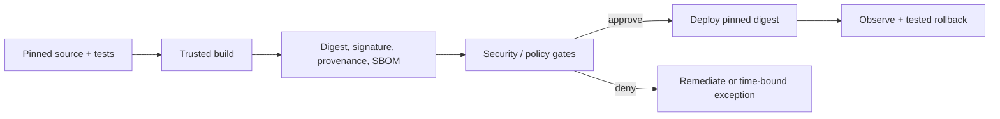

# Secure MCP CI/CD and Release Gates

## Learning objectives

Design a promotion pipeline that produces and verifies tests, provenance, SBOM,
vulnerability, policy, deployment, and rollback evidence; and reject manual
or model-generated claims that are not attached to an immutable artifact.

## Pipeline model

An MCP server release must preserve the reviewed artifact digest from CI through
registry and deployment. Gate failures default to no promotion. Keep deployment
credentials scoped and short-lived; do not let a server artifact mint or read
the pipeline's broad credentials.

## Lab and evaluation

Run `python3 lab.py`. A release is approved only when tests, provenance, SBOM,
clean/accepted vulnerability evidence, policy checks, and a known-good rollback
digest are all present. It rejects a scan failure and a release with no recovery
target. Production pipelines should also test tool contracts and adversarial
fixtures, verify attestations, protect branch/release approvals, record policy
versions and exceptions, deploy by digest, and smoke-test revocation/rollback.

## Failure modes

Avoid mutable tags, skipped gates, unreviewed manual artifacts, secrets in logs,
unbounded third-party actions, failed-open scanners, and a rollback plan that
was never exercised. Treat emergency exceptions as owned, time-bounded, traced,
and reviewable—not permanent bypasses.

## References

- [SLSA](https://slsa.dev/)
- [GitHub Actions security hardening](https://docs.github.com/actions/security-for-github-actions/security-guides/security-hardening-for-github-actions)
