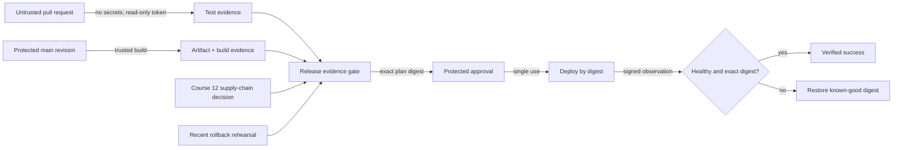
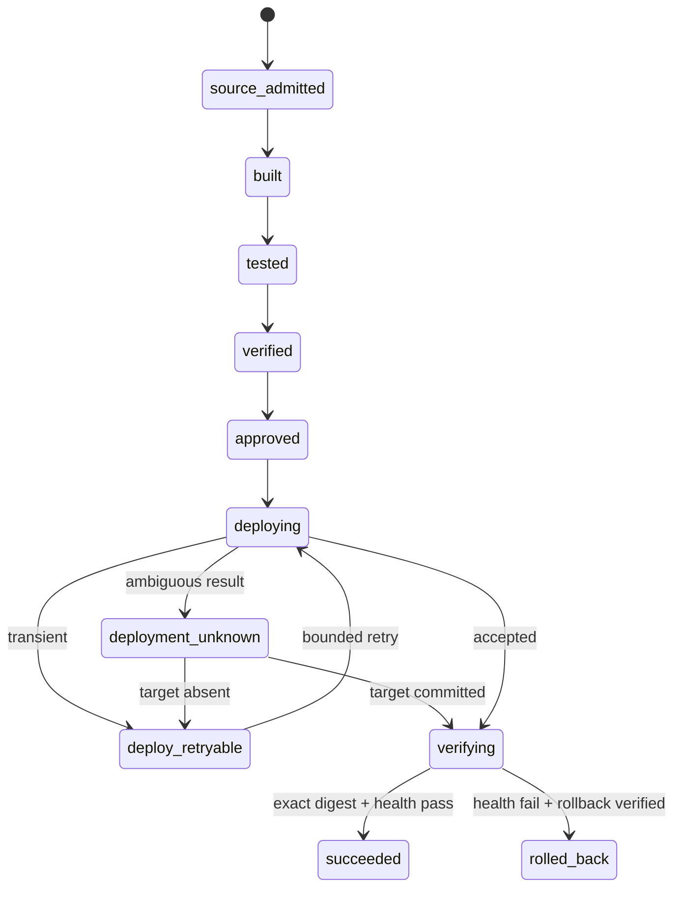

# Secure MCP CI/CD and Release Gates

An MCP server is executable authority: changing its artifact can change the tools,
descriptions, schemas, dependencies, credentials, and effects exposed to an agent.
This course builds a fail-closed release controller that admits reviewed source,
correlates signed evidence, authorizes one exact deployment, handles ambiguous
outcomes safely, and proves either healthy production state or verified rollback.

## Course thesis

CI is not trusted merely because it is automated. A defensible release separates
untrusted pull-request work from privileged build and deployment jobs, gives each
job only the authority it needs, and makes every transition depend on fresh,
authenticated evidence for the same source revision and artifact digest.

```text
workflows, scanners, builders, agents -> propose or produce evidence
trusted release application          -> validates, authorizes, executes, verifies
```

Level: intermediate. You should already understand GitHub Actions, public-key
signatures, artifact digests, OIDC, and the evidence gate in Course 12. Course 12
asks whether artifact evidence is acceptable. This course asks whether the entire
orchestration—from reviewed source to observed production state—is safe.

## Learning objectives

You will learn to:

1. separate untrusted pull-request tests, protected builds, and protected deploys;
2. audit workflow permissions, immutable action pins, checkout semantics, runner
   isolation, cache behavior, and expression-in-script injection surfaces;
3. bind a run to immutable repository, owner, workflow, source, ref, environment,
   and actor identity;
4. correlate signed source, build, test, supply-chain, rollback, and health evidence;
5. authorize one exact release plan with a trusted, expiring, single-use receipt;
6. exchange GitHub OIDC identity for a short-lived, target-scoped credential;
7. implement a durable, versioned state machine with bounded retries;
8. reconcile unknown deployment outcomes before retrying an effect;
9. verify the deployed digest and service checks, then restore an exact known-good
   digest when health fails; and
10. measure outcomes with explicit denominators rather than counting log messages.

## 1. Release safety is a chain of evidence


```mermaid
flowchart LR
  PR[Untrusted pull request] -->|no secrets; read-only token| T[Test evidence]
  M[Protected main revision] -->|trusted build| B[Artifact + build evidence]
  T --> G[Release evidence gate]
  B --> G
  S[Course 12 supply-chain decision] --> G
  R[Recent rollback rehearsal] --> G
  G -->|exact plan digest| A[Protected approval]
  A -->|single use| D[Deploy by digest]
  D -->|signed observation| H{Healthy and exact digest?}
  H -->|yes| OK[Verified success]
  H -->|no| RB[Restore known-good digest]
```

A green job is not sufficient. The controller must know which source revision ran,
which workflow definition ran it, which bytes were built, which tests and policy
evaluated those bytes, which production target was approved, and what production
actually contains after the deployment API returns.

### Security invariants

1. Pull-request code never receives production identity, secrets, or a writable
   package/deployment token.
2. Privileged jobs run only from the trusted repository and protected main ref.
3. Every third-party action is allowlisted and pinned to a full commit SHA.
4. Workflow expressions do not enter shell scripts as source text.
5. Build and deploy jobs use ephemeral runners and cannot write a shared cache.
6. Evidence is schema-valid, cryptographically authenticated, fresh, and bound to
   the same run, source revision, and artifact digest.
7. Approval binds the complete release plan and can be consumed exactly once.
8. Cloud identity is short-lived and bound to repository IDs, workflow, ref, run,
   environment, audience, and target scope.
9. Retries reuse one stable logical operation ID and have a strict attempt budget.
10. An unknown result is reconciled against target state before another write.
11. Success is claimed only after signed health evidence and target state agree.
12. Failed health restores and verifies the exact rehearsed known-good digest.

## 2. Threat model

### Assets

- production MCP server bytes and tool behavior;
- protected branches, workflow definitions, environments, and approvals;
- repository and cloud workload identities;
- package, deployment, signing, and evidence authority;
- release plans, state transitions, operation IDs, and audit records; and
- the known-good artifact and tested recovery path.

### Adversaries and failures

- malicious code in a forked pull request;
- a compromised or mutable third-party action;
- expression injection through branch names, issue titles, or other event data;
- over-broad `GITHUB_TOKEN` permissions or a long-lived cloud secret;
- a persistent self-hosted runner contaminated by an earlier job;
- cache poisoning across trust boundaries;
- a build or test report for another commit, artifact, workflow, or run;
- forged, stale, replayed, or cross-target approval;
- transient API failures, lost responses, worker crashes, and duplicate delivery;
- a deployment API that committed the effect but returned an ambiguous result;
- a successful API response that did not produce the intended runtime state; and
- rollback instructions that were never rehearsed or name mutable content.

### Trust boundaries

| Boundary | Treat as untrusted | Trusted enforcement |
|---|---|---|
| pull request | code, metadata, artifacts, cache writes | minimal test token and isolated runner |
| workflow source | names and mutable tags | reviewed workflow digest and full action SHAs |
| evidence producers | claims inside signed documents | policy-owned keys, schemas, correlation, freshness |
| approval UI/API | caller-supplied `approved=true` | server-side receipt store and exact plan digest |
| OIDC token | claim text without verification | issuer/audience/context validation and cloud policy |
| deploy API | timeout or success response | idempotency, reconciliation, and observed target state |
| health system | unsigned status text | signed, fresh, deployment-bound observations |

## 3. Design three workflow trust zones

### Zone A: pull-request tests

Run fork-controlled code with `pull_request`, read-only contents access, no secrets,
no OIDC request, and an ephemeral runner. Check out the pull-request merge commit so
the test subject is explicit. Do not let this job publish packages or write a cache
later consumed by a privileged job.

`pull_request_target` runs in the base repository's privileged context. Combining it
with checkout or execution of attacker-controlled pull-request code creates the
classic “pwn request” path. Use it only for narrowly designed metadata operations;
the lab rejects it as a test trigger.

### Zone B: protected build

Build only after the revision is admitted on protected main with required reviews
and checks. The build job has only the explicit permissions needed for contents,
OIDC, attestations, and package publication. It has no long-lived secrets and cannot
write a shared cache.

The builder signs evidence that binds the run ID, exact source SHA, artifact digest,
trusted builder identity, and build time.

### Zone C: protected production deployment

The deployment job runs only for a trusted push or allowlisted manual actor, targets
the protected `production` environment, does not check out source, and requests OIDC
only when deployment is ready. Environment reviewers, wait rules, and branch/tag
restrictions should be configured in GitHub as a second control plane.

Use concurrency controls so two production releases do not race. Decide whether a
new run cancels an old one based on the effect: cancelling a process does not undo a
deployment already accepted by the target.

## 4. Audit the workflow as code

`WorkflowAuditor` validates a closed `WorkflowContract` before any release state is
created. Trusted policy fixes the reviewed workflow SHA; calculating a digest over an
attacker-selected workflow would not establish trust. The lab then requires the
following exact permission sets:

| Phase | Permissions |
|---|---|
| test | `contents: read` |
| build | `contents: read`, `id-token: write`, `attestations: write`, `packages: write` |
| deploy | `contents: read`, `id-token: write`, `deployments: write`, `packages: read` |

`id-token: write` permits a job to request an OIDC token; it does not itself grant
cloud access. The cloud identity provider and target policy still decide whether the
verified claims receive a credential.

### Pin actions to immutable identities

Git tags can move. Pin third-party actions to a full 40-character commit SHA, keep an
approved pin list, and use dependency automation to propose reviewed updates. GitHub
documents a full-length commit SHA as the only immutable action release reference.
Useful workflow analysis tools include:

- [zizmor](https://docs.zizmor.sh/) for GitHub Actions security findings;
- [OpenSSF Scorecard](https://scorecard.dev/) for dangerous workflow, token, and
  pinned-dependency signals;
- GitHub CodeQL and secret scanning for repository-wide analysis; and
- Dependabot or Renovate for reviewable action and dependency updates.

### Prevent script injection

Do not splice `${{ github.event.* }}` directly into a `run:` script. Expression data
can contain shell syntax. Prefer a purpose-built action; otherwise pass the value as
an environment variable and quote it in the shell. The lab rejects any direct
workflow expression embedded in a script contract.

### Runner and cache isolation

Ephemeral runners reduce persistence but are not a complete sandbox. Harden the
image, minimize installed credentials, restrict egress, monitor runner registration,
and destroy the environment after the job. Treat caches and artifacts as data from
their producing trust zone. A privileged build must not consume a writable cache
key controlled by an untrusted pull request.

## 5. Bind runtime identity, not display names

`ReleaseRunContext` uses immutable repository and owner IDs in addition to names. It
also fixes source repository ID, protected ref, workflow path and SHA, event, actor,
run ID, source SHA, and environment. This prevents a familiar repository name or a
fork from silently becoming trusted release identity.

For manual releases, the controller allowlists actors. In production, prefer a
trusted group/role lookup and preserve reviewer identity, separation of duties, and
the protection-rule decision in the audit record.

GitHub OIDC policies should validate all available immutable context. GitHub's
current subject customization supports claims such as repository and owner IDs;
combine them with audience, protected ref, workflow identity, environment, and run
context. Do not authorize solely from a reusable repository name.

## 6. Build a correlated evidence graph

The course uses real Ed25519 signatures and a policy-owned trust store. Each producer
has a distinct role so a test service cannot sign build evidence and a health
observer cannot mint source-admission evidence.

| Evidence | Required binding |
|---|---|
| protected revision | repository ID, source SHA, protected ref, reviews, exact checks |
| build | run ID, source SHA, artifact digest, trusted builder, time |
| tests | run ID, source SHA, artifact digest, required suite, counts, time |
| supply-chain decision | run/source/artifact, provenance/SBOM/scan digests, policy, result |
| rollback rehearsal | production, current known-good digest, checks, restore time, freshness |
| health | run, operation, environment, expected/observed digest, named checks, time |

Course 12 produces the authenticated supply-chain decision. Course 13 consumes it as
one edge in a larger graph. A passing decision for another artifact or policy version
is rejected.

The state machine persists the exact source, build, and test evidence digests as each
stage is admitted. Final verification rejects a second valid-but-different document,
so the approved graph is the same graph that advanced the earlier stages.

The release plan freezes every material input:

```text
run + source + artifact + environment + target + previous digest
+ workflow contract digest
+ source/build/test/security/rollback evidence digests
+ policy version
```

Changing any field changes the canonical plan digest and invalidates approval.

## 7. Use an explicit durable state machine


```mermaid
stateDiagram-v2
  [*] --> source_admitted
  source_admitted --> built
  built --> tested
  tested --> verified
  verified --> approved
  approved --> deploying
  deploying --> deploy_retryable: transient
  deploy_retryable --> deploying: bounded retry
  deploying --> deployment_unknown: ambiguous result
  deployment_unknown --> verifying: target committed
  deployment_unknown --> deploy_retryable: target absent
  deploying --> verifying: accepted
  verifying --> succeeded: exact digest + health pass
  verifying --> rolled_back: health fail + rollback verified
```

`RunStore` persists state and an integer version. Every transition supplies the
version it read. If another worker changed the run, the stale worker receives a
version conflict and must reload. This optimistic concurrency check prevents two
workers from independently advancing the same old state.

Production storage should provide transactional compare-and-set behavior, durable
uniqueness for run and operation IDs, and crash recovery. An in-memory lock is used
only to make the local invariant executable.

## 8. Approve an exact plan once

An approval is not a Boolean in workflow input. `ApprovalStore` issues a trusted
receipt containing the run ID, exact plan digest, approver role, issue time, and
expiry. Consumption performs an atomic `issued -> consumed` transition.

The controller also checks approver eligibility and denies self-approval by the
workflow actor. Production should resolve these identities through the protected
environment or enterprise identity system rather than accepting an email string.

Before consuming approval, the controller confirms that the run is still at the
approved version/state and validates the OIDC identity. This prevents an invalid
deployment identity from burning the one valid approval. Forged, expired, mutated,
missing, or replayed receipts are denied.

Production systems should additionally enforce reviewer eligibility, no self-
approval where required, change references, short TTLs, revocation, exact target and
risk-tier binding, and atomic coordination with durable deployment intent.

## 9. Exchange OIDC for least authority

`CredentialBroker` validates issuer, audience, subject, repository ID, owner ID,
workflow path/SHA, protected ref, production environment, run ID, and time window.
It returns a short-lived credential descriptor scoped to one deployment target.

In production, the cloud provider performs the token verification and exchange.
Configure its trust policy to match the same claims, then grant only the deployment
API actions needed for that environment. Never print the OIDC token or exchanged
credential, place one in an artifact, or pass it to an MCP server process.

## 10. Make effects idempotent and retries bounded

The deployment target receives one stable logical operation ID derived from the run
and artifact. A retry reuses that ID. Reusing an operation ID with different bytes is
an idempotency conflict, not a new deployment.

Distinguish three outcomes:

- `success`: the target accepted or previously accepted the exact operation;
- `transient`: the target confirms no final outcome; retry within budget; and
- `unknown`: the request may have committed, so query target status first.

Never turn a timeout directly into another non-idempotent write. If the target says
the unknown operation committed, proceed to verification. If it is absent, return to
the retryable state. If status is itself unavailable, remain unknown and alert rather
than guessing.

## 11. Verify outcomes and rollback

An API 200 proves only that an API returned 200. `HealthEvidence` is signed by a
separate production observer and binds the exact run, operation ID, environment,
expected digest, observed digest, named checks, and observation time.

The lab requires both the observer and deployment target to report the intended
artifact digest, and every health check must pass. On failure, the controller applies
the previously approved and recently rehearsed known-good digest. It declares
`rolled_back` only after target state confirms restoration. A failed rollback raises
an incident condition; it is never labelled successful release or recovery.

Useful production checks include workload/image digest, MCP initialization and
capability snapshot, authenticated non-destructive tool smoke tests, authorization-
denial tests for a canary principal, downstream health, and error-budget signals over
a bounded observation window.

## 12. Lab walkthrough

From this course directory:

```bash
python3 lab.py
```

From the repository root:

```bash
pytest -q tests/test_course_13_release_gates.py
```

The demonstration exercises two realistic failure modes:

1. a deployment response is lost after the target committed; reconciliation finds
   the stable operation ID and the release succeeds after health verification; and
2. the new digest is deployed but an authorization smoke check fails; the controller
   restores and verifies the known-good digest.

The tests also mutate workflow triggers, token scopes, action pins, source identity,
signed evidence, plan bindings, approvals, OIDC claims, retry budgets, operation IDs,
health reports, rollback outcomes, and concurrent state changes.

### Lab limitations

The deterministic lab is a policy model, not a hosted CI platform. Replace:

- local workflow contracts with parsed GitHub workflow and organization settings;
- local Ed25519 keys with Sigstore, GitHub attestations, or managed signing services;
- in-memory stores with transactional durable storage;
- the simulated deployment target with an idempotent orchestrator API;
- constructed OIDC claims with provider-verified tokens; and
- local health fixtures with authenticated production observations.

Preserve the invariants when replacing the adapters.

## 13. Common tools and production mapping

| Need | Common tools or methods | Verification question |
|---|---|---|
| workflow lint/security | actionlint, zizmor, Scorecard, CodeQL | does analysis cover the committed workflow SHA? |
| dependency updates | Dependabot, Renovate | are action updates reviewed and repinned? |
| ephemeral execution | GitHub-hosted runners, ARC ephemeral runners, hardened VMs | is destruction and egress policy evidenced? |
| workload identity | GitHub OIDC + AWS/Azure/GCP/Vault federation | do policies bind immutable repo/workflow/environment claims? |
| provenance | GitHub artifact attestations, SLSA, in-toto, Cosign | do subject, builder, source, and workflow match intent? |
| SBOM and scanning | Syft, CycloneDX/SPDX, Grype, Trivy, OSV-Scanner | are reports fresh and bound to the exact digest? |
| policy | OPA/Rego, Cedar, Kyverno, Gatekeeper | is the decision enforced at the effect boundary? |
| deploy control | protected environments, deployment API, GitOps controller | is the target immutable and operation idempotent? |
| observability | OpenTelemetry, deployment events, signed health reports | can run, digest, operation, decision, outcome correlate? |
| recovery | digest-pinned rollback, canary, blue-green | was the exact recovery path recently rehearsed? |

GitHub immutable releases can protect release tags and assets after publication. They
complement, rather than replace, workflow identity, artifact attestations, registry
digest pinning, environment protection, and runtime verification.

## 14. Evaluation and metrics

Keep attempts, decisions, API responses, target outcomes, health observations, and
rollback results separate. Recommended measures include:

```text
unsafe deployment rate
  = completed forbidden production deployments / labelled adversarial attempts

safe block rate
  = correctly denied unsafe release attempts / labelled unsafe release attempts

false block rate
  = denied valid release attempts / labelled valid release attempts

unknown-outcome reconciliation rate
  = correctly reconciled unknown operations / unknown deployment outcomes

rollback success rate
  = verified known-good restorations / rollback attempts

release recovery time
  = verified known-good restoration time - incident detection time
```

Publish the population, label source, observation window, exclusions, and confidence
interval where appropriate. “We saw 20 denials” is not a safety rate. A detector
finding is not a completed forbidden effect, and a rollback request is not a verified
restoration.

### Test scenarios

Include at least:

- fork pull requests attempting to read secrets or request OIDC;
- malicious branch/title expression injection;
- mutable and unapproved action references;
- poisoned cache and persistent-runner assumptions;
- source, workflow, artifact, evidence, and policy mismatch;
- stale, forged, revoked, or wrong-role evidence;
- approval mutation, expiry, forgery, replay, and concurrency;
- OIDC wrong audience, repository, workflow, ref, environment, run, or time;
- transient retries and exhausted budgets;
- committed and absent forms of unknown outcomes;
- operation-ID reuse with another digest;
- health evidence for another operation or stale observation;
- failed service check, digest drift, rollback failure, and verified restoration; and
- logging checks that exclude tokens, signatures, secrets, and artifact contents.

## 15. Exercises

1. Parse a real `.github/workflows/*.yml` file into `WorkflowContract`, preserving
   reusable-workflow and composite-action boundaries.
2. Add staging without allowing staging approval or identity to deploy production.
3. Persist `RunStore` and `ApprovalStore` in a transactional database and write a
   crash test at every state boundary.
4. Model a target whose unknown outcome cannot be queried. Define escalation without
   inventing a safe retry.
5. Replace local evidence signing with GitHub artifact attestations and validate the
   expected subject digest, repository, signer identity, and workflow.
6. Add canary rollout stages and prove promotion and rollback retain immutable
   artifact identities.
7. Create a labelled attack set and compute the metrics above from observable target
   state rather than controller logs alone.

## 16. Production readiness checklist

- [ ] Pull-request jobs have no secrets, OIDC, privileged token scopes, or cache path
      into trusted jobs.
- [ ] Every action is pinned to an approved full commit SHA.
- [ ] Repository, owner, source repository, workflow, ref, and environment identity
      are verified with immutable IDs where available.
- [ ] Protected branch and environment rules are tested, not only documented.
- [ ] Build, test, supply-chain, rollback, and health evidence are authenticated,
      fresh, and mutually bound.
- [ ] Release plans and approvals bind exact source, artifact, target, previous
      digest, workflow, policy, and evidence digests.
- [ ] Approval consumption and run transitions are durable and concurrency-safe.
- [ ] Cloud credentials are short-lived, target-scoped, and absent from logs/artifacts.
- [ ] Deployment APIs support idempotency and status reconciliation.
- [ ] Retry budgets and unknown-outcome escalation are explicit.
- [ ] Success depends on observed production digest and health, not API response.
- [ ] Rollback restores a recently rehearsed immutable digest and is independently
      verified.
- [ ] Audit events use stable reason codes and exclude credential or payload material.
- [ ] Metrics use labelled populations and completed outcomes.

## References

Standards and guidance reviewed for this course on 2026-09-28:

- [GitHub Actions: Secure use reference](https://docs.github.com/en/actions/reference/security/secure-use)
- [GitHub Actions: `GITHUB_TOKEN` authentication and permissions](https://docs.github.com/en/actions/tutorials/authenticate-with-github_token)
- [GitHub Actions: OpenID Connect reference](https://docs.github.com/en/actions/reference/security/oidc)
- [GitHub Actions: OIDC in cloud providers](https://docs.github.com/en/actions/how-tos/secure-your-work/security-harden-deployments/oidc-in-cloud-providers)
- [GitHub Actions: Manage environments for deployment](https://docs.github.com/en/actions/how-tos/deploy/configure-and-manage-deployments/control-deployments)
- [GitHub Actions: Deployments and environments](https://docs.github.com/en/actions/reference/workflows-and-actions/deployments-and-environments)
- [GitHub Actions: Secure use of `pull_request_target`](https://docs.github.com/en/actions/reference/security/securely-using-pull_request_target)
- [GitHub: Immutable releases](https://docs.github.com/en/code-security/concepts/supply-chain-security/immutable-releases)
- [GitHub: Artifact attestations](https://docs.github.com/en/actions/concepts/security/artifact-attestations)
- [SLSA 1.2 Build track basics](https://slsa.dev/spec/v1.2/build-track-basics)
- [NIST SP 800-218, Secure Software Development Framework 1.1](https://csrc.nist.gov/pubs/sp/800/218/final)
- [OWASP Top 10 CI/CD Security Risks](https://owasp.org/www-project-top-10-ci-cd-security-risks/)
- [zizmor GitHub Action and documentation](https://github.com/zizmorcore/zizmor-action)

Recheck provider behavior and supported claims before production rollout: hosted CI,
OIDC claim sets, action releases, and protection features evolve.
