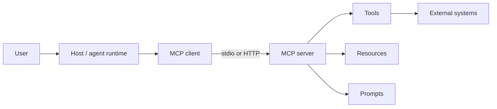

# 1. MCP architecture and threat model

## The protocol surface

An MCP **host** coordinates the model and user experience. An MCP **client** maintains a session to one server. An MCP **server** exposes capability namespaces: tools (actions), resources (readable context), and prompts (templates). Transports can be local stdio or remote HTTP. Each boundary has different exposure and failure modes.

## Threat-model questions

For every server, document the principal, data classification, allowed tools, destinations, credentials, package source, owner, and recovery owner. Then ask:

- Can a malicious manifest induce a tool call or disclose a secret?
- Can a server use a host credential for a caller that did not receive that authority (confused deputy)?
- Can a URL, file path, or archive escape its intended boundary (SSRF/path traversal)?
- Can a tool output inject instructions into the next model turn?
- Can a compromised dependency modify the server after review?
- Can a session be replayed or hijacked?

Use STRIDE or attack trees to record threats, controls, tests, and residual risk. A protocol connection is not an authorization decision: authorize every tool invocation and high-impact resource read.

## Security invariants

1. The model never directly decides permission.
2. Every action has an explicit tool, schema, audience, tenant, and approval policy.
3. Server output is untrusted data and is delimited before re-entering model context.
4. Credentials are short-lived, scoped, and never forwarded to a different resource.
5. A server can be disabled and rolled back without redeploying the host.

Read the [MCP specification](https://modelcontextprotocol.io/specification/latest) and [official security best practices](https://modelcontextprotocol.io/docs/tutorials/security/security_best_practices).
