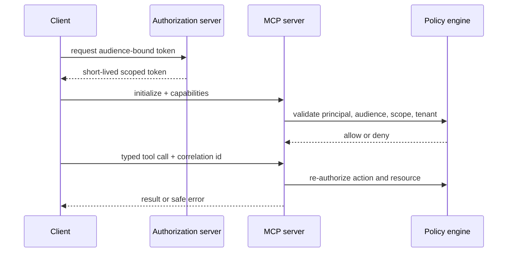

# 2. Protocol authentication and authorization

Authentication establishes the peer; authorization decides the operation. For remote MCP, use TLS, validate the server identity, and apply OAuth resource indicators so an access token is minted for the specific MCP resource. Never pass through a token issued for the host, another API, or an upstream user session.

## Request decision flow

Validate issuer, signature, expiry, audience, scopes, and nonce/state where applicable. For delegation, use a typed envelope with delegator, subject, audience, actions, resource constraints, expiry, and maximum depth. Intersect child actions with parent actions; escalation is always a denial. Add human approval for destructive, financial, privilege-changing, or external communication actions.

Use deny-by-default policy-as-code and enforce tenant/path/amount constraints at the resource API. Record policy version, token ID hash, decision, and tool argument hash without logging secrets. References: [MCP authorization](https://modelcontextprotocol.io/specification/latest/basic/authorization), [OAuth Security BCP](https://datatracker.ietf.org/doc/html/rfc9700), and [OAuth Token Exchange](https://datatracker.ietf.org/doc/html/rfc8693).
