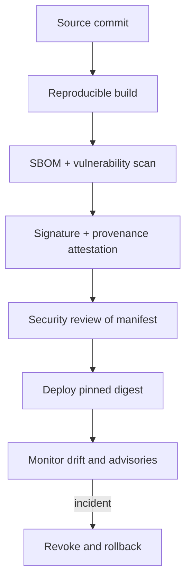

# 3. Supply-chain provenance and dependencies

Treat an MCP server like a production service, not a downloaded prompt. Maintain a bill of materials for direct and transitive dependencies, lock versions and hashes, and require review for manifest, schema, endpoint, and permission changes.

## Release gates

- Pin a container/image/package digest; do not deploy `latest`.
- Generate SBOMs with [Syft](https://github.com/anchore/syft); scan with [OSV-Scanner](https://google.github.io/osv-scanner/).
- Sign artifacts and attest build provenance with [Sigstore](https://www.sigstore.dev/) and follow [SLSA](https://slsa.dev/).
- Verify signatures in CI and again at deployment; keep a known-good digest.
- Review transitive licenses, abandoned dependencies, native extensions, and install scripts.
- Use staged rollout and a canary server with synthetic calls before production.

Signing proves integrity and origin; it does not prove the code is safe. Combine provenance with static analysis, sandboxing, adversarial tests, and human review.
