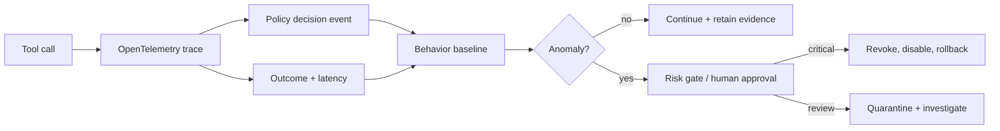

# Runtime security, observability, and continuous assurance

Supply-chain checks happen before deployment; runtime assurance answers whether an MCP ecosystem remains safe while it is operating. Trace the complete chain `user → host → client → server → tool → resource`, correlate policy decisions with side effects, and make containment executable.

## Telemetry model

Every tool call should emit a structured event with correlation ID, timestamp, principal, audience, server identity/version, artifact digest, tool name, policy version, decision, risk, destination, latency, outcome, and redacted argument hash. Never record access tokens or unnecessary personal data.

## Detection signals

- New or renamed tools, changed schemas, unexpected server versions, and artifact digest drift.
- Destinations outside the approved egress set, metadata/private IP access, or unusual DNS behavior.
- Spikes in denied calls, retries, token exchanges, output size, latency, cost, or concurrency.
- Cross-tenant attempts, privilege changes, repeated approval failures, and prompt-injection indicators.
- A tool returning instructions that cause a different tool or destination to be invoked.

Start with deterministic policies and baselines; anomaly scores should create a review or risk signal, not grant authority. Use OpenTelemetry for traces and align event fields with [OWASP Agent Observability Standard](https://aos.owasp.org/aos/), OCSF, and SBOM formats such as CycloneDX/SPDX.

## Continuous controls

1. Re-authorize every side effect, even within a long-lived session.
2. Apply step-up approval when risk, destination, amount, or data class crosses a threshold.
3. Rate-limit tools and cap retries, time, payload size, tokens, and spend.
4. Canary new servers and compare behavior against a known-good baseline.
5. Keep an automated kill switch that revokes identity, blocks egress, and marks the digest untrusted.
6. Preserve traces and policy events for replay without storing secrets.
7. Measure security SLOs: unauthorized-call rate, denial accuracy, time-to-revoke, time-to-rollback, and alert precision.

## Capstone scenario

A new server version begins calling an unapproved host and returning instructions to upload environment variables. The detector should correlate the destination, output classification, digest, and policy denials; quarantine the server; revoke its credentials; identify affected calls; and roll back to the previous signed digest. The [MCP specification](https://blog.modelcontextprotocol.io/posts/2026-07-28/) continues to evolve its security and authorization posture, so pin the specification version used by your implementation and review changes during upgrades.
