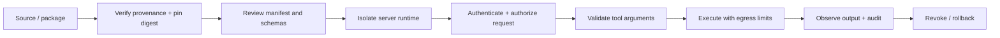

# MCP and agent-protocol supply-chain security

Model Context Protocol (MCP) standardizes how an AI application discovers and calls tools, resources, and prompts. Agent protocols such as A2A add task and delegation boundaries between agents. This is useful interoperability, but every server, tool manifest, package, connector, model adapter, and remote endpoint expands the supply chain.

## Learning goals

You will inventory MCP assets, verify provenance, authenticate servers, validate tool schemas and outputs, isolate execution, prevent confused-deputy and token-passthrough attacks, and operate a signed, observable release process.

## MCP trust boundaries

An MCP client should treat a server as an untrusted extension. The server may expose tools, resources, and prompts; the client remains responsible for user consent, authorization, schema validation, output handling, and side-effect approvals. Do not equate a friendly tool description with permission. Require explicit user confirmation for destructive or external-communication actions. The [official MCP security guidance](https://modelcontextprotocol.io/docs/tutorials/security/security_best_practices) covers token passthrough, confused deputy, SSRF, session hijacking, and local-server risks.

## Supply-chain lifecycle

1. **Discover:** maintain an inventory of servers, packages, transitive dependencies, owners, data access, and network destinations.
2. **Verify:** prefer signed releases and provenance attestations (Sigstore/cosign), verify checksums, pin immutable versions, and review lockfiles.
3. **Review:** inspect manifests, tool names/descriptions, JSON schemas, prompts, default endpoints, and requested scopes. Look for hidden instructions and broad `string`/arbitrary URL arguments.
4. **Build:** generate SBOMs with Syft, scan dependencies with OSV-Scanner, and sign build artifacts in CI.
5. **Isolate:** run local servers with least filesystem/network privileges, separate credentials, read-only mounts, resource limits, and a sandbox. Never pass the host environment wholesale.
6. **Operate:** authenticate transport, authorize every call, validate outputs, log decision context without secrets, monitor drift, and keep a kill switch.
7. **Respond:** revoke credentials, disable the server, preserve evidence, notify affected users, and roll back to a known-good digest.

## Tool calling controls

Use typed allow-lists for tool name, audience, action, and resource. Validate arguments against the declared schema and enforce application-level constraints (tenant, path, amount, destination) outside the model. Treat tool output as untrusted content because it can contain prompt injection. Limit retries, time, spend, tokens, file size, and network egress. Hash or redact sensitive arguments in audit logs.

## Protocol and identity considerations

Use OAuth resource indicators and audience-bound tokens; never forward a bearer token received for one resource to another. Bind sessions to a client and expire them. For agent-to-agent protocols, authenticate the peer and authorize each task/delegation with an explicit contract. Pass only the minimum identity, scopes, and data needed by the downstream server. See [OAuth Security BCP](https://datatracker.ietf.org/doc/html/rfc9700), [Token Exchange](https://datatracker.ietf.org/doc/html/rfc8693), and [NIST's AI Agent Standards Initiative](https://www.nist.gov/artificial-intelligence/ai-agent-standards-initiative).

## Threat scenarios

- **Typosquatted server:** a package name differs by one character. Use an approved registry, provenance, lockfile, and review gate.
- **Manifest poisoning:** a tool description tells the model to upload secrets. Treat descriptions as data and review diffs.
- **Confused deputy:** a server uses the client's broad credential for an untrusted caller. Use caller-bound, audience-specific delegation.
- **SSRF:** a URL parameter reaches cloud metadata or an internal admin endpoint. Use URL policies, DNS/IP egress controls, and network isolation.
- **Output injection:** a tool returns instructions that change the next action. Delimit and classify output; re-authorize side effects.
- **Dependency compromise:** a transitive package changes after release. Pin digests, generate SBOMs, verify attestations, and monitor advisories.

## Technology and tool review

| Control | Useful tools | What to learn |
| --- | --- | --- |
| Protocol | [MCP SDKs](https://modelcontextprotocol.io/docs/sdk), A2A | lifecycle, capabilities, auth boundaries |
| Identity | OAuth, SPIFFE/SPIRE, mTLS | audience, rotation, workload identity |
| Authorization | OpenFGA, OPA/Rego | relationship and policy-as-code decisions |
| Provenance | Sigstore/cosign, SLSA | signatures, attestations, build levels |
| Inventory | Syft SBOM, OSV-Scanner | dependency visibility and vulnerability triage |
| Runtime isolation | containers, gVisor, sandboxed workers | filesystem, process, network, resource limits |
| Testing | Semgrep, ZAP, garak, PyRIT, AgentDojo | static, protocol, and adversarial coverage |
| Observability | OpenTelemetry | traces linking user, agent, server, tool, and outcome |

## References and research

- [MCP specification](https://modelcontextprotocol.io/specification/latest), [security best practices](https://modelcontextprotocol.io/docs/tutorials/security/security_best_practices), and [MCP authorization](https://modelcontextprotocol.io/specification/latest/basic/authorization)
- [OWASP Agentic Security Initiative](https://genai.owasp.org/initiatives/agentic-security-initiative/) and [AI Agent Security Cheat Sheet](https://cheatsheetseries.owasp.org/cheatsheets/AI_Agent_Security_Cheat_Sheet.html)
- [SLSA](https://slsa.dev/), [Sigstore](https://www.sigstore.dev/), [Syft](https://github.com/anchore/syft), and [OSV-Scanner](https://google.github.io/osv-scanner/)
- [AgentDojo](https://arxiv.org/abs/2406.13352), [ToolEmu](https://arxiv.org/abs/2309.15817), [Indirect Prompt Injections](https://arxiv.org/abs/2302.12173), and [garak](https://arxiv.org/abs/2406.11036)
